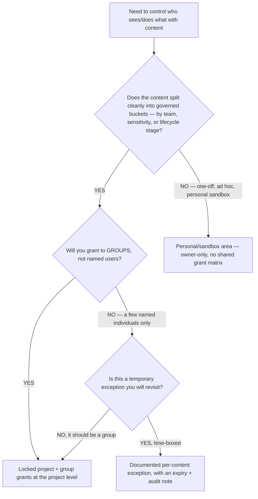
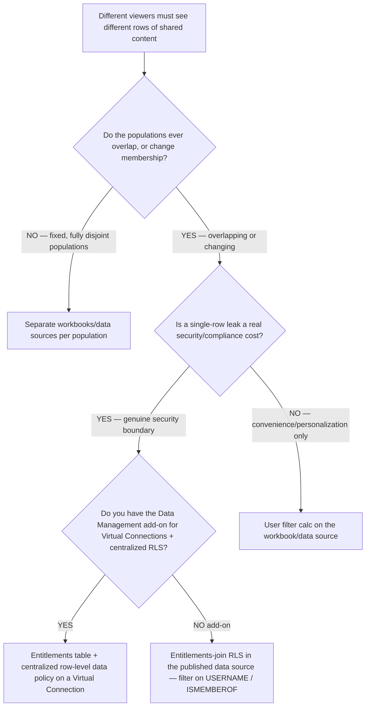
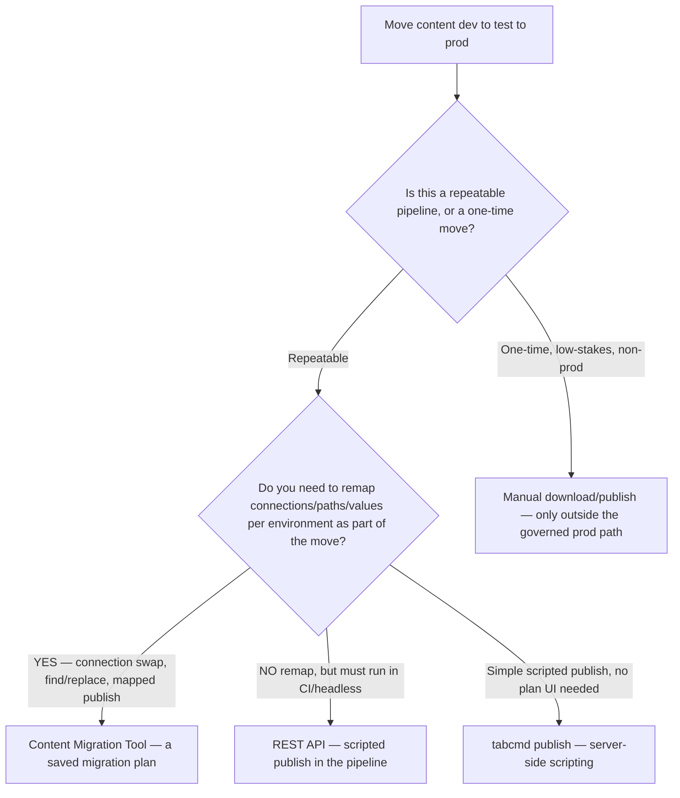
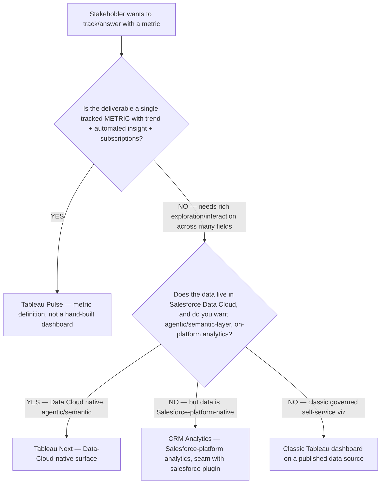

# Governance & Embedding decision trees

> Canonical `## Decision Tree` sections for the `tableau-admin` platform craft: the permission model, the RLS mechanism, the content-promotion method, the embedding-auth method, and the next-gen-surface choice. The agent **traverses the relevant tree top-to-bottom before selecting a method** (see `agents/tableau-admin.md` → "Decision-tree traversal"). Do not keyword-match the user's description; resolve the first clean branch.
>
> **Volatility note.** RLS-data-policy licensing, Connected-Apps/JWT mechanics, and the Pulse / Tableau-Next / CRM-Analytics surface change quarter-to-quarter. Every `Last verified` date below is a re-verification deadline, not a guarantee. Mark any positioning claim `[verify-at-build]` before quoting to a client.

---

## Decision Tree: Permission model — locked project vs per-content grants

**When this applies:** You are setting up (or auditing) who can see and do what with content on a Tableau Server/Cloud site. The observable trigger: a request like "Finance and Sales must not see each other's workbooks," a request to grant a new group access, or an audit finding that the same user has different effective permissions on two workbooks in the same project. Not for *row*-level visibility (that is the RLS tree).

**Last verified:** 2026-05-30 against Tableau Server/Cloud permission model (projects, groups, locked vs customizable projects, deny-by-omission) `[verify-at-build]`.



**Rationale per leaf:**
- *Locked project + group grants* — the project's permission rule becomes the single source of truth for every workbook/data source inside it; "locked" stops authors silently overriding at the content level, so the grant matrix is auditable. **requires:** Project Leader or Site Administrator on the target project to set "Locked" + manage permissions.
- *Documented per-content exception* — sometimes a single workbook genuinely needs a narrower/wider grant than its project; allow it only time-boxed and written down, never as the default. **requires:** the same project/site admin role plus a tracked review date.
- *Personal/sandbox area* — exploratory content with no shared audience doesn't need a grant matrix; owner-only is correct until it graduates into a governed project.

**Tradeoffs summary:**

| Leaf | Audit clarity | Drift risk | Effort | Requires | Use when |
|---|---|---|---|---|---|
| Locked project + group grants | High — read off the project rule | Low — overrides blocked | Low ongoing | Project Leader / Site Admin | The default for any governed, multi-team content |
| Per-content exception (time-boxed) | Medium — must read each override | Medium — exceptions accumulate | Medium | Project/Site admin + review date | A single workbook genuinely diverges from its project |
| Personal/sandbox (owner-only) | N/A | Low | None | Owner only | Exploratory, no shared audience yet |

---

## Decision Tree: RLS mechanism — user filter vs entitlements + data policy vs separate content

**When this applies:** Different viewers of the *same* content must see *different rows* — "each regional manager sees only their region," "each customer sees only their own tenant's data." The observable trigger is a per-viewer row-visibility requirement on shared content. This is a **security control**: every leaf here ends in escalation to `ravenclaude-core/security-reviewer`.

**Last verified:** 2026-05-30 against Tableau user filters, Virtual Connections + centralized row-level security (data policy), and the Data Management add-on requirement `[verify-at-build]`.



**Rationale per leaf:**
- *User filter* — a per-workbook calculated filter (`USERNAME()` / `ISMEMBEROF()`), fast to build but unenforced, per-workbook, and easy to bypass or forget — acceptable only for personalization, never for a real boundary. **Escalate the verdict to `security-reviewer` regardless.**
- *Entitlements + centralized data policy* — RLS authored once on a Virtual Connection and inherited by every workbook/data source built on it; the enforced, audit-friendly answer for a real boundary. **requires:** Data Management add-on (Virtual Connections) + a maintained entitlements table keyed to identity.
- *Separate content per population* — when populations are fixed and never overlap, physically separating the data sources removes the row-leak surface entirely; costs duplication. **requires:** the populations to be genuinely disjoint and stable.
- *Entitlements-join RLS in the data source* — the fallback when there's no Data Management add-on: join an entitlements table in the published data source and filter on `USERNAME()`/`ISMEMBEROF()` at the source. Enforced if the data source is the only path to the data, but the policy lives per-data-source, not centrally. **requires:** an entitlements table + the data source published (not embedded per workbook).

**Tradeoffs summary:**

| Leaf | Enforcement | Reuse | Requires | Leak cost if wrong | Use when |
|---|---|---|---|---|---|
| User filter | Weak (convenience) | Per-workbook | None | High & silent | Personalization only, never a boundary |
| Entitlements + data policy | Strong, central | All content on the VConn | Data Management add-on + entitlements table | Contained — one place to fix | A genuine security boundary, add-on present |
| Entitlements-join in data source | Strong if sole path | Per data source | Entitlements table + published DS | Contained to that DS | Boundary, no Data Management add-on |
| Separate content | Strongest (physical) | None — duplicated | Disjoint stable populations | Near-zero | Fixed, non-overlapping populations |

**Every leaf escalates the security verdict to `ravenclaude-core/security-reviewer`** with the threat model: who the populations are, the entitlement key, and what one leaked row costs.

---

## Decision Tree: Content promotion — CMT vs REST API vs tabcmd vs manual

**When this applies:** Content must move between environments — dev→test→prod — and you're choosing *how*. Observable trigger: "promote this dashboard to prod," "set up our release pipeline," or a connection-string/permission drift discovered after a hand-republish.

**Last verified:** 2026-05-30 against Tableau Content Migration Tool (CMT), the Tableau REST API, and `tabcmd` (Cloud vs Server availability differs) `[verify-at-build]`.



**Rationale per leaf:**
- *Content Migration Tool* — a reusable migration plan that remaps connections, paths, and field values between sites/environments; the right tool when promotion needs transformation, not just a copy. **requires:** CMT (a Tableau Advanced Management / Server Management capability `[verify-at-build]`) + creds on source and destination sites.
- *REST API* — full programmatic control for CI/CD; publish workbooks/data sources, set permissions, and refresh extracts headlessly. The default for a real pipeline with no per-env remap UI need. **requires:** a Connected App or PAT for auth + appropriate site role.
- *tabcmd* — simpler server-side scripting for straightforward publishes; lighter than the REST API but **availability differs on Cloud vs Server** `[verify-at-build]`. **requires:** `tabcmd` installed/authorized against the target.
- *Manual* — acceptable only for a one-time, non-prod move; hand-republishing into the governed prod path is the anti-pattern (drifts connection strings, drops permissions, breaks the audit chain).

**Tradeoffs summary:**

| Leaf | Repeatable | Remap connections | CI-friendly | Requires | Use when |
|---|---|---|---|---|---|
| Content Migration Tool | Yes (saved plan) | Yes — first-class | Partial (plan-driven) | CMT add-on + dual-site creds | Promotion needs transformation per env |
| REST API | Yes | Via scripting | Yes — headless | Connected App/PAT + site role | A real CI/CD pipeline |
| tabcmd | Yes | Limited | Yes (scripted) | tabcmd authorized (Server-leaning) | Simple scripted publishes |
| Manual | No | No | No | Owner/publisher creds | One-time, non-prod only |

---

## Decision Tree: Embedding auth — Connected Apps/JWT vs SAML SSO vs public

**When this applies:** A viz is being embedded in an external/portal/customer-facing app and you're choosing how the embedded session authenticates. Observable trigger: "embed this dashboard in our portal," "embed with per-tenant isolation," or a legacy embed still using trusted tickets. This is a **security control**: the chosen leaf escalates to `ravenclaude-core/security-reviewer`.

**Last verified:** 2026-05-30 against Embedding API v3, Connected Apps (direct-trust JWT), SAML/IdP SSO, and the deprecation of trusted tickets `[verify-at-build]`.

```mermaid
flowchart TD
    START[Embed a viz in an external/host app] --> Q1{Is the data public — same view for everyone, no row restriction, no login?}
    Q1 -->|YES — truly public data| LEAF_C[Public/anon embed — no per-user auth, no RLS]
    Q1 -->|NO — per-user or restricted| Q2{Does the host app already federate identity via your IdP (SAML/OIDC)?}
    Q2 -->|YES — and seamless SSO into Tableau is acceptable| LEAF_B[SAML/IdP SSO embed — IdP-initiated session]
    Q2 -->|NO, or you want app-controlled, short-lived tokens| LEAF_A[Connected App + signed JWT via Embedding API v3]
    LEAF_A --> NOTE[Bind the JWT subject/scope to the RLS entitlement key]
```

**Rationale per leaf:**
- *Connected App + JWT* — the modern, supported default: the host app mints a short-lived JWT signed with the Connected App secret, the Embedding API v3 exchanges it for a session. App-controlled, no shared service-account creds. **requires:** a Connected App created and enabled at the site level by a site/server admin; the signing secret stored server-side (never in browser JS). **The JWT subject/scope and the viz's RLS entitlement key must be designed together** — a token that authenticates the right user against the wrong entitlement still leaks.
- *SAML/IdP SSO* — appropriate when the host app already federates identity and a full SSO session into Tableau is acceptable; heavier and IdP-coupled, less granular than per-request JWTs. **requires:** SAML/OIDC configured on the site + the IdP.
- *Public/anon* — only for genuinely public data with no row restriction; no auth, no RLS, anyone with the URL sees it. **requires:** the data to be truly public — verify, don't assume.

> **Legacy trusted tickets and embedded service-account credentials are deprecated/insecure** `[verify-at-build]` — they are not a leaf on this tree. Migrate them to Connected Apps + JWT.

**Tradeoffs summary:**

| Leaf | Per-user isolation | Token lifetime | Coupling | Requires | Use when |
|---|---|---|---|---|---|
| Connected App + JWT | Yes — bind to RLS key | Short-lived, per-request | App-controlled | Site-level Connected App + server-side secret | Customer-facing/multi-tenant embeds |
| SAML/IdP SSO | Yes — IdP identity | Full SSO session | IdP-coupled | SAML/OIDC on site + IdP | Host already federates identity |
| Public/anon | None | N/A | None | Truly public data | Public data, no restriction |

**The Connected-App/JWT and SAML leaves escalate the auth verdict to `ravenclaude-core/security-reviewer`**, with where the JWT is minted, how the secret is stored, and how the JWT scope binds to the RLS entitlement key.

---

## Decision Tree: Next-gen surface — Tableau Pulse vs Tableau Next vs classic dashboard

**When this applies:** A stakeholder wants to "track a metric" and you're choosing the surface. Observable trigger: "should this be Pulse or a dashboard?", "automate this KPI with insights," or a request to build agentic/semantic-layer analytics on Data Cloud. **This whole tree is volatile** — the next-gen surface moves every quarter; mark every leaf `[verify-at-build]` before quoting.

**Last verified:** 2026-05-30 against Tableau Pulse (metrics layer + automated insights), Tableau Next (Data-Cloud-native, agentic/semantic reimagining), and CRM Analytics (Salesforce-platform-native) — **all positioning `[unverified — training knowledge; changes fast]`**.



**Rationale per leaf:**
- *Tableau Pulse* — a tracked metric with automatic trend/anomaly insights and subscriptions; a metric *definition*, not a viz you lay out by hand. Use it when the ask is "watch this number and tell me when it moves" `[verify-at-build]`.
- *Tableau Next* — the Data-Cloud-native, agentic/semantic-layer reimagining of the platform; reach for it when the data is in Salesforce Data Cloud and you want on-platform semantic/agentic analytics `[unverified — positioning changes fast; verify-at-build]`.
- *CRM Analytics* (formerly Einstein Analytics / Tableau CRM) — Salesforce-platform-native analytics; the leaf when the data and audience live on the Salesforce platform. **Seam with the `salesforce` plugin.** `[verify-at-build]`
- *Classic dashboard* — the right answer when the user genuinely needs rich, interactive, multi-field exploration on a governed published data source — most "build me a dashboard" requests still land here.

**Tradeoffs summary:**

| Leaf | Best for | Interaction depth | Platform coupling | Volatility | Use when |
|---|---|---|---|---|---|
| Tableau Pulse | One tracked metric + insights | Low (metric-centric) | Tableau Cloud `[vab]` | High | "Watch this KPI, alert me on moves" |
| Tableau Next | Agentic/semantic on Data Cloud | Emerging | Salesforce Data Cloud `[unverified]` | Very high | Data-Cloud-native, agentic analytics |
| CRM Analytics | Salesforce-platform analytics | Medium | Salesforce platform `[vab]` | High | Data + audience on Salesforce |
| Classic dashboard | Rich multi-field exploration | High | Tableau Server/Cloud | Low | Governed self-service viz |

> `[vab]` = `[verify-at-build]`. The entire next-gen row re-verifies every quarter; do not quote the positioning to a client without a fresh check.

---

## See also

- [`../agents/tableau-admin.md`](../agents/tableau-admin.md) — the agent that traverses these trees
- [`../best-practices/gov-permissions-via-locked-projects-not-per-workbook.md`](../best-practices/gov-permissions-via-locked-projects-not-per-workbook.md)
- [`../best-practices/gov-rls-as-a-data-policy-not-a-hidden-filter.md`](../best-practices/gov-rls-as-a-data-policy-not-a-hidden-filter.md)
- [`../best-practices/server-promote-content-dont-rebuild.md`](../best-practices/server-promote-content-dont-rebuild.md)
- [`../best-practices/embed-connected-apps-jwt-not-trusted-tickets.md`](../best-practices/embed-connected-apps-jwt-not-trusted-tickets.md)
- [`../best-practices/next-pulse-vs-dashboard-for-metrics.md`](../best-practices/next-pulse-vs-dashboard-for-metrics.md)
- [`../../../docs/best-practices/decision-trees-in-knowledge-files.md`](../../../docs/best-practices/decision-trees-in-knowledge-files.md) — the format these trees follow

---

_Last reviewed: 2026-05-30 by `claude`_
