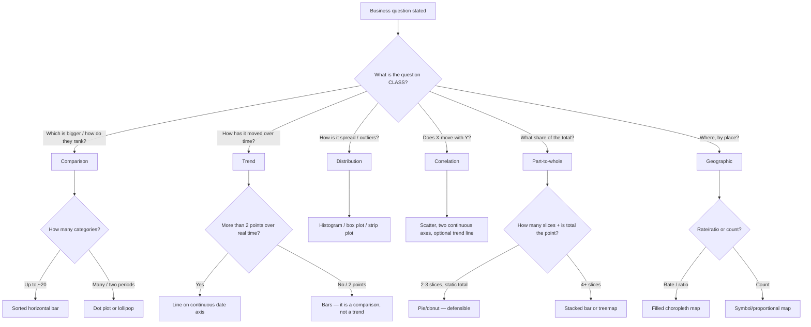
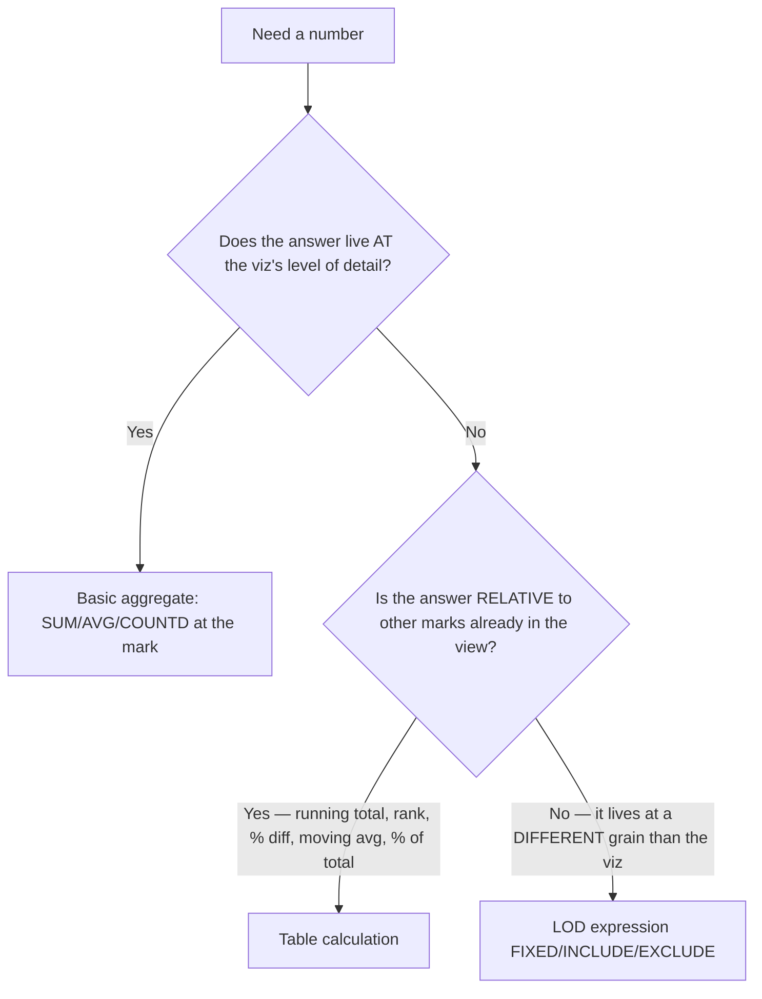
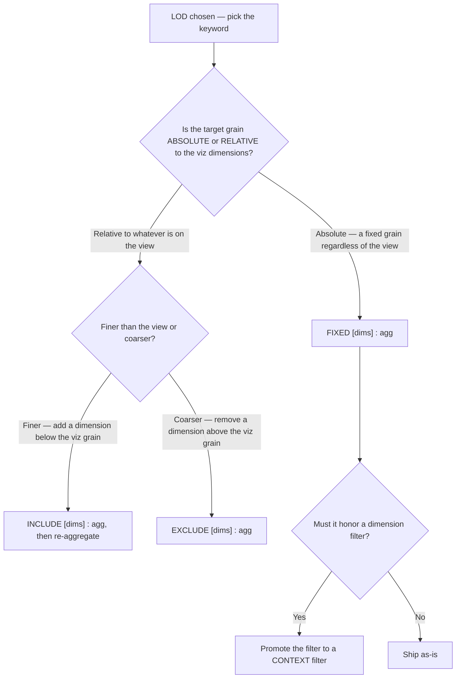
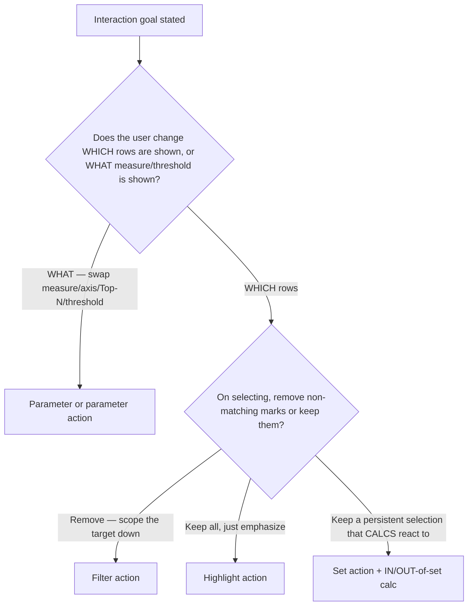

# Viz & calculation decision trees

> Canonical decision trees for the Tableau **viz engineer** craft — chart-type selection, the calc-layer choice (basic aggregate vs LOD vs table calc), the FIXED/INCLUDE/EXCLUDE choice within LODs, and the interactivity-mechanism choice. The agent traverses the matching tree **top-to-bottom before selecting a method** — it does not keyword-match on the user's phrasing. Format follows [`docs/best-practices/decision-trees-in-knowledge-files.md`](../../../docs/best-practices/decision-trees-in-knowledge-files.md).

These trees implement house opinions #1, #3, and #5 from [`../CLAUDE.md`](../CLAUDE.md). Volatile facts carry inline `[verify-at-build]` / `[unverified — training knowledge]` markers per the Capability Grounding Protocol.

---

## Decision Tree: Viz design — Chart type by question class

**When this applies:** The user asks "which chart should I use?" or hands you a measure/dimension set with a business question, and you must pick a mark/encoding. The observable trigger is a stated business question whose *class* (comparison, trend, distribution, correlation, part-to-whole, geographic) can be named.

**Last verified:** 2026-05-30 against Tableau practice + the Cleveland & McGill encoding ranking `[unverified — training knowledge]`.

**Rationale per leaf:**
- *Sorted horizontal bar* — position-along-a-common-scale is the most accurately read encoding; sorting makes rank instant.
- *Dot plot / lollipop* — keeps comparison readable when bars would be too dense or when showing two periods per category.
- *Line on continuous date axis* — a continuous (green) date pill renders time gaps honestly and reads as a trajectory.
- *Bars for 2 points* — two points is a comparison, not a trend; don't imply a trajectory you don't have.
- *Histogram / box / strip* — distribution questions need the *shape*, which a single aggregated bar hides.
- *Scatter* — two continuous axes show co-movement directly; a trend line quantifies it.
- *Pie/donut* — only honest for 2-3 well-separated slices where the *total* is the message.
- *Stacked bar / treemap* — part-to-whole with 4+ pieces; reads far better than many pie slices.
- *Filled (choropleth) map* — encodes a rate/ratio by hue without distorting via area.
- *Symbol map* — encodes a count by size; a fill would let big regions visually dominate counts unfairly.

**Tradeoffs summary table:**

| Leaf | Reading accuracy | Best for | Fails when |
|---|---|---|---|
| Sorted bar | Highest (position/length) | Ranking, comparison | >~20 categories get cramped |
| Dot/lollipop | High | Many categories, 2-period delta | Needs careful sort to read |
| Line (continuous date) | High for trajectory | Trend over real time | ≤2 points; irregular time |
| Histogram/box | High for shape | Distribution, outliers | Audience wants a single number |
| Scatter | High for co-movement | Correlation | Too few points; heavy overplot |
| Stacked bar/treemap | Medium (length/area) | Part-to-whole, 4+ slices | Comparing inner segments precisely |
| Pie/donut | Low (angle/area) | 2-3 slices, total is the point | 4+ slices; precise comparison |
| Filled map | Medium | Rates/ratios by place | Encoding a raw count |
| Symbol map | Medium | Counts by place | Dense overlapping points |

---

## Decision Tree: Calculations — Basic aggregate vs LOD vs table calc

**When this applies:** A number must be computed and you must choose the calc *layer*. Observable trigger: a "wrong total / double-counting" bug, or a new measure whose required grain you can state relative to the view. This is the most consequential calc decision and the source of most wrong-number bugs.

**Last verified:** 2026-05-30 against documented Tableau calculation behavior `[verify-at-build]`.

**Rationale per leaf:**
- *Basic aggregate* — when the question's grain equals the viz's grain, a plain `SUM`/`AVG`/`COUNTD` is correct, simplest, and fastest.
- *Table calculation* — the answer depends on the *other marks already drawn* (their order/position), so it must run after the query, over the rendered table; set addressing/partitioning explicitly.
- *LOD expression* — the answer lives at a grain you can name that differs from the viz (per-customer, per-region-share); LOD computes it independent of the view. Proceed to the FIXED/INCLUDE/EXCLUDE tree.

**Tradeoffs summary table:**

| Leaf | Computes | When correct | Main risk |
|---|---|---|---|
| Basic aggregate | Across rows under the mark | Answer grain = viz grain | Wrong if grain later changes (write aggregate form anyway) |
| Table calc | Over the rendered marks | Answer is relative to other marks | Default addressing silently wrong on layout change |
| LOD | At a named grain, independent of view | Answer grain ≠ viz grain | Forgets it ignores dimension filters (FIXED) |

---

## Decision Tree: LOD — FIXED vs INCLUDE vs EXCLUDE

**When this applies:** You have already decided the answer needs an **LOD** (from the tree above) and must pick the keyword. Observable trigger: you can name the grain the number must compute at and whether it is absolute or relative to the current view.

**Last verified:** 2026-05-30 against documented LOD semantics + order of operations `[verify-at-build]`.

**Rationale per leaf:**
- *FIXED* — computes at the named dimensions only, ignoring the viz; use for per-customer/per-order values that must not move with the view.
- *INCLUDE* — computes at viz dimensions **plus** named ones (finer), then re-aggregates up; use for "average X *per customer*, shown by region."
- *EXCLUDE* — computes at viz dimensions **minus** named ones (coarser); use for "each row's share of its category total."
- *Context filter (FIXED only)* — FIXED is evaluated **after** context filters but **before** dimension (quick) filters, so promote a filter to context when the FIXED number must respect it. `[verify-at-build]`

**Tradeoffs summary table:**

| Leaf | Grain vs view | Filter order interaction | Typical use |
|---|---|---|---|
| FIXED | Absolute, ignores view | After context, before dimension filters | Per-customer lifetime value; first order date |
| INCLUDE | View + extra dims (finer) | After dimension filters | Avg sales per customer shown by region |
| EXCLUDE | View − dims (coarser) | After dimension filters | % of category / share-of-parent |
| Context filter | (modifier on FIXED) | Forces FIXED to honor it | When FIXED must respect a selected filter |

---

## Decision Tree: Interactivity — Which mechanism (filter / highlight / parameter / set action)

**When this applies:** The user wants the dashboard to respond to interaction ("make these views talk", "let me drill", "let the user choose"). Observable trigger: a stated interaction goal you can phrase as "when the user does X, the dashboard should Y."

**Last verified:** 2026-05-30 against documented Tableau action/parameter/set behavior `[verify-at-build]`.

**Rationale per leaf:**
- *Parameter / parameter action* — changes *what* is displayed (the measure, the Top-N, a threshold), not which rows match; a parameter action writes a clicked value into the parameter.
- *Filter action* — removes non-matching marks from the target view; the right tool for drill/scope-down.
- *Highlight action* — preserves full context and emphasizes the selection; use when removing marks would lose the comparison.
- *Set action* — writes the selection into a set so calcs branch on in-vs-out; the only mechanism that expresses "selected vs rest" and proportional brushing.

**Tradeoffs summary table:**

| Leaf | Changes | Keeps context? | Use when | Watch out |
|---|---|---|---|---|
| Parameter | What is shown | n/a | Swap measure / Top-N / threshold | Doesn't filter rows by itself |
| Filter action | Which rows in target | No (removes marks) | Drill / scope down | High-cardinality target re-queries |
| Highlight action | Emphasis only | Yes | Keep all series, draw the eye | Doesn't reduce marks/clutter |
| Set action | Set membership → calcs | Yes (configurable) | Selected-vs-rest, proportional brush | Must design clearing behavior |

> **Security note:** none of these is an access control. Row-level security (user filters, data-policy RLS) is *not* an interactivity choice — it escalates to `ravenclaude-core/security-reviewer` via `tableau-admin`. A hidden filter is never a security boundary.

---

## See also

- [`../best-practices/viz-chart-type-follows-the-question.md`](../best-practices/viz-chart-type-follows-the-question.md)
- [`../best-practices/calc-aggregate-vs-row-level.md`](../best-practices/calc-aggregate-vs-row-level.md)
- [`../best-practices/calc-lod-for-grain-mismatch.md`](../best-practices/calc-lod-for-grain-mismatch.md)
- [`../best-practices/calc-table-calc-addressing-explicit.md`](../best-practices/calc-table-calc-addressing-explicit.md)
- [`../best-practices/viz-actions-and-interactivity.md`](../best-practices/viz-actions-and-interactivity.md)
- [`../agents/tableau-viz-engineer.md`](../agents/tableau-viz-engineer.md) — traverses these trees before selecting a method
