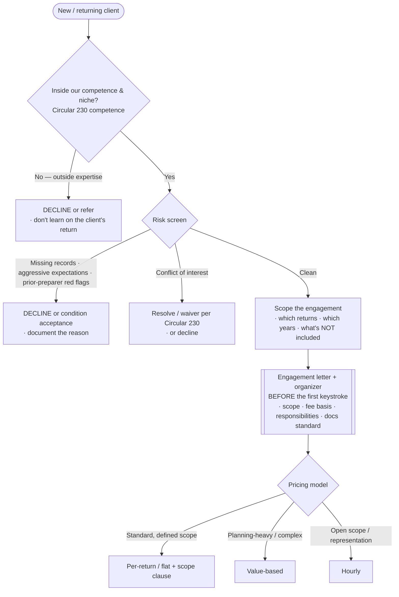
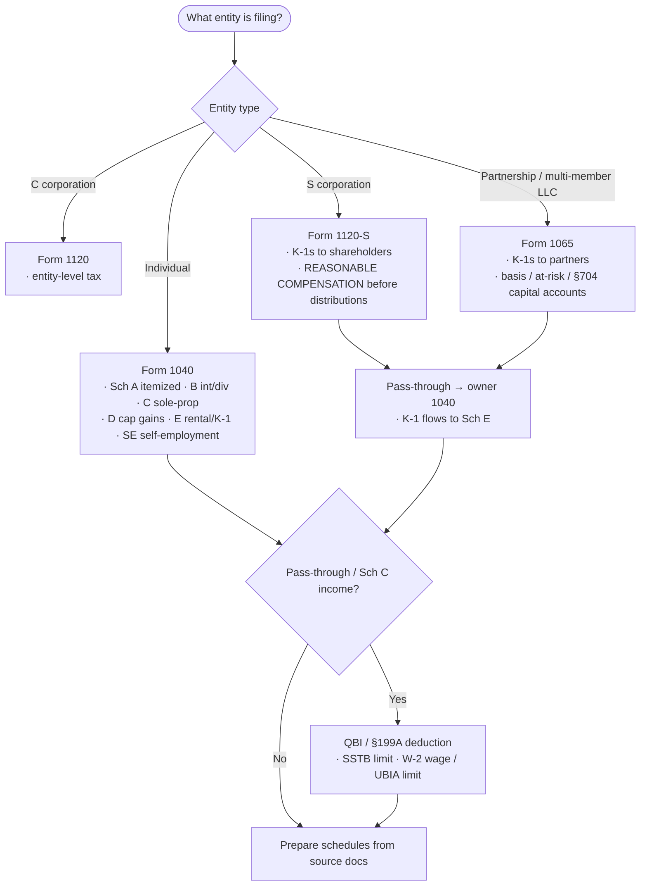
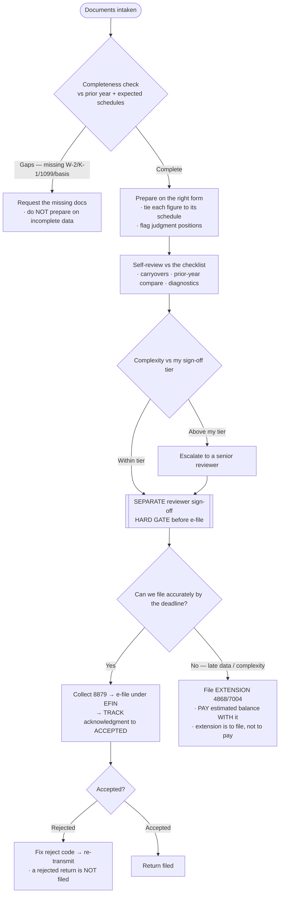
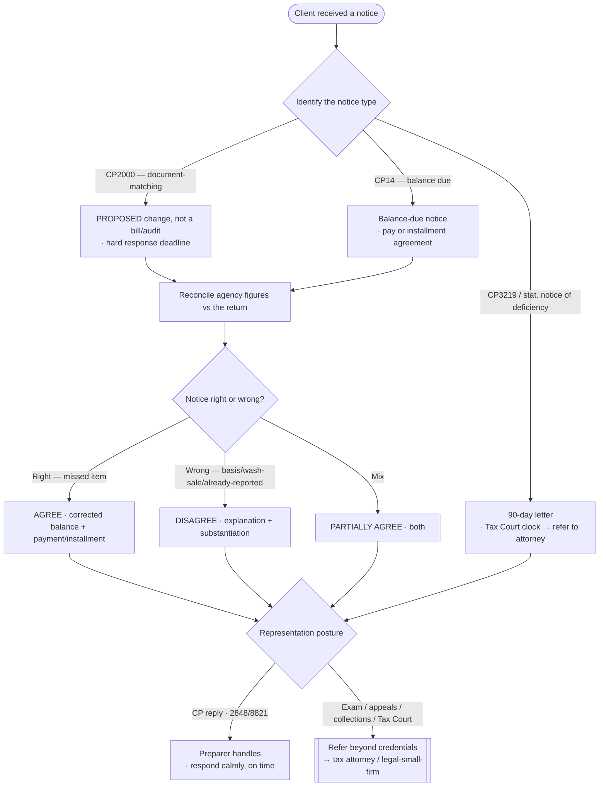
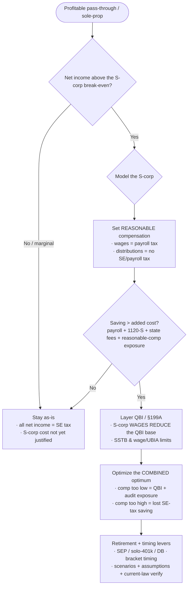

# Knowledge — Tax-preparation-practice decision trees

> **Last reviewed:** 2026-07-17 · **Confidence:** Medium-High (consensus on the engagement-acceptance, entity→form routing, review-gate, extension, and notice-response framings, and on the engagement-letter-before-preparation and separate-eyes-review disciplines; **specific forms, line numbers, dollar thresholds, phase-outs, filing deadlines, and Circular 230 clause numbers are volatile and jurisdiction-specific — re-verify against current IRS/state guidance before filing**).
> The most-asked practice questions are "should we accept this client?", "which form does this entity file?", "who reviews before e-file?", "do we extend?", "how do we answer this notice?", and "should this client be an S-corp?". These are the decision trees the `tax-practice-lead` and `tax-preparation-specialist` traverse **before** accepting an engagement, routing a form, or naming a position, plus the trade-off tables and the seams to adjacent plugins.

The team's discipline: **the engagement letter and organizer come before the first keystroke; review is a separate step by a separate set of eyes; an extension is a tool, not a failure; and a position is defensible before it is aggressive.** This is **not legal, tax, or accounting advice** and does not replace a credentialed preparer — volatile forms/thresholds/deadlines carry a retrieval date and are verified at use. Bookkeeping / monthly-close questions — the *ledger the return sits on* — leave this layer for `accounting-bookkeeping`; investment advisory leaves for `wealth-management-ria`.

---

## Decision Tree 1: engagement accept / decline (screen before the season)

Gate on **competence, niche fit, and risk** — a bad client accepted in January is a liability in April.

---

## Decision Tree 2: entity → form routing

The **entity drives the form**; the **form drives the schedules**. A wrong form is a wrong return.

---

## Decision Tree 3: preparation → review → e-file (the review gate)

**Self-review is not the review gate.** A separate set of eyes signs off before e-file.

---

## Decision Tree 4: IRS / state notice response

**Identify the type and deadline first**; a CP2000 is a *proposed* change, not a bill and not an audit.

---

## Decision Tree 5: entity-choice planning (SE-tax vs S-corp), with QBI

Model the **combined** SE-tax-vs-S-corp trade-off **with** the §199A interaction — not each alone.

---

## Trade-off table — pricing models

| Model | Sweet spot | Watch out for |
|---|---|---|
| **Per-return / flat** | Standard, defined-scope returns; rewards efficiency | Needs a tight scope clause — the quietly-tripling return kills realization |
| **Value-based** | Planning-heavy or high-complexity work | Requires articulating the value; harder to quote up front |
| **Hourly** | Open-scope projects, representation, messy clean-ups | Client wants a cap; discipline the time tracking |
| **Per-form add-on** | Extra schedules beyond the base engagement | Reserve it in the engagement letter or you can't bill it |

## Trade-off table — extension vs rush-to-file

| Choice | Sweet spot | Watch out for |
|---|---|---|
| **File on time** | Complete data, within reviewed-hours | Rushing incomplete/complex work to beat the date → errors, amended returns |
| **Extension (4868 / 7004)** | Late data, high complexity, capacity peak | It's to *file*, not to *pay* — pay the estimated balance with it or interest+penalty run |
| **Amended (1040-X / 1120-X)** | A genuine post-filing correction | Not a substitute for getting it right — flags the return, re-opens the clock |

## Trade-off table — entity choice

| Structure | Sweet spot | Watch out for |
|---|---|---|
| **Sole-prop / single-member LLC** | Low net income; simplicity | All net income hit by SE tax |
| **S-corp (1120-S)** | Net income above the break-even; wages + distribution split | Reasonable-comp exposure; payroll + 1120-S + state cost; wages reduce QBI |
| **Partnership (1065)** | Multiple owners; flexible allocations | SE tax on general partners; basis/at-risk/§704 complexity |
| **C-corp (1120)** | Retained earnings, certain benefits, some scale plays | Double taxation; a bigger, separate analysis — often a `legal-small-firm` seam |

---

## Seams (this team owns the return and the practice, not the whole finance stack)

- **The books / monthly close / write-up / bookkeeping** → `accounting-bookkeeping` (the *ledger* the return is prepared from; tax reads it, doesn't keep it).
- **Investment advisory / financial planning / portfolio** → `wealth-management-ria` (the *investment* side of a plan; tax owns the return).
- **Corporate FP&A / budgeting / the earnings plan** → `finance`.
- **Entity-formation law, a legal opinion, exam/appeals/Tax-Court representation beyond preparer credentials** → `legal-small-firm` (or a tax attorney).
- **Deep AML / BSA / sanctions program** → `regulatory-compliance`.
- **Verifying a volatile claim** (a form, line number, threshold, phase-out, deadline, or Circular 230 clause) → `ravenclaude-core/deep-researcher`.

---

## Provenance

- Durable framings (the engagement-letter-and-organizer-before-preparation discipline, entity→form routing, the separate-eyes review gate, the extension as a load valve, completeness-check-before-prep, identify-notice-type-and-deadline-first, the SE-tax-vs-S-corp-with-QBI combined model, defensible-before-aggressive positions) are consensus US tax-practice practice reviewed 2026-07-17 — **Medium-High confidence**.
- Specific forms, line numbers, dollar thresholds, phase-outs, filing deadlines, safe-harbor percentages, and Circular 230 clause numbers are **volatile and jurisdiction-specific**, carry retrieval dates, and are **not legal/tax/accounting advice** — re-verify with `ravenclaude-core/deep-researcher` and against current IRS/state guidance (and confirm with a credentialed preparer) before filing. _(Reviewed 2026-07-17.)_
