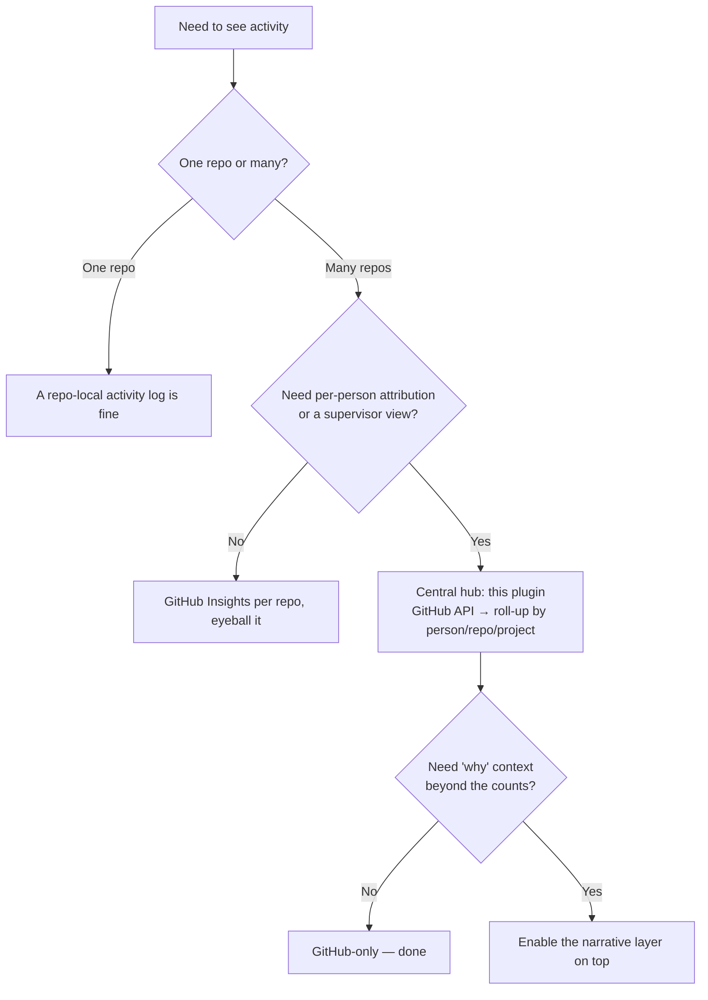

# Multi-repo activity tracking — the model

_Last verified: 2026-06-04. Source: GitHub REST API docs (commits, issues) + this plugin's
implementation._

## The core problem this solves

A team working across sibling repos keeps activity logs / weekly trackers / status docs
**inside one repo**. That repo can't see the others, so the picture is always partial and
the supervisor can't manage across the team. The fix is not "a better log in each repo" —
it's **one hub that reads the one system that already sees every repo and every person:
GitHub**.

## Why GitHub is the source of truth

| Requirement | Why GitHub already satisfies it |
| --- | --- |
| See every repo | The API queries any repo the token can read; no per-repo install. |
| Attribute to each person | Commits/PRs/issues carry the author's login natively. |
| Multi-user, zero effort | Teammates just work normally; nothing to remember to log. |
| Supervisor view | Roll-up across people is a `group by author` over the same data. |

A hand-maintained log is the *optional* narrative layer on top — for the "why" the commits
don't capture — never the primary source.

## Data model

The collector normalizes three GitHub object types into one flat `event` shape so the
report and dashboard never special-case a source:

```
event = {
  type:       "commit" | "pr" | "issue",
  repo:       "owner/name",
  actor:      "<github-login>",
  title:      "<first line / title, truncated>",
  url:        "<html_url>",
  state:      "open" | "closed" | "committed",
  merged:     <bool, PRs only>,
  created_at, updated_at, closed_at: "<ISO-8601>",
  labels:     ["..."],
  project:    "<project name | null>"   # assigned by the matcher
}
```

The artifact (`portfolio-activity.json`) wraps the events with the window, the roster, the
project list, any per-repo errors, and whether the run was authenticated — everything a
renderer needs, nothing it has to re-fetch.

## How the data is gathered (and the boundaries)

- **Commits** — `GET /repos/{owner}/{repo}/commits?since&until`, attributed by `author.login`.
- **PRs + issues in one call** — `GET /repos/{owner}/{repo}/issues?since&state=all`. This
  endpoint returns both; a PR is an issue with a `pull_request` key. Attributed by `user.login`.
- **Pagination** is capped (`MAX_PAGES`) so one busy repo can't run away; the secondary
  rate limit is respected with a short pause near exhaustion.
- **Fail soft per repo** — a 403/404 on one repo (e.g. a private repo the token can't see)
  is recorded in `errors[]` and skipped; the run still produces a report for the rest.

### Known v1 boundaries (deliberate, documented)

- **Reviews are not collected** in v1 (keeps the call budget bounded). A PR review shows up
  only as activity on its PR. Add the `pulls/{n}/reviews` endpoint when review credit matters.
- The `issues?since` filter is **updated-at based**, so an old issue touched in the window
  appears (correct for "what moved this week") — not a created-in-window filter.
- Attribution is by GitHub login. People who commit under multiple logins/emails need each
  login in the roster.

## Decision tree: where should activity tracking live?



The smaller-blast-radius leaf wins: don't stand up a hub for a single repo, and don't add a
narrative layer the team won't maintain.

## Privacy & least privilege

- The token lives in env/secrets, never in `team-portfolio.json`.
- Scope the token read-only to exactly the tracked repos — not org-admin, not write.
- The artifacts contain only what's already visible to anyone with read on those repos
  (titles, authors, links, timestamps). Treat the hub repo's read access accordingly.
