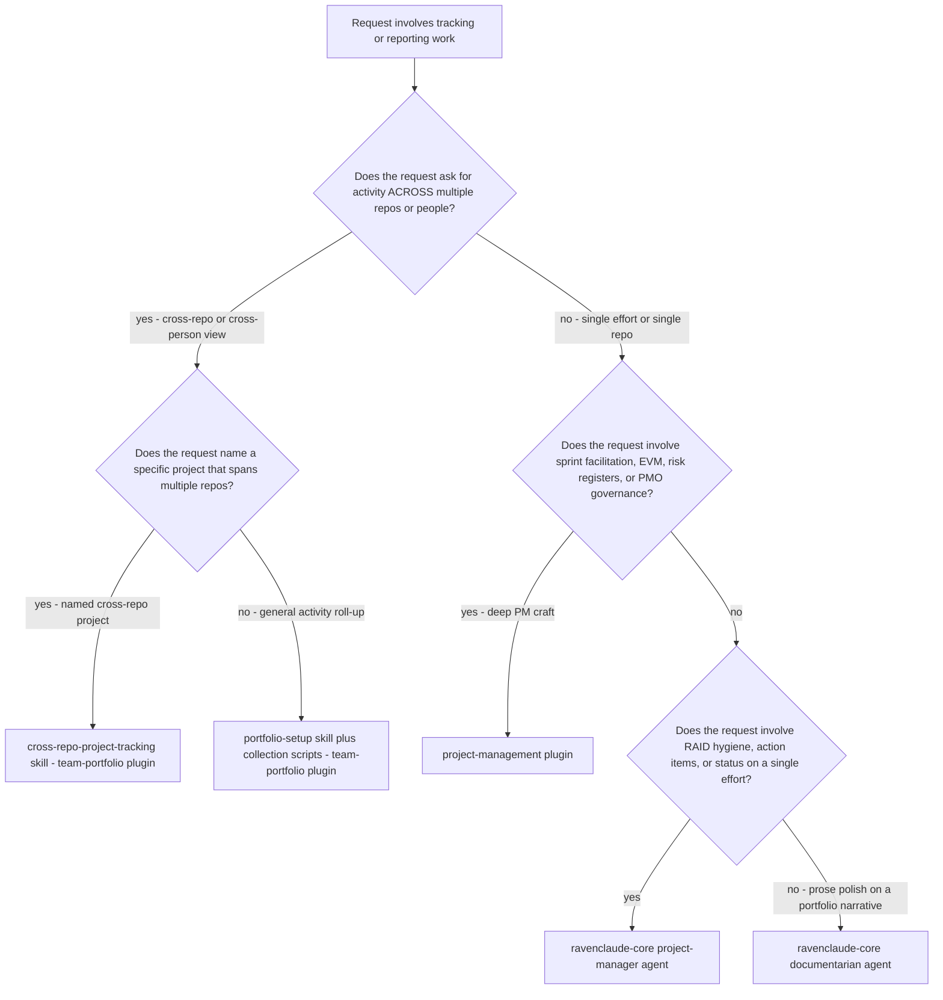
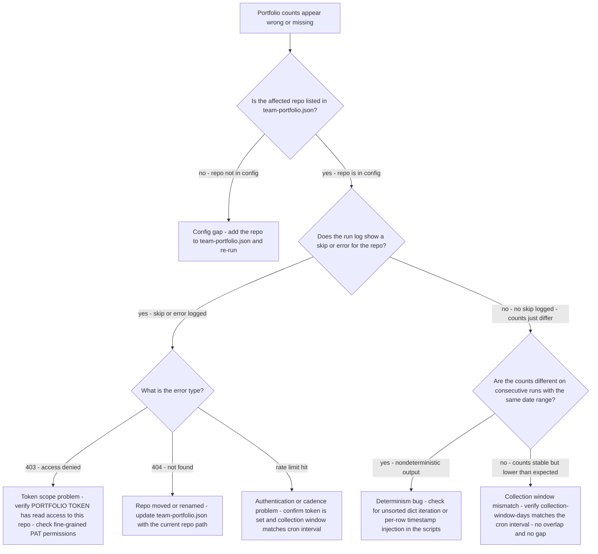
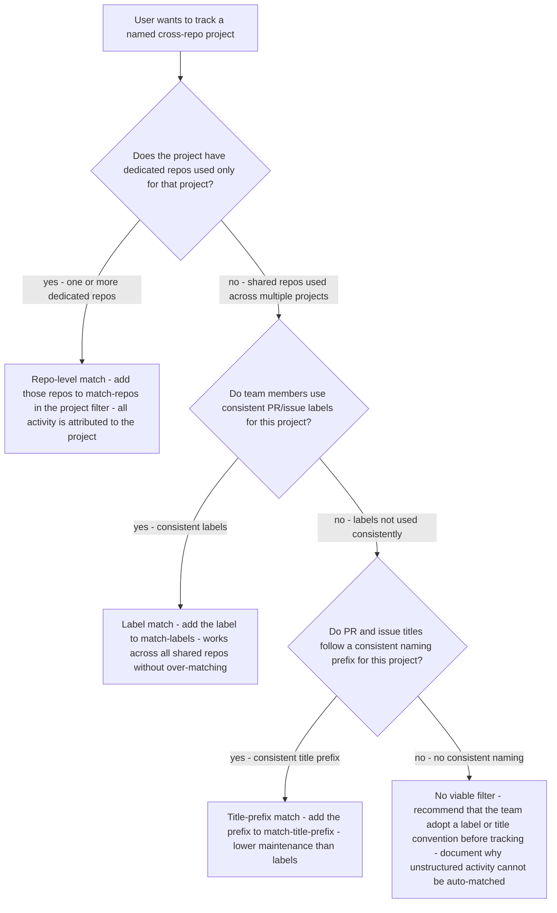

# Team portfolio decision trees

Which approach for which situation — traverse top-to-bottom before picking a method. Last reviewed: 2026-06-05.

## Decision Tree: Routing — This Plugin vs Neighbouring Plugins

**When this applies:** A request arrives that involves tracking, reporting, or managing work across repos or people. The agent needs to decide whether to use the `team-portfolio` plugin's skills, the `cross-repo-project-tracking` skill, the `project-management` plugin, or `ravenclaude-core/project-manager`. The wrong route produces the wrong deliverable.

**Last verified:** 2026-06-05 against `team-portfolio` CLAUDE.md §3 routing rules and §8 seams.

**Rationale per leaf:**
- *cross-repo-project-tracking* — a named project spanning multiple repos needs the filter-based tracking model, not just raw activity counts.
- *portfolio scripts* — an undifferentiated cross-repo roll-up is the base collection use case for this plugin.
- *project-management plugin* — deep PM craft (predictive baselines, EVM, scored risk) belongs to the specialist plugin that carries PMBOK/Agile canon.
- *ravenclaude-core project-manager* — RAID/status hygiene on a single effort is the core agent's lane; it does not require the deep PM plugin.
- *documentarian* — prose polish on a generated report is a writing task, not a tracking task.

**Tradeoffs summary:**

| Method | Cost / time | What you get | Use when |
|---|---|---|---|
| cross-repo-project-tracking skill | Minutes to configure | Project-attributed activity with filter-defined scope | Named effort spanning repos |
| portfolio scripts | Minutes to run | Raw cross-repo activity counts by person/repo | Weekly supervisor view |
| project-management plugin | Deeper engagement | EVM, sprint plan, scored risk register | Running or governing a project |
| ravenclaude-core project-manager | Minutes to hours | RAID log, action items, status hygiene | Single effort, hygiene focus |

## Decision Tree: Collection Problem — Diagnose Why Counts Are Wrong

**When this applies:** The portfolio output is missing repos, showing zero counts for known activity, or showing different counts on consecutive runs with the same time window. The agent needs to identify the root cause before recommending a fix.

**Last verified:** 2026-06-05 against GitHub API behavior and `team-portfolio` script architecture.

**Rationale per leaf:**
- *Config gap* — the most common cause; the repo was added to the team but not to the config.
- *Token scope* — fine-grained PATs scope permissions per repo; a new repo may need an explicit grant.
- *Repo renamed* — GitHub redirects API calls to renamed repos, but the config path needs updating for clarity and correctness.
- *Rate limit* — an unauthenticated or misconfigured run hits the rate limit and skips the tail of the repo list.
- *Determinism bug* — nondeterministic output on identical inputs indicates a sorting or timestamp injection problem in the scripts.
- *Window mismatch* — a `collection_window_days` shorter than the cron interval creates gaps; longer creates double-counting.

**Tradeoffs summary:**

| Root cause | Fix effort | Impact if unfixed | Detectability |
|---|---|---|---|
| Config gap | Minutes | Missing repo entirely | Obvious - known repo absent |
| Token scope 403 | Minutes - PAT update | Repo skipped with error | Error log present |
| Repo renamed 404 | Minutes - config update | Repo skipped with error | Error log present |
| Rate limit | Minutes - add token | Tail repos silently skipped | Warning banner if surfaced |
| Determinism bug | Hours - script fix | Unstable diffs and caching | Only visible on re-run |
| Window mismatch | Minutes - config update | Gaps or double-counts | Subtle - needs manual check |

## Decision Tree: Project Filter Design — How to Define a Cross-Repo Project

**When this applies:** A user wants to track a named project (e.g., "Website Redesign", "API v2") that spans work across multiple repos. The agent needs to recommend a filter strategy that will capture the right events without over-matching (pulling in unrelated activity) or under-matching (missing project work).

**Last verified:** 2026-06-05 against `team-portfolio` cross-repo-project-tracking skill and filter evaluation model.

**Rationale per leaf:**
- *Repo-level match* — the cleanest filter; when a repo is dedicated to the project, 100% of its activity is attributable and no per-item discipline is needed from the team.
- *Label match* — reliable when the team applies labels consistently; requires labeling discipline but does not require title changes.
- *Title-prefix match* — the lowest-friction option for teams that don't use labels; a `[website]` prefix is easy to adopt and easy to scan.
- *No filter* — tracking unstructured activity produces noise, not insight; the honest recommendation is to establish a naming convention first.

**Tradeoffs summary:**

| Filter type | Team discipline required | Over-match risk | Under-match risk | Use when |
|---|---|---|---|---|
| Repo-level | None - automatic | Low if repos are dedicated | Low | Project has dedicated repos |
| Label match | Labeling every PR/issue | Low | Medium - unlabeled items missed | Shared repos, label discipline exists |
| Title prefix | Prefixing every PR/issue title | Low | Medium - unprefixed items missed | Shared repos, no label habit |
| No filter | N/A | N/A | N/A | Avoid - recommend convention first |
