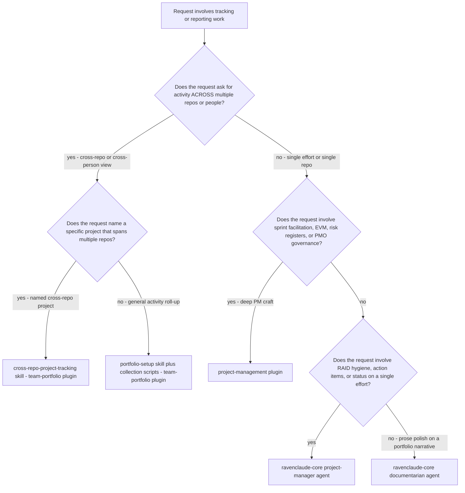
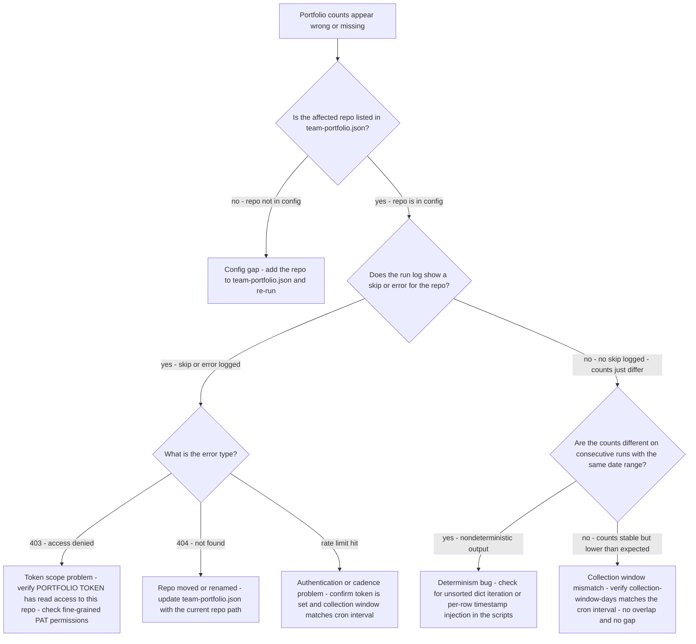
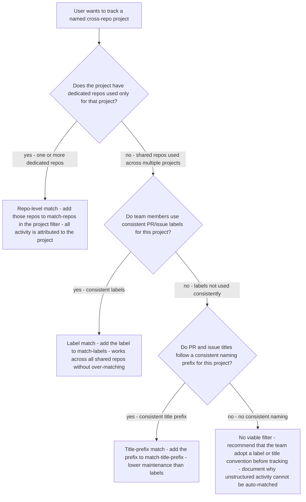
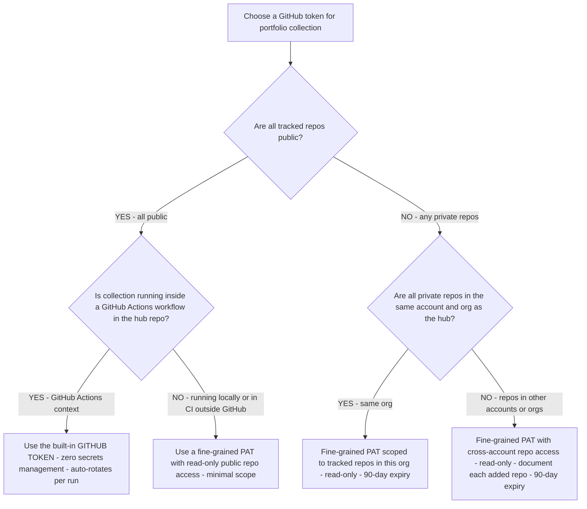
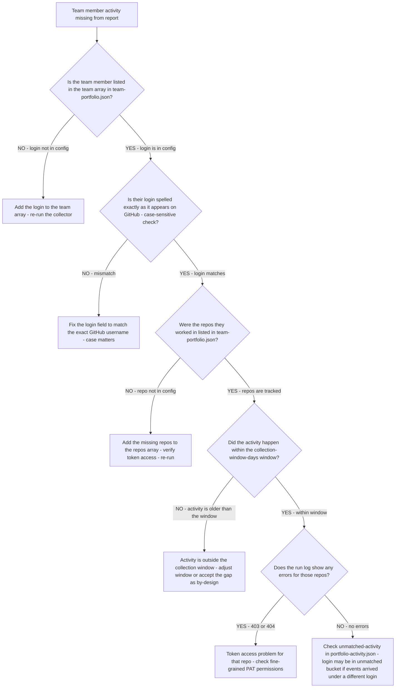
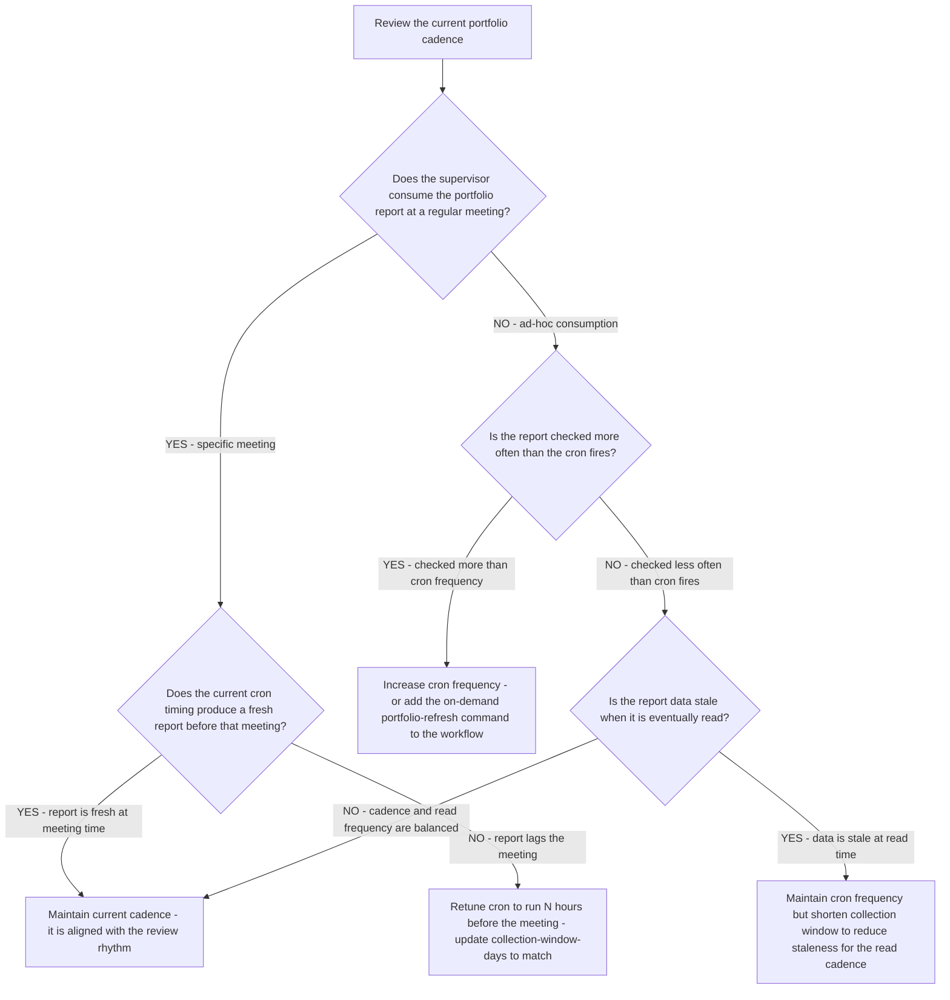
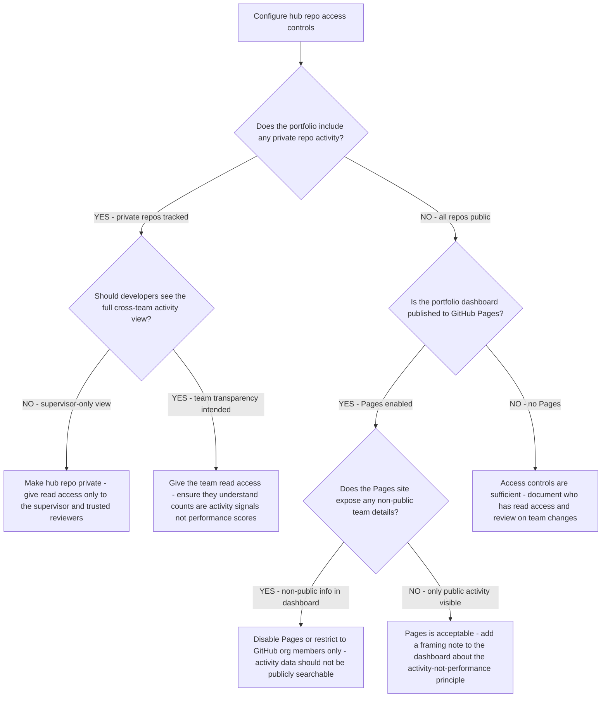
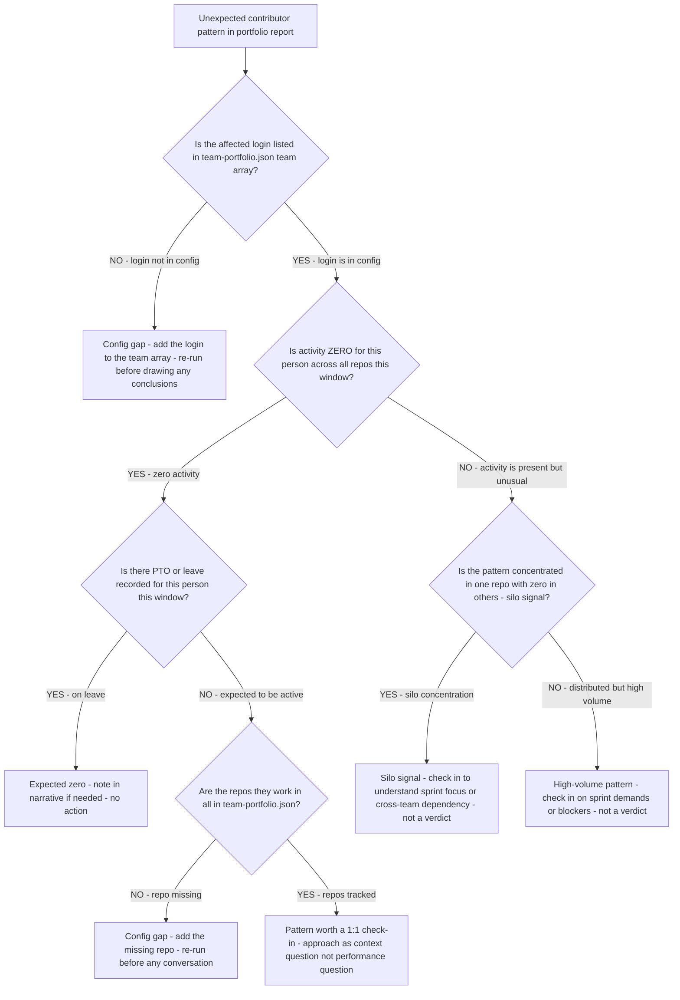

# Team portfolio decision trees

Which approach for which situation — traverse top-to-bottom before picking a method. Last reviewed: 2026-06-05.

## Decision Tree: Routing — This Plugin vs Neighbouring Plugins

**When this applies:** A request arrives that involves tracking, reporting, or managing work across repos or people. The agent needs to decide whether to use the `team-portfolio` plugin's skills, the `cross-repo-project-tracking` skill, the `project-management` plugin, or `ravenclaude-core/project-manager`. The wrong route produces the wrong deliverable.

**Last verified:** 2026-06-05 against `team-portfolio` CLAUDE.md §3 routing rules and §8 seams.

**Rationale per leaf:**
- *cross-repo-project-tracking* — a named project spanning multiple repos needs the filter-based tracking model, not just raw activity counts.
- *portfolio scripts* — an undifferentiated cross-repo roll-up is the base collection use case for this plugin.
- *project-management plugin* — deep PM craft (predictive baselines, EVM, scored risk) belongs to the specialist plugin that carries PMBOK/Agile canon.
- *ravenclaude-core project-manager* — RAID/status hygiene on a single effort is the core agent's lane; it does not require the deep PM plugin.
- *documentarian* — prose polish on a generated report is a writing task, not a tracking task.

**Tradeoffs summary:**

| Method | Cost / time | What you get | Use when |
|---|---|---|---|
| cross-repo-project-tracking skill | Minutes to configure | Project-attributed activity with filter-defined scope | Named effort spanning repos |
| portfolio scripts | Minutes to run | Raw cross-repo activity counts by person/repo | Weekly supervisor view |
| project-management plugin | Deeper engagement | EVM, sprint plan, scored risk register | Running or governing a project |
| ravenclaude-core project-manager | Minutes to hours | RAID log, action items, status hygiene | Single effort, hygiene focus |

## Decision Tree: Collection Problem — Diagnose Why Counts Are Wrong

**When this applies:** The portfolio output is missing repos, showing zero counts for known activity, or showing different counts on consecutive runs with the same time window. The agent needs to identify the root cause before recommending a fix.

**Last verified:** 2026-06-05 against GitHub API behavior and `team-portfolio` script architecture.

**Rationale per leaf:**
- *Config gap* — the most common cause; the repo was added to the team but not to the config.
- *Token scope* — fine-grained PATs scope permissions per repo; a new repo may need an explicit grant.
- *Repo renamed* — GitHub redirects API calls to renamed repos, but the config path needs updating for clarity and correctness.
- *Rate limit* — an unauthenticated or misconfigured run hits the rate limit and skips the tail of the repo list.
- *Determinism bug* — nondeterministic output on identical inputs indicates a sorting or timestamp injection problem in the scripts.
- *Window mismatch* — a `collection_window_days` shorter than the cron interval creates gaps; longer creates double-counting.

**Tradeoffs summary:**

| Root cause | Fix effort | Impact if unfixed | Detectability |
|---|---|---|---|
| Config gap | Minutes | Missing repo entirely | Obvious - known repo absent |
| Token scope 403 | Minutes - PAT update | Repo skipped with error | Error log present |
| Repo renamed 404 | Minutes - config update | Repo skipped with error | Error log present |
| Rate limit | Minutes - add token | Tail repos silently skipped | Warning banner if surfaced |
| Determinism bug | Hours - script fix | Unstable diffs and caching | Only visible on re-run |
| Window mismatch | Minutes - config update | Gaps or double-counts | Subtle - needs manual check |

## Decision Tree: Project Filter Design — How to Define a Cross-Repo Project

**When this applies:** A user wants to track a named project (e.g., "Website Redesign", "API v2") that spans work across multiple repos. The agent needs to recommend a filter strategy that will capture the right events without over-matching (pulling in unrelated activity) or under-matching (missing project work).

**Last verified:** 2026-06-05 against `team-portfolio` cross-repo-project-tracking skill and filter evaluation model.

**Rationale per leaf:**
- *Repo-level match* — the cleanest filter; when a repo is dedicated to the project, 100% of its activity is attributable and no per-item discipline is needed from the team.
- *Label match* — reliable when the team applies labels consistently; requires labeling discipline but does not require title changes.
- *Title-prefix match* — the lowest-friction option for teams that don't use labels; a `[website]` prefix is easy to adopt and easy to scan.
- *No filter* — tracking unstructured activity produces noise, not insight; the honest recommendation is to establish a naming convention first.

**Tradeoffs summary:**

| Filter type | Team discipline required | Over-match risk | Under-match risk | Use when |
|---|---|---|---|---|
| Repo-level | None - automatic | Low if repos are dedicated | Low | Project has dedicated repos |
| Label match | Labeling every PR/issue | Low | Medium - unlabeled items missed | Shared repos, label discipline exists |
| Title prefix | Prefixing every PR/issue title | Low | Medium - unprefixed items missed | Shared repos, no label habit |
| No filter | N/A | N/A | N/A | Avoid - recommend convention first |

## Decision Tree: Token provisioning — which token type for which setup?

**When this applies:** A team is setting up the portfolio hub for the first time or rotating the token, and needs to decide which GitHub token type to provision for the collection scripts. Observable inputs: whether tracked repos are public or private, whether repos are in the same account/org as the hub, and whether a GitHub Actions context is available.

**Last verified:** 2026-06-05 against `team-portfolio` CLAUDE.md §4 house opinion #3 (least privilege) and the `portfolio-setup` skill Step 2.

**Rationale per leaf:**
- *Built-in token* — the zero-maintenance option; scoped to the current repo only, which is sufficient when all tracked repos are public (GitHub API read is public for public repos).
- *Fine-grained PAT (all public)* — when running outside GitHub Actions, a fine-grained PAT with minimal public-read scope is the least-privilege option; no write or admin scope needed.
- *Fine-grained PAT (same org)* — private repos require explicit token permission; fine-grained PATs let you scope to exactly the repos in `team-portfolio.json`, nothing more.
- *Fine-grained PAT (cross-account)* — same as same-org but requires individual repo grants on each cross-account private repo; document each grant for the access-review skill.

**Tradeoffs summary:**

| Token type | Rotation needed | Scope granularity | Setup effort | Use when |
|---|---|---|---|---|
| Built-in GITHUB_TOKEN | None - auto | Current repo only | None | All public repos + Actions context |
| Fine-grained PAT (public) | 90-day expiry | Repo-level | Low | Running outside Actions |
| Fine-grained PAT (same org) | 90-day expiry | Per-repo read | Low | Private repos, same org |
| Fine-grained PAT (cross-account) | 90-day expiry | Per-repo read per account | Medium | Private repos, multiple accounts |

## Decision Tree: Report output is missing a team member — what went wrong?

**When this applies:** A specific team member's activity is absent or unusually low in the portfolio report, even though the supervisor believes the person was active in one or more tracked repos during the window. Observable inputs: the team member's GitHub login, the repos they were expected to be active in, and the current `team` config in `team-portfolio.json`.

**Last verified:** 2026-06-05 against `team-portfolio` script architecture and config model.

**Rationale per leaf:**
- *Config gap (team)* — most common cause; the person joined the team but was not added to the config.
- *Login mismatch* — GitHub logins are case-sensitive in some contexts; `AliceC` and `alicec` may not match.
- *Repo gap* — the person worked in a repo not yet in the config; same fix as the config-gap rule.
- *Window gap* — the activity predates the collection window; this is by-design behavior, not a bug.
- *Token scope* — a new repo may have been added to the config but not to the token's permission list.
- *Unmatched bucket* — the login exists under a different string in the commit/PR author; check the unmatched activity events for the expected contributor.

## Decision Tree: Cadence review — is the current schedule still right for this team?

**When this applies:** A supervisor wants to review whether the portfolio's current collection schedule and report format are still serving the team's needs, or when the team's rhythm has changed (new sprint cadence, team growth, different review meeting).

**Last verified:** 2026-06-05 against `team-portfolio` CLAUDE.md §4 house opinion and the `report-cadence-tuning` skill.

**Rationale per leaf:**
- *Maintain* — when the cron aligns with the review meeting and the window matches the interval, no change is needed.
- *Retune timing* — shifting the cron to run a few hours before the standing meeting ensures the report is always current for the review.
- *Increase frequency* — if the supervisor checks the report ad-hoc between scheduled runs, an on-demand command or more frequent cron is a better fit than the current schedule.
- *Maintain frequency with shorter window* — a team that reads the report less frequently than it runs might prefer a shorter window per run to reduce the volume of data per report, while still running on the same schedule.

## Decision Tree: Hub repo access control — who can see what?

**When this applies:** A team is setting up the hub repo for the first time, or a security reviewer is auditing who has access to the portfolio reports. The hub repo contains activity data about team members and their work; access should be scoped appropriately.

**Last verified:** 2026-06-05 against `team-portfolio` CLAUDE.md §4 house opinion #2 and #3, and the `portfolio-access-review` skill.

**Rationale per leaf:**
- *Private hub* — when private repo activity is in scope and the team doesn't need to see the cross-repo supervisor view, a private hub with restricted read access is the safest default.
- *Team read* — a transparent team culture may benefit from everyone seeing the cross-repo activity view; include the activity-not-performance framing prominently.
- *Restrict Pages* — a GitHub Pages site publishing a portfolio dashboard is publicly searchable; activity data about team members should not be in a public search index.
- *Pages OK* — if the dashboard contains only public repository activity and no personal activity data, public Pages is acceptable with the appropriate framing note.

**Tradeoffs summary:**

| Access pattern | Privacy protection | Team transparency | Use when |
|---|---|---|---|
| Private hub - supervisor only | High | None | Private repos; supervisor-only view |
| Private hub - team read | Medium | Full | Team prefers transparency |
| Public hub | Low | Full | All public repos; activity data non-sensitive |
| Pages - org-only | Medium | Org members | Public repos; prefer searchability restriction |

## Decision Tree: Contributor analysis — pattern worth a conversation or a config gap?

**When this applies:** The portfolio report shows an unexpected contributor pattern — zero activity, unusually high activity in a single repo, or activity under an unrecognised login — and the supervisor or agent needs to decide whether the pattern reflects real team behaviour or a configuration gap before taking any action. Reaching for a conversation before ruling out a config gap wastes a 1:1 on a false alarm.

**Last verified:** 2026-06-05 against `team-portfolio` `cross-team-contributor-analysis` skill and CLAUDE.md §5 anti-patterns.

**Rationale per leaf:**
- *Config gap (person)* — a missing login means the person's activity is in the unmatched bucket; no conversation should happen until the config is correct.
- *Expected zero* — leave or PTO is a complete explanation; no action needed beyond an optional narrative note for the supervisor's context.
- *Config gap (repo)* — zero activity may mean the person is working in a repo not yet tracked; fix the config, verify, then decide whether a conversation is warranted.
- *Worth a check-in* — after all config explanations are ruled out, zero activity is a genuine signal worth a 1:1; approach it as "I wanted to check in — is there anything blocking you?" not "your activity is low."
- *Silo signal* — high concentration in one repo may be sprint-appropriate or may indicate a blocked dependency in other areas; a conversation clarifies which.
- *High-volume* — unusually high counts can mean a big sprint push or a stressful crunch; check in on capacity, not output.

**Tradeoffs summary:**

| Pattern | First action | Conversation needed? | What to ask |
|---|---|---|---|
| Zero activity, not in config | Fix config | No | N/A |
| Zero activity, on leave | Note in narrative | No | N/A |
| Zero activity, repo missing | Fix config + re-run | Maybe | Check after re-run |
| Zero activity, unexplained | Check-in | Yes | Blockers or context? |
| Silo concentration | Check-in | Yes | Sprint focus or dependency? |
| High volume | Check-in | Yes | Capacity and sustainability? |
