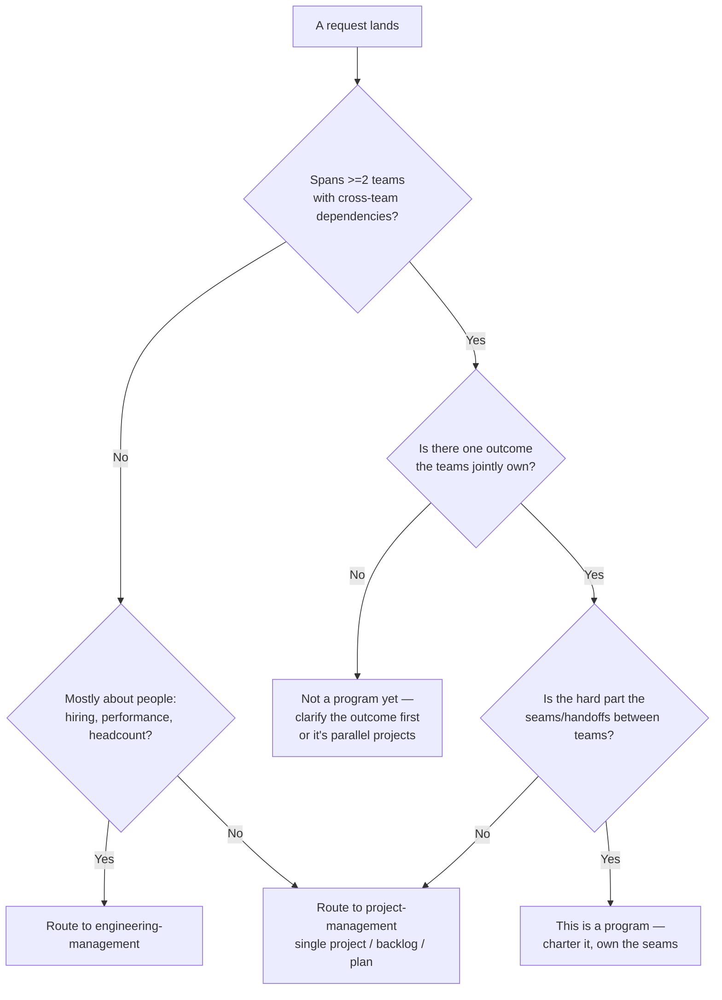
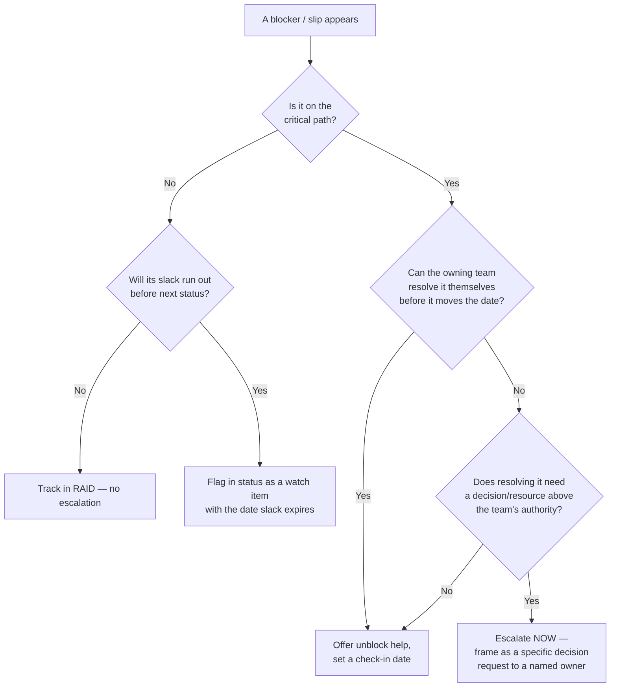
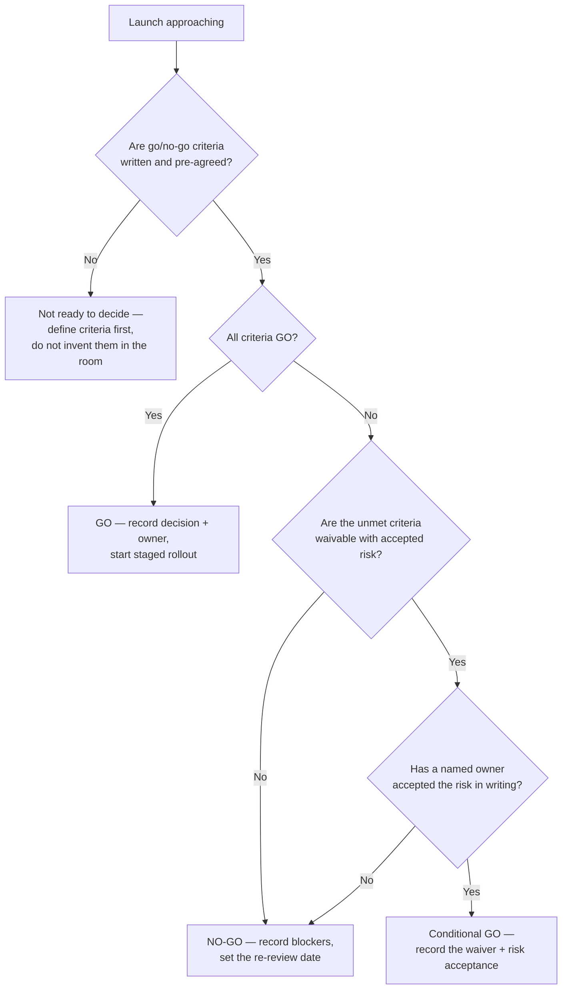

# TPM engagement decision trees

Traverse these top-to-bottom before picking a move. They keep this team from
absorbing work that belongs to a PM or EM, and from escalating (or launching) on
mood instead of criteria.

## 1. Is this a program (TPM), a project (PM), or people (EM)?

**Rule:** the TPM earns the work only when the difficulty is the *cross-team
coordination*. A big single-team effort is still a project. A pile of unrelated
team work sharing a deadline is not a program until someone names the joint
outcome.

## 2. Escalate or not?

**Rule:** escalation is framed as a *decision request* ("I need X to choose
between A and B by Friday or we slip two weeks"), never as a complaint. Early is
leadership; late is a postmortem.

## 3. Go / no-go

**Rule:** a launch decision is only as good as its written criteria. No criteria →
no decision, only an accident waiting for a retro. Every waiver has an owner who
accepted the risk on the record.
