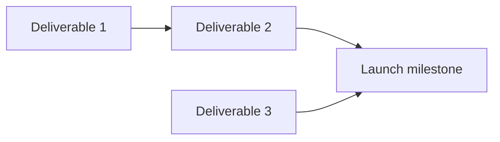

# Dependency map: <program name>

> Built around the seams, not the tasks. Every cross-team handoff gets a producer,
> consumer, due date, and interface contract. See the
> [`dependency-mapping`](../skills/dependency-mapping/SKILL.md) skill.

## Cross-team deliverables

| # | Deliverable | Producer team | Consumer team | Due | Interface contract (schema/API/event/doc) | Status |
| - | ----------- | ------------- | ------------- | --- | ----------------------------------------- | ------ |
| 1 |             |               |               |     |                                           |        |

## Dependency graph

## Critical path

> The longest chain of gated handoffs — this chain *is* the date.

`D1 → D2 → D4` (example). Total: **\_\_** days.

## Slack on non-critical chains

| Chain | Slack (days) | Watch date (when slack runs out) |
| ----- | ------------ | -------------------------------- |
|       |              |                                  |

## Flags

- **Cycles** (break with stub/phased contract):
- **Single points of failure** (one under-resourced team on the critical path):
- **Unowned interface seams** (route to TPM to assign an owner):
