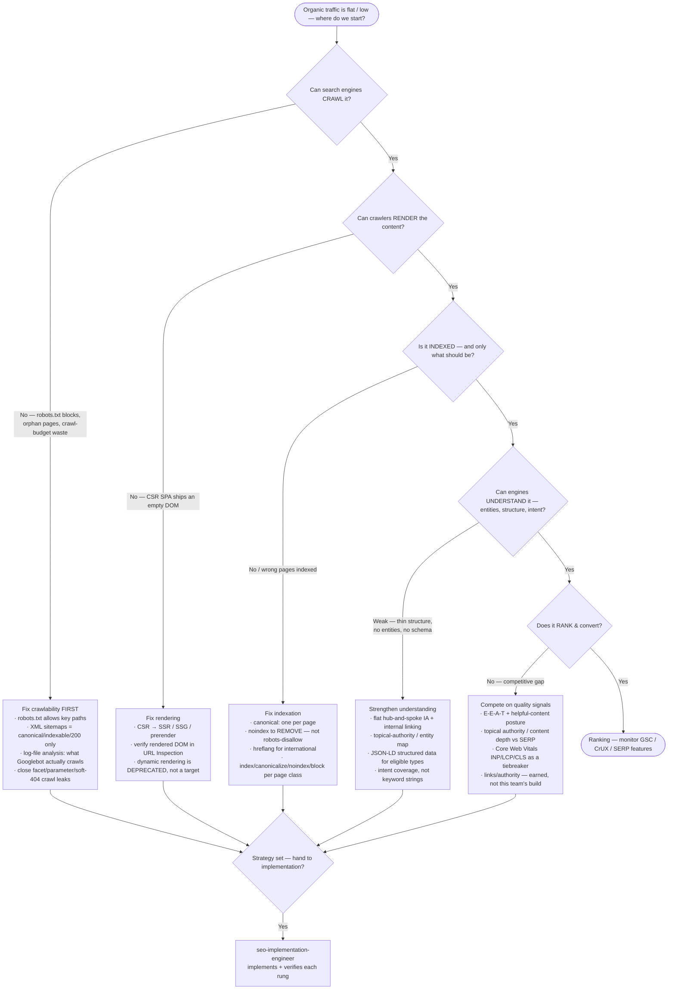

# Knowledge — SEO strategy decision tree

> **Last reviewed:** 2026-07-09 · **Confidence:** Medium-High (consensus on the crawl→render→index→understand→rank ladder, the indexation-strategy framing, and where architecture / content-model / E-E-A-T each fit; **specific Google ranking-signal weightings, SERP-feature behavior, rich-result eligibility, and tool pricing are volatile — re-verify before a client commitment**).
> The most-asked SEO question is "our organic traffic is flat — where do we start?". This is the decision tree the `seo-strategy-architect` traverses **before** prescribing a tactic, plus the trade-off table, the "what should we index" sub-choice, and the seams to adjacent plugins.

The agent's discipline: **diagnose the binding rung first (crawl / render / index / understand / rank), prescribe the tactic second.** Internal site-search relevance — ranking inside the site's *own* search box — is **not** technical SEO; it leaves this layer for `search-relevance-engineering`. Paid campaigns leave for `marketing-operations`; the visual site build leaves for `web-design`.

---

## Decision Tree: what to fix first

Traverse top-to-bottom. A page can't rank if it can't be understood, can't be understood if it isn't indexed, isn't indexed if it can't be rendered, can't be rendered if it isn't crawled. **Fix the lowest broken rung first** — effort spent on a higher rung while a lower one is broken is wasted.

---

## Trade-off table — the five rungs

| Rung | The binding question | Highest-leverage move | Watch out for |
|---|---|---|---|
| **Crawl** | Can Googlebot reach the URLs at all? | robots.txt + clean XML sitemaps + a log-file read; close crawl-budget leaks | Crawl budget matters at scale (100k+ URLs); on small sites it's rarely the constraint — don't over-invest |
| **Render** | Does the crawler see the content or an empty shell? | SSR/SSG for content that must rank; verify rendered DOM | Assuming Google "runs the JS fine" — it renders on a delay/budget; CSR content can go unseen |
| **Index** | Is the right set of pages in the index — and only it? | Per-page-class index/canonical/noindex/block strategy | Confusing robots-disallow with noindex; indexing faceted/duplicate/thin URLs |
| **Understand** | Can engines map the page to entities & intent? | Flat IA + internal linking + topical map + JSON-LD | Schema that doesn't match visible content (manual-action risk); keyword pages with no topic depth |
| **Rank** | Does it beat the competition on quality signals? | E-E-A-T/helpful-content + topical authority + CWV tiebreaker | Treating CWV or schema as a magic ranking lever; ignoring genuine content-quality gaps |

> **Volatile:** Google's ranking-signal weightings, helpful-content/core-update behavior, SERP-feature triggering, rich-result eligibility, and every tool's pricing change frequently. Treat the guidance above as a 2026-07 snapshot and re-verify with `ravenclaude-core/deep-researcher` before a client commitment.

---

## "What should we index" sub-choice (the indexation strategy)

Most sites index far too much and bleed crawl budget + dilute relevance. Decide per **page class**:

- **Index** — unique, valuable, intent-matching pages (money pages, pillar/cluster content). The pages you *want* to rank.
- **Canonicalize** — near-duplicates and variants (parameterized, print, cross-listed) that should consolidate signals to one canonical URL. Not removal — consolidation.
- **Noindex (follow)** — real pages with no search value (thin tag/author archives, internal search results, thank-you pages). Removed from the index, still crawlable so links flow.
- **Block (robots.txt disallow)** — crawl traps you never want fetched (infinite facet combinations, staging, admin). Note: a blocked URL **cannot** be crawled to *see* a noindex — so never block a page you're trying to de-index; noindex it and leave it crawlable until it drops, then optionally block.

Cross-cut with **crawl budget**: at scale, every wasted crawl on a facet/parameter/soft-404 URL is a crawl not spent on a money page.

---

## Seams (technical SEO is the organic-search-engineering layer, not everything adjacent)

- **Internal site-search relevance** — ranking/tuning results inside the site's *own* search box → `search-relevance-engineering` (distinct from "does Google rank us").
- **The full website build / visual design / components** → `web-design` (this team specifies the SEO requirements the build must honor; it doesn't build the site).
- **Paid ads / campaign strategy / audience buying** → `marketing-operations` (organic ≠ paid).
- **Writing the actual content / docs** → `technical-writing-docs` (this team sets the content model + E-E-A-T posture; the words are theirs).
- **Deep front-end performance beyond Core Web Vitals** → `performance-engineering`.
- **Analytics/event instrumentation to measure organic behavior** → `martech-event-instrumentation`.

---

## Provenance

- The crawl→render→index→understand→rank ladder, the indexation-strategy framing (index/canonicalize/noindex/block), flat hub-and-spoke IA + internal linking, topical authority vs keyword targeting, and E-E-A-T/helpful-content as quality signals are consensus practice across the technical-SEO literature and Google Search Central documentation, reviewed 2026-07-09 — **Medium-High confidence**.
- Google-specific claims — dynamic rendering deprecation, INP replacing FID as a Core Web Vitals metric (2024), rich-result eligibility, helpful-content/core-update behavior, SERP-feature triggering — are **volatile**; treat as a 2026-07 snapshot and re-verify with `ravenclaude-core/deep-researcher` before quoting to a client.
