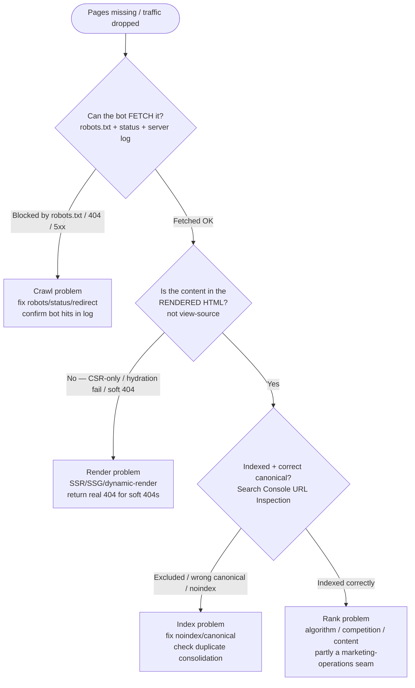
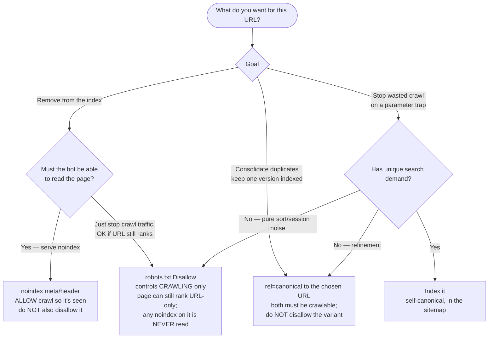

# Technical SEO Engineering — Decision Trees

> Reference decision trees for the `technical-seo-engineering` team. Agents **traverse the relevant tree top-to-bottom before choosing** (the proactive complement to the Capability Grounding Protocol). Each `## Decision Tree` section is a Mermaid graph plus the rule it encodes.
>
> _Last reviewed: 2026-06-25 by `claude`. Principles are durable; volatile specifics (CWV thresholds, Googlebot behavior, tool names) live (dated) in [`technical-seo-engineering-reference-2026.md`](technical-seo-engineering-reference-2026.md) — re-verify before quoting._

---

## Decision Tree: is this a crawl problem or an index problem? (drop triage)

**When this applies:** organic traffic or indexed-page count dropped, or a page "isn't showing up." Isolate the layer **before** proposing a fix — most "SEO drops" are misdiagnosed at the wrong layer.

**Rule:** crawl → render → index → rank, in that order. Each layer is checked with hard evidence (robots.txt + HTTP status + server log for crawl; rendered HTML for render; Search Console URL Inspection for index). Don't jump to "it's a ranking change" — that's the layer people skip to and it's usually wrong. A page can be crawlable but not rendered, rendered but not indexed, indexed but not ranking — different problems, different owners.

---

## Decision Tree: noindex vs robots-disallow vs canonical — which signal?

**When this applies:** you have a set of URLs (filtered/faceted, duplicate, thin, paginated, private) and must decide how to treat them for indexing. These three tools are **not interchangeable** — the most common own-goal is combining them wrongly.

**Rule:**

- **`noindex`** removes a page from the index but **requires the page to be crawlable** to be seen. Serve it as a meta tag or `X-Robots-Tag` header — and do **not** also `Disallow` it (the bot would never read the tag).
- **`robots.txt Disallow`** controls **crawling**, not indexing. A disallowed URL can still appear in results (URL-only, no snippet), and any `noindex`/canonical on it is never read. Use it to save crawl budget, not to deindex or to hide content.
- **`rel=canonical`** consolidates duplicates to one indexed version; both URLs must be crawlable for the signal to be read. **Disallow + canonical on the same URL is contradictory** — the canonical is never seen (the advisory hook flags this).

> The trap, restated: to *remove* a page from Google, allow the crawl and serve `noindex`; to *save crawl budget* on noise, `Disallow`; to *consolidate duplicates*, `canonical`. Mixing them produces the opposite of what people expect.

---

## See also

- [`technical-seo-engineering-reference-2026.md`](technical-seo-engineering-reference-2026.md) — dated CWV thresholds, Googlebot/rendering behavior, and tooling (re-verify before quoting).
- [`../best-practices/README.md`](../best-practices/README.md) — the named rules these trees feed.
- [`../CLAUDE.md`](../CLAUDE.md) — team constitution (house opinions, anti-patterns, Output Contracts, the advisory hook).

---

_Last reviewed: 2026-06-25 by `claude`_
