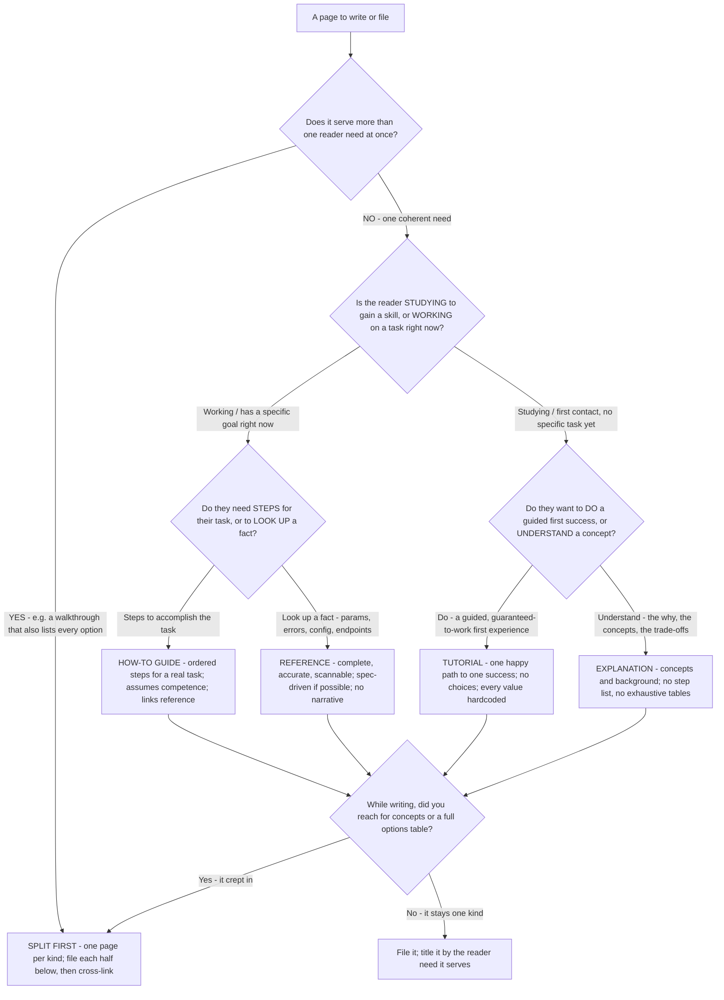

# Diátaxis content-type selection — which of the four kinds is this page?

**Last reviewed:** 2026-06-05 · **Confidence:** high (Diátaxis is an established, stable framework; web-verified this date). The framework itself is not volatile; tool/renderer specifics elsewhere carry their own `[verify-at-use]` markers.

> Canonical content-type selector for [`docs-architect`](../agents/docs-architect.md) (and any agent filing a page). Traverse top-to-bottom **before writing or filing** a page. This deepens the brief "Which kind of doc is this" tree in [`technical-writing-docs-decision-trees.md`](technical-writing-docs-decision-trees.md) with the **mixed-kind split** logic — the single most common Diátaxis failure (a page that is two kinds wearing one title). The four kinds map to four reader needs and **must not be blended**: a tutorial full of reference tables teaches nobody; a reference that lectures on concepts can't be looked up.

---

## When this applies

You have content to write or an existing page to file, and you must decide which of the four Diátaxis kinds it is — **or** discover it is more than one kind and must be split. Triggers: a new docs page request, a card-sort during an IA fix, a "Getting Started" page with a high drop-off, or any page that "feels off" but you can't say why (usually: it serves two needs).

## The two axes (the grid you're resolving against)

Diátaxis places the four kinds on a 2D grid: **Acquisition ↔ Application** (is the reader *studying* or *working*?) and **Action ↔ Cognition** (is the page about *doing* or *knowing*?).

| | Action (practical steps) | Cognition (theoretical knowledge) |
|---|---|---|
| **Acquisition** (studying / learning) | **Tutorial** — learning-oriented | **Explanation** — understanding-oriented |
| **Application** (working / a task at hand) | **How-to guide** — task-oriented | **Reference** — information-oriented |

## The tree

## Rationale per leaf

- **Split first (mixed-kind)** — the most common and most damaging Diátaxis error. A "Getting Started" that mixes a tutorial, three how-tos, and a config table fails at all four: it neither gets a beginner to first success quickly nor lets an expert look up a fact. Split into one page per kind, then cross-link. (Real pattern: [`../scenarios/2026-06-05-tutorial-reference-confusion.md`](../scenarios/2026-06-05-tutorial-reference-confusion.md).)
- **Tutorial** — learning-oriented; optimize for **time-to-first-success**. One happy path, no decision points, every value hardcoded. The learner's confidence — "I did it" — is the deliverable, not completeness. See [`scope-the-tutorial-to-one-success`](../best-practices/scope-the-tutorial-to-one-success.md) and [`optimize-time-to-first-success`](../best-practices/optimize-time-to-first-success.md).
- **How-to guide** — task-oriented; the reader already knows the subject and wants to accomplish *one* real task (handle pagination, configure SSO, add a webhook). Ordered steps; assume competence; link out to reference and explanation rather than restating them.
- **Reference** — information-oriented; the reader is looking something up. Complete, accurate, scannable, structured to mirror the product so a fact is findable by name. **No narrative, no teaching** — those distract the look-up. Spec-driven where possible so it can't drift ([`spec-driven-reference-not-hand-maintained`](../best-practices/spec-driven-reference-not-hand-maintained.md)).
- **Explanation** — understanding-oriented; the "why" — concepts, architecture, trade-offs, background. The reader wants to *understand*, not act, so no step list and no exhaustive options table belong here.

## Gotchas

- **The recurring trap is the tutorial that grows a config table.** Pressure to "be complete" pushes reference material into the learning path. If a tutorial makes the beginner choose between options before their first success, those options are reference — move them out.
- **A how-to is not a tutorial.** Both are step-based, but a tutorial *teaches* a beginner (guaranteed success, no choices) while a how-to *serves* a competent user with a task (assumes knowledge, may branch). Misfiling a how-to as a tutorial buries beginners in assumed knowledge.
- **Reference that lectures can't be looked up.** Concepts belong in explanation; a reference page that explains is a reference page you can't scan.
- **Title the page by the reader need, not the internal feature name** — see [`navigation-labels-are-user-tasks`](../best-practices/navigation-labels-are-user-tasks.md).

## Escalation & guardrails

- The contract a spec-driven reference generates from (OpenAPI/AsyncAPI) → `api-engineering`; this team turns it into great reference.
- Where the docs site builds the IA you decide here → [`docs-site-engineer`](../agents/docs-site-engineer.md).
- One-off prose polish / ADRs → `ravenclaude-core/documentarian` (the litmus: a docs *system* → here; a one-off doc → core).

## Sources (retrieved 2026-06-05)

- Diátaxis — the framework and the 2D needs grid: https://diataxis.fr/ and https://diataxis.fr/start-here/
- Diátaxis — Tutorials: https://diataxis.fr/tutorials/ · How-to guides: https://diataxis.fr/how-to-guides/ · Reference: https://diataxis.fr/reference/ · Explanation: https://diataxis.fr/explanation/
- Diátaxis — "The difference between a tutorial and a how-to guide": https://diataxis.fr/tutorials-how-to/
