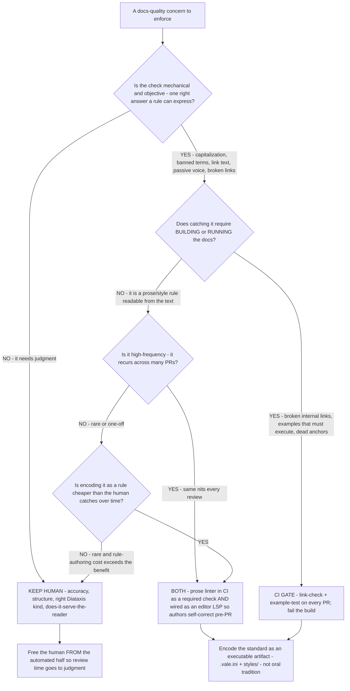

# Docs review — automate in CI/editor vs. keep it a human review

**Last reviewed:** 2026-06-05 · **Confidence:** medium (tooling landscape verified this date; the tool names + versions are volatile and carry inline `[verify-at-use]` markers — re-confirm against the current release before any deliverable).

> Canonical review-split decision tree for [`docs-site-engineer`](../agents/docs-site-engineer.md) (owns the CI gates + editor LSP wiring) with input from [`docs-architect`](../agents/docs-architect.md) (owns what stays a human judgment call). Traverse before adding a docs-review check or deciding "should a human catch this?" The principle: **automate the mechanical, objective, high-frequency checks; reserve the human for judgment** (accuracy, structure, the right Diátaxis kind, does-it-serve-the-reader). A team that hand-reviews capitalization and banned terms has a bottleneck, not a quality bar — see [`../scenarios/2026-06-05-docs-review-bottleneck.md`](../scenarios/2026-06-05-docs-review-bottleneck.md).

---

## When this applies

You're deciding how a given docs-quality concern should be enforced: as an automated CI gate, as an editor LSP diagnostic (self-correct before the PR), or as a human review item. Triggers: a docs-review queue that's backed up, the same nits recurring PR after PR, a single reviewer who is the bottleneck, or standing up a docs-as-code review process from scratch.

## The tree

## Rationale per leaf

- **Keep human (judgment)** — accuracy ("is this true?"), structure ("is this the right Diátaxis kind? is it in the right place?"), and reader-fit ("does this serve the reader's task?") are not rule-expressible. A linter can't tell you a tutorial should have been a reference. These are where a reviewer's time has leverage — so automate everything *else* to protect that time.
- **CI gate (needs a build/run)** — broken internal links, dead anchors, and code examples that must execute can only be caught by building/running the docs. Gate them on every PR so they fail the build, not a reader ([`ci-gate-broken-links-and-examples`](../best-practices/ci-gate-broken-links-and-examples.md), [`examples-must-run`](../best-practices/examples-must-run.md)).
- **Both (CI + editor LSP)** — a high-frequency prose/style rule (heading case, banned/inconsistent terminology, "click here", passive voice) should run **in CI as a required check** *and* **in the editor via an LSP** so authors see the same diagnostics as they type and self-correct before opening the PR. CI alone catches it late (at review); the LSP shifts it left to authoring. A prose linter (Vale `[verify-at-use]`) covers both surfaces from one `.vale.ini` + `styles/`. This plugin ships the Vale-LS config in [`../.lsp.json`](../.lsp.json); the binary installs separately (see [`../CLAUDE.md`](../CLAUDE.md)).
- **Human (rare + rule-authoring not worth it)** — if a check is genuinely rare and encoding it as a rule costs more than the human will ever spend catching it, leave it to the human. Don't gold-plate the linter with rules that fire once a year.

## The load-bearing move: make the standard executable

The recurring root cause behind a docs-review bottleneck is that the terminology/voice/style standard **lives in a reviewer's head** (or an un-run style-guide doc), so it doesn't scale past one reviewer and can't be enforced before a PR is opened. Encoding it as `.vale.ini` + a `styles/` rule pack turns oral tradition into a machine-checkable, version-controlled artifact that runs in CI *and* the editor. That — not hiring a second reviewer — is what removes the bottleneck.

## Tooling landscape (dated — verify at use)

| Tool | 2026 state `[verify-at-use]` | Role |
|---|---|---|
| **Vale** (prose linter) | active, GA | Markup-aware prose/style linting; custom + packaged styles. https://vale.sh/ |
| **Vale-LS** (`vale-ls`) | v0.4.0, 2025-03-14, MIT, Rust | LSP wrapper around a local Vale install → editor diagnostics/hover. https://github.com/errata-ai/vale-ls |
| **markdownlint-cli2** | active, GA | Markdown structural/style lint in CI; `markdownlint-cli2-action` for GitHub. Requires a Node step in CI. https://github.com/DavidAnson/markdownlint-cli2 |
| **Marksman** | active | Markdown LSP — navigation/completion/diagnostics (structure, not prose style). |
| Link-check / example-test in CI | mature | Gate broken links + runnable examples on every PR. |

## Gotchas

- **The LSP wraps the CLI, not the other way around** — Vale-LS needs a local Vale install + a `.vale.ini`; it's an editor surface over the same config CI runs, so the two never disagree (`[verify-at-use]` the exact install path against the current Vale-LS release).
- **Don't put judgment behind the linter.** A linter that tries to enforce "is this the right content type?" produces false positives and erodes trust in the gate. Keep the gate mechanical.
- **A required CI check that's slow becomes the new bottleneck.** Keep the prose-lint step fast (Vale is Go, fast); a 20-second Node install for markdownlint-cli2 in a non-JS repo adds friction — weigh it `[verify-at-use]`.

## Escalation & guardrails

- Where the CI gate runs/builds → `devops-cicd` (this team specifies the docs checks; they own the pipeline).
- Any example carrying auth/secrets → route to `ravenclaude-core/security-reviewer` before it ships.
- The tool names/versions above are volatile — every figure entering a deliverable carries a source URL + retrieval date or an `[unverified]` / `[verify-at-use]` mark.

## Sources (retrieved 2026-06-05)

- Vale — syntax-aware prose linter: https://vale.sh/ and https://docs.vale.sh/
- Vale-LS — the Vale Language Server (v0.4.0, 2025-03-14, MIT): https://github.com/errata-ai/vale-ls
- markdownlint-cli2 — Markdown linter for CI/editor: https://github.com/DavidAnson/markdownlint-cli2
