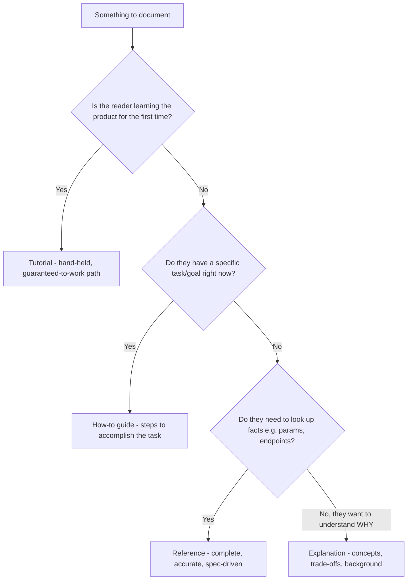
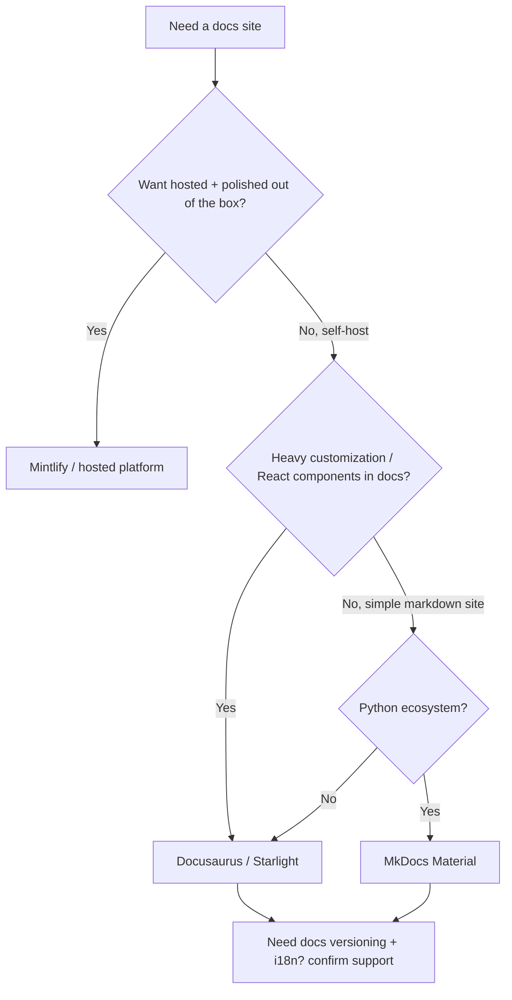
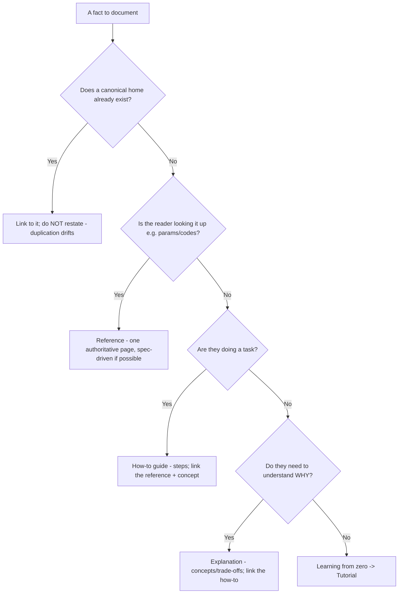
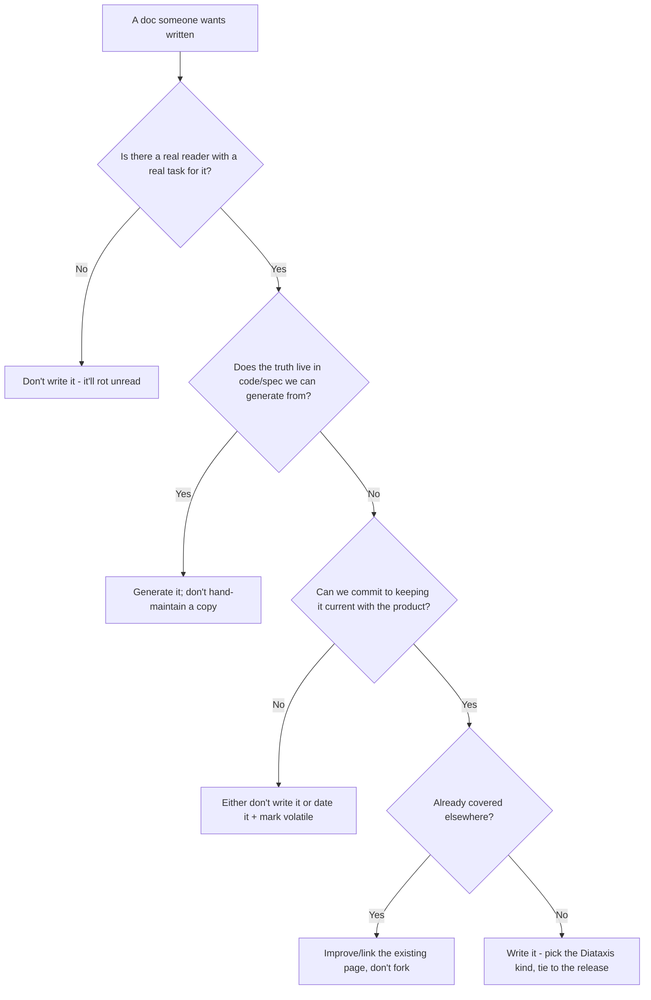
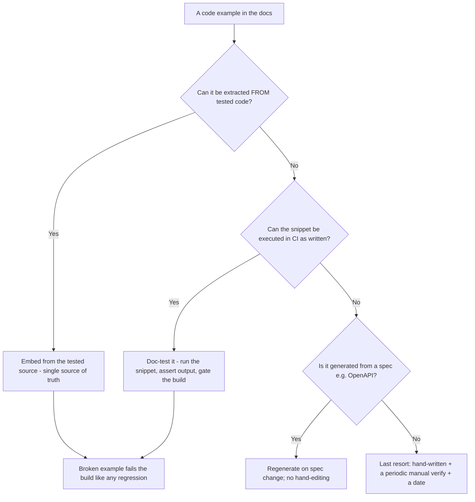

# Technical Writing & Docs — Decision Trees

_Decision trees + a dated capability map. Capability rows are `[verify-at-build]` — re-check against the vendor before quoting. Last reviewed: 2026-06-04._

Traverse before writing a doc or picking a docs tool.

## Decision Tree: Which kind of doc is this (Diataxis)?

Identify the reader's need; don't blend the four kinds.

_A 'tutorial' full of reference tables, or a reference that lectures on concepts, helps no one._

## Decision Tree: Docs tooling choice

Pick by maintenance, versioning, and design-control needs — not by popularity.

## Decision Tree: Where does this content belong?

Diataxis says which kind; this says which page already owns the fact. Default to linking, not restating.

_The same fact in two places is one place that will go wrong. One owner, everything else links._

## Decision Tree: Is this doc worth writing (and keeping)?

A confidently-wrong or never-read doc is a liability; write to a real reader need, prune the rest.

_Maintaining less but accurate beats hoarding more that quietly rotted._

## Decision Tree: How do I keep examples from going stale?

Examples must run; choose the mechanism by how the example is produced and tested.

_A copy-paste snippet that errors destroys trust faster than a missing one._

## Capability map (dated — verify at build)

| Capability | 2026 state `[verify-at-build]` | Notes |
|---|---|---|
| Diataxis framework | established | The 4-kind model |
| Docusaurus / Starlight | GA | React-based, versioning, MDX |
| Mintlify | GA | Hosted, polished, API docs |
| MkDocs Material | GA | Simple, Python, fast |
| OpenAPI -> reference (e.g. Redocly) | GA | Spec-driven, no drift |
| Link-check / doc-test in CI | mature | Gate broken links + examples |
