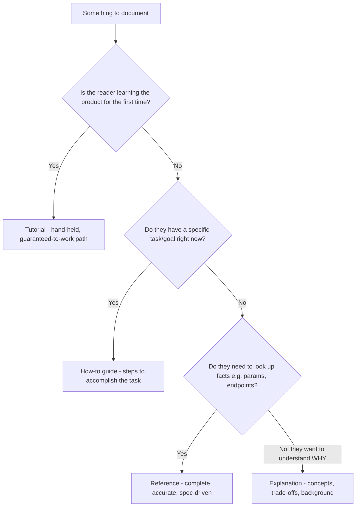
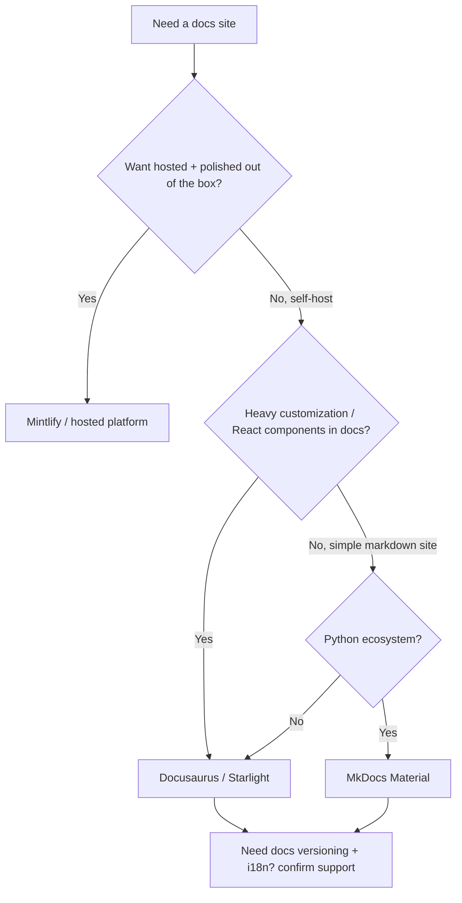
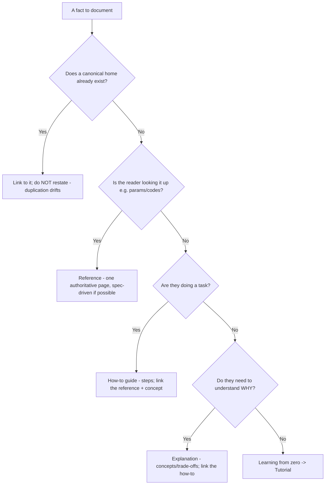
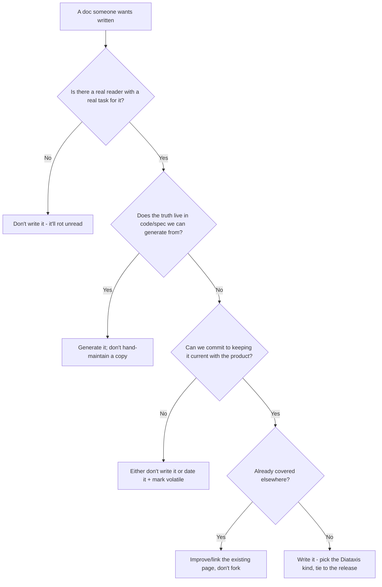
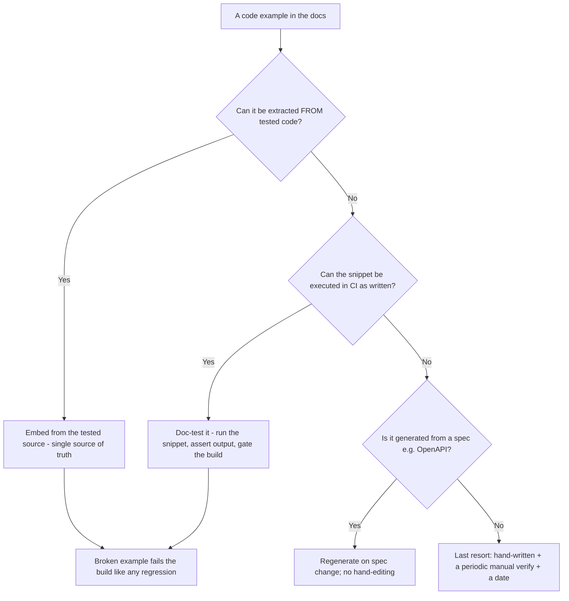
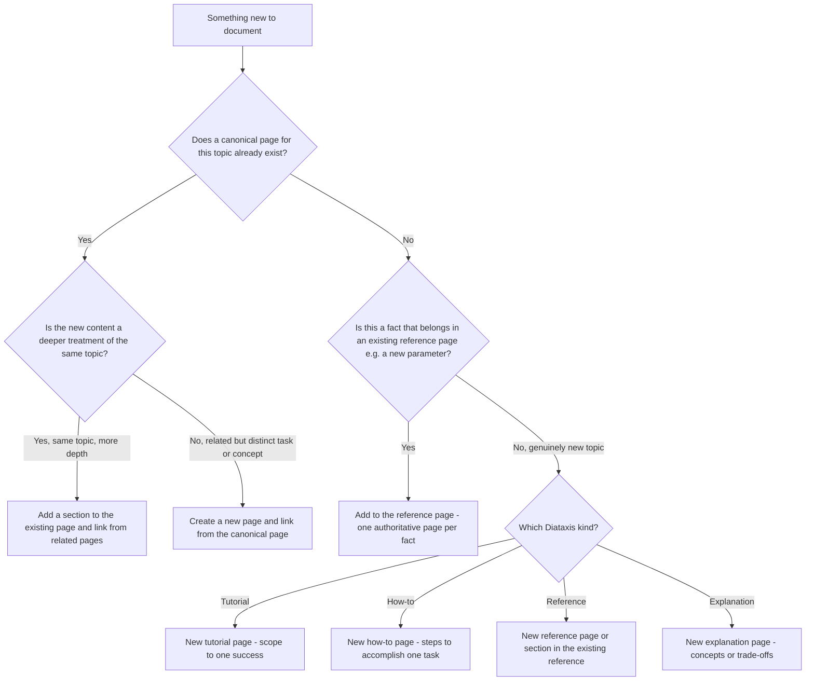
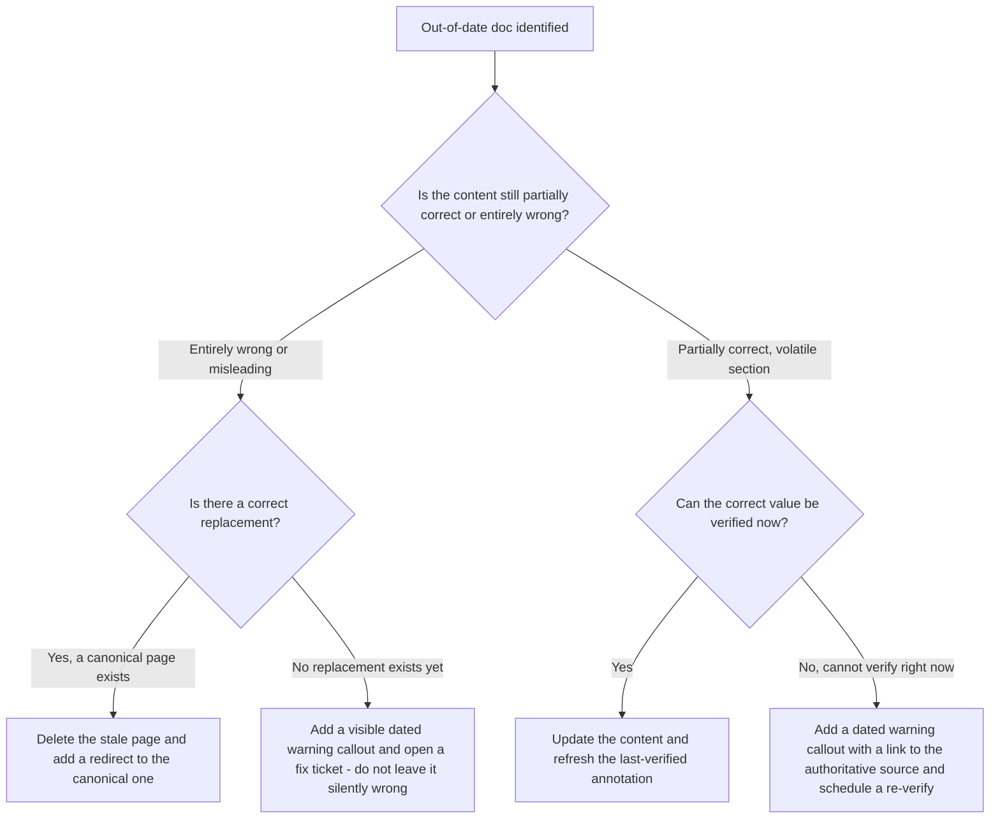
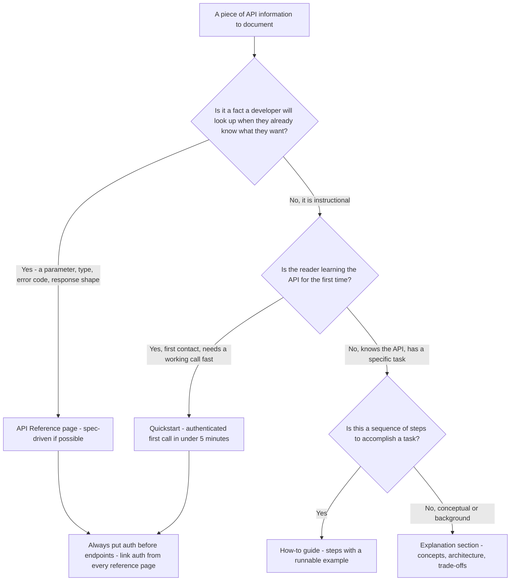

# Technical Writing & Docs — Decision Trees

_Decision trees + a dated capability map. Capability rows are `[verify-at-build]` — re-check against the vendor before quoting. Last reviewed: 2026-06-04._

Traverse before writing a doc or picking a docs tool.

## Decision Tree: Which kind of doc is this (Diataxis)?

Identify the reader's need; don't blend the four kinds.

_A 'tutorial' full of reference tables, or a reference that lectures on concepts, helps no one._

## Decision Tree: Docs tooling choice

Pick by maintenance, versioning, and design-control needs — not by popularity.

## Decision Tree: Where does this content belong?

Diataxis says which kind; this says which page already owns the fact. Default to linking, not restating.

_The same fact in two places is one place that will go wrong. One owner, everything else links._

## Decision Tree: Is this doc worth writing (and keeping)?

A confidently-wrong or never-read doc is a liability; write to a real reader need, prune the rest.

_Maintaining less but accurate beats hoarding more that quietly rotted._

## Decision Tree: How do I keep examples from going stale?

Examples must run; choose the mechanism by how the example is produced and tested.

_A copy-paste snippet that errors destroys trust faster than a missing one._

## Capability map (dated — verify at build)

| Capability | 2026 state `[verify-at-build]` | Notes |
|---|---|---|
| Diataxis framework | established | The 4-kind model |
| Docusaurus / Starlight | GA | React-based, versioning, MDX |
| Mintlify | GA | Hosted, polished, API docs |
| MkDocs Material | GA | Simple, Python, fast |
| OpenAPI -> reference (e.g. Redocly) | GA | Spec-driven, no drift |
| Link-check / doc-test in CI | mature | Gate broken links + examples |

---

## Decision Tree: Should this be a new page or an update to an existing page?

**When this applies:** A writer or contributor wants to document something and is deciding whether to create a new doc, add a section to an existing page, or just add a link. Observable trigger: a PR description says "adding new docs page for X" or a Jira ticket says "document feature Y."

**Last verified:** 2026-06-05 against the `one-source-of-truth` and `right-home-for-the-content` best-practices.

**Rationale per leaf:**
- *Add a section* — same topic with more depth stays on the canonical page so there is one place to maintain and one place to link to.
- *New page, link from canonical* — a related but distinct task or concept warrants its own page to keep Diataxis kinds separate; the canonical page cross-links.
- *Add to reference* — facts like parameters, error codes, and config options belong in the single authoritative reference page, not scattered across prose guides.
- *New Diataxis-typed page* — a genuinely new topic starts a properly-typed page so the site doesn't accumulate unfiled blobs.

---

## Decision Tree: How to handle a doc that is out of date?

**When this applies:** A doc is discovered to be inaccurate, outdated, or no longer matches the current product behavior. Observable trigger: a reader reports an error, a developer notices a stale example, or a content audit flags a page with a last-verified date older than the threshold.

**Last verified:** 2026-06-05 against the `stale-docs-are-worse-than-none` and `annotate-volatile-content-with-dates` best-practices.

**Rationale per leaf:**
- *Delete + redirect* — an entirely wrong page with a replacement is a liability; removing and redirecting is better than letting readers find the wrong one.
- *Warning callout + ticket* — if the correct answer isn't known yet, warn the reader immediately and open a tracked fix; do not leave silence where a wrong answer sits.
- *Update + refresh annotation* — the lowest-cost path when the correct value is known; updating is faster than deleting and preserves the page's search ranking.
- *Warning + link + schedule* — when verification requires a live system check or a vendor lookup that can't happen right now; the callout is the interim protection.

---

## Decision Tree: API docs structure — should this information go in the quickstart, the reference, or a guide?

**When this applies:** You have a piece of API information to document and must decide which section owns it. Observable trigger: writing API docs and a fact could plausibly live in multiple places.

**Last verified:** 2026-06-05 against Diataxis (tutorial/how-to/reference/explanation) and the `api-auth-docs-before-feature-docs` best-practice.

**Rationale per leaf:**
- *Reference* — look-up information (parameters, types, errors) belongs in spec-driven reference; it must be complete, accurate, and findable by name.
- *Quickstart* — the first-contact path must optimize for time-to-first-working-call; everything else is a distraction here.
- *How-to guide* — a specific task sequence (upload a file, handle pagination, implement a webhook) belongs in a how-to, not in reference or the quickstart.
- *Explanation* — concepts (how rate limiting works, the token refresh model) belong in explanation so they don't clutter the procedural guides; readers who want the why find them here.
- *Auth first* — enforces `api-auth-docs-before-feature-docs`: authentication information links into every surface.
