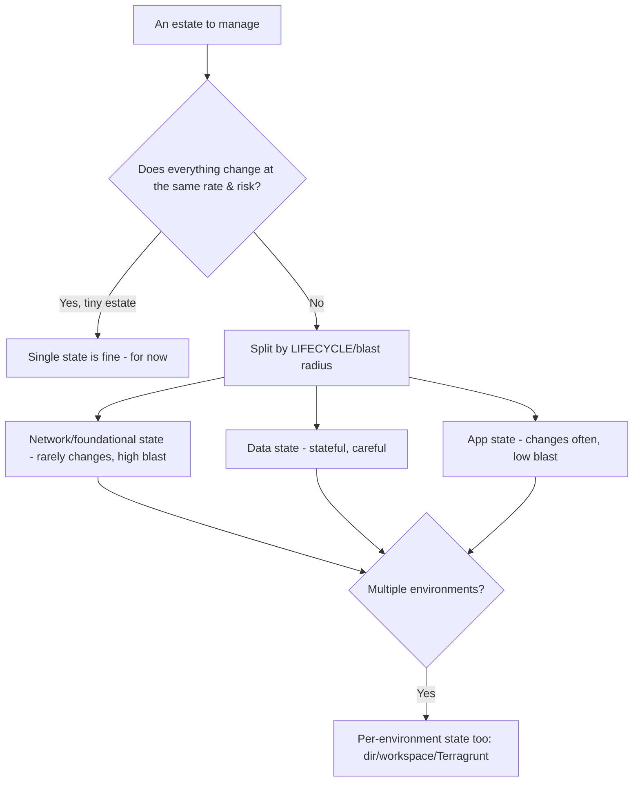
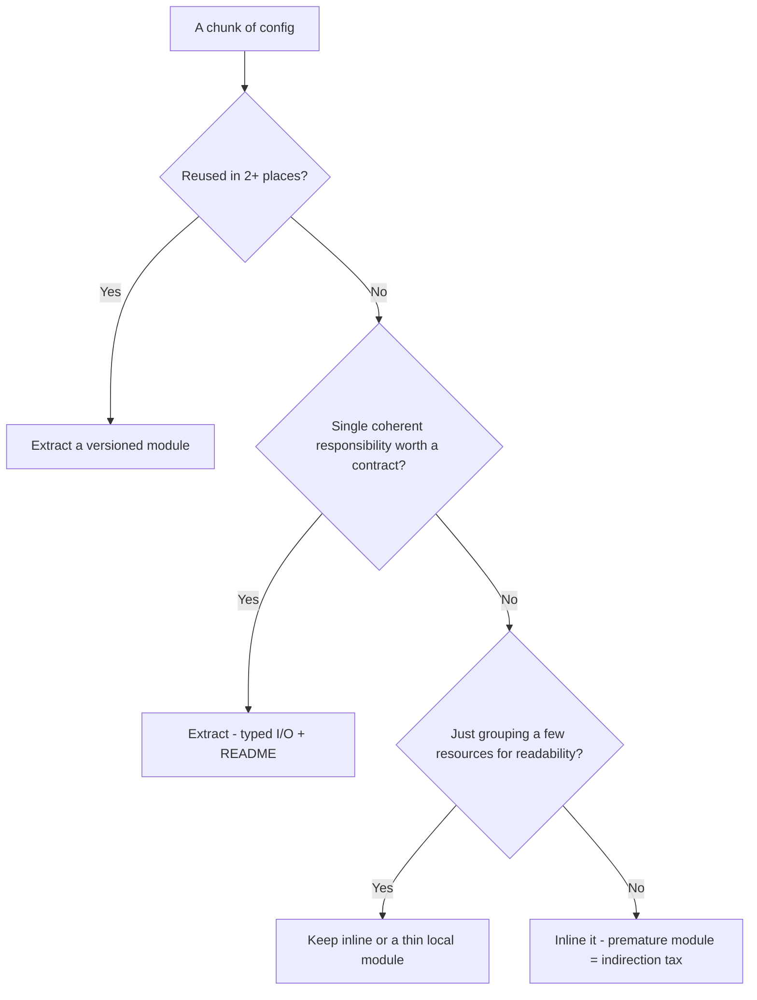
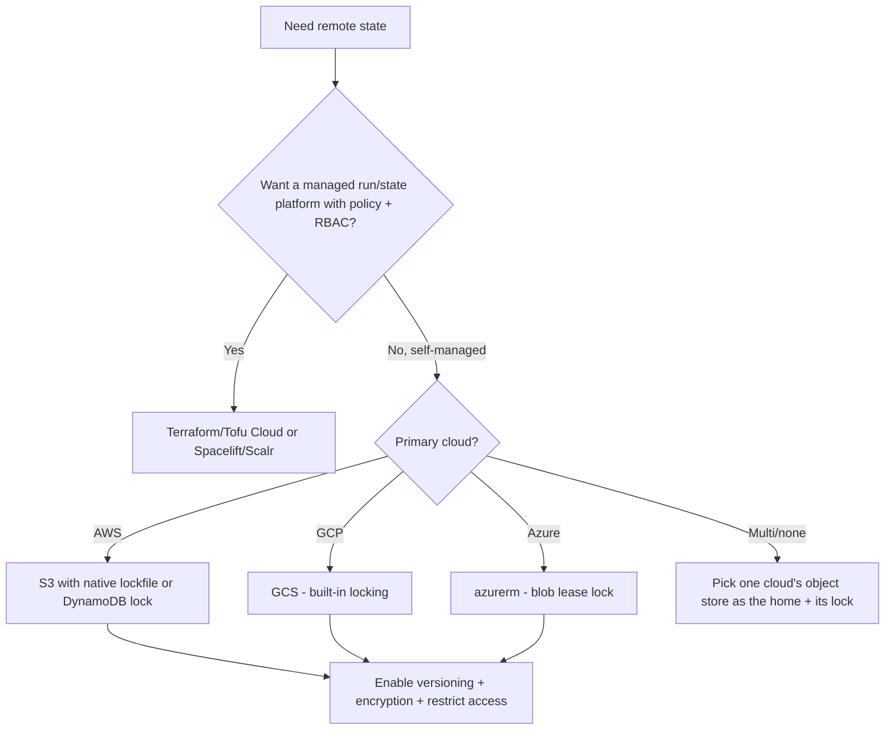
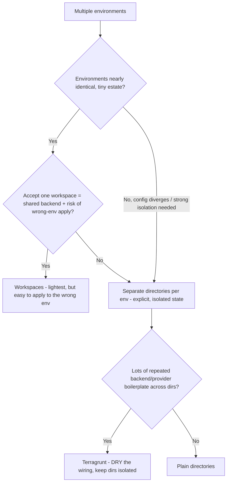
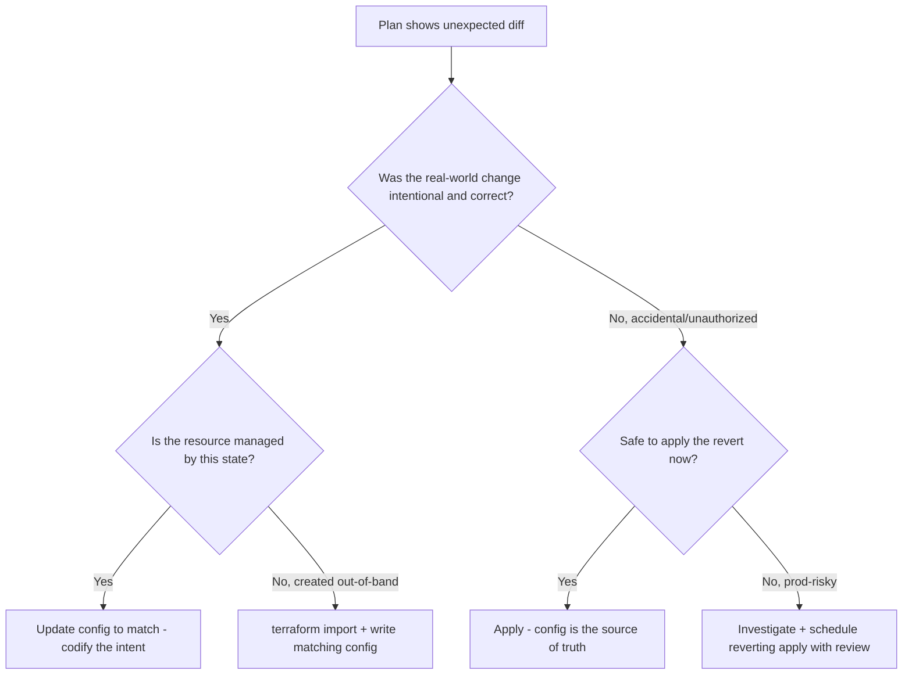
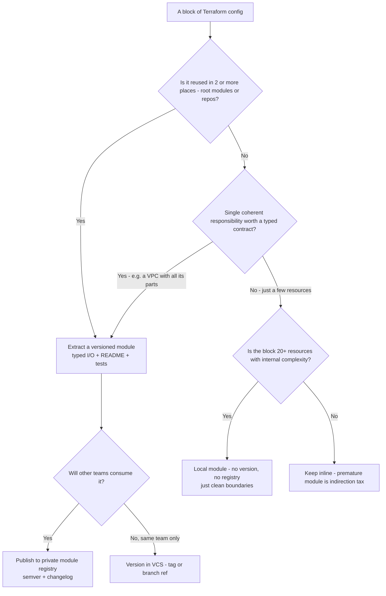
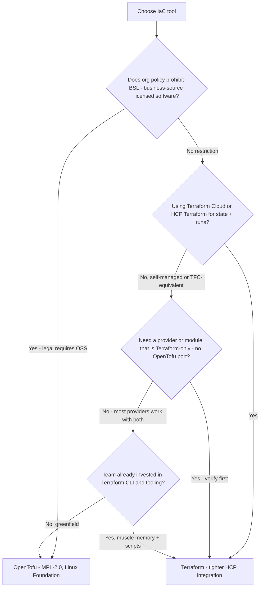
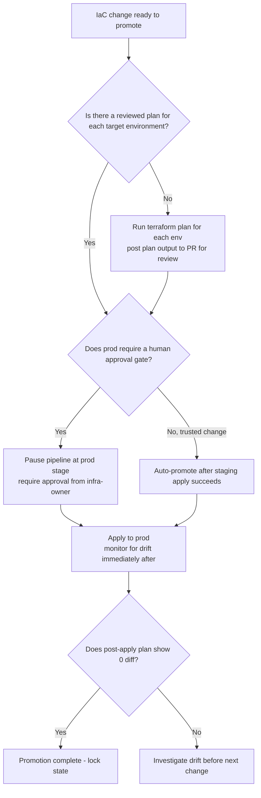

# Terraform & IaC — Decision Trees

_Decision trees + a dated capability map. Capability rows are `[verify-at-build]` — re-check against the vendor before quoting. Last reviewed: 2026-07-08._

Traverse before splitting state or drawing a module boundary.

## Decision Tree: How to isolate state

Isolate by blast radius and change cadence, not by team org-chart.

_Cross-state references via remote-state data sources or outputs — keep them few._

## Decision Tree: Module boundary — extract or inline?

Extract a module when it's reused or is a coherent single responsibility; don't over-abstract.

## Decision Tree: Which remote state backend?

Locking is non-negotiable; pick the backend that's native to where you already operate.

_Whatever the backend, it must give locking, versioning, encryption, and access control — or it isn't a backend, it's a liability._

## Decision Tree: How to model environments (promotion)

DRY versus explicit. Pick by blast-radius risk and how much config diverges per environment.

_Workspaces share a backend and a module — fine for ephemeral copies, risky as the prod/dev boundary. Directories are the safer default._

## Decision Tree: Drift found — codify, import, or revert?

When a plan shows divergence, decide deliberately; never let `apply` silently revert a hand-fix.

_The wrong move is a reflexive `apply` that reverts an emergency console fix and re-breaks prod._

## Capability map (dated — verify at build)

| Capability | 2026 state `[verify-at-build]` | Notes |
|---|---|---|
| Terraform | GA (BSL license since 1.6) | Verify licensing fit |
| OpenTofu | GA (MPL, Linux Foundation fork) | Drop-in for many; verify provider/module parity · **Pin ≥ 1.12.3** — earlier 1.12.x had GHSA-q7j3-v8qv-22vq (crafted-git-URL arbitrary file read). |
| State locking backends | mature (S3+DynamoDB/GCS/azurerm/TFC) | Locking is non-negotiable |
| Terragrunt | mature | DRY + explicit; extra tool |
| OPA/Conftest, Sentinel | mature | Evaluate plan JSON; preventive guardrails |
| terraform test | GA | Native module testing |

---

## Decision Tree: Should this be a module or inline config?

**When this applies:** An engineer is writing Terraform configuration and faces the choice between extracting a block of resources into a separate module or keeping them inline in the root configuration. Observable inputs: is this resource block reused across environments or repos, does it have a coherent single responsibility, and how many resources does it group?

**Last verified:** 2026-06-05 against Terraform module documentation and the module-boundary best practice.

**Rationale per leaf:**
- *Versioned module* — reuse across ≥2 places means drift prevention justifies the module overhead; version it so callers control when they upgrade.
- *Local module* — same-repo grouping for readability and boundary clarity; no versioning needed since it moves with the root.
- *Inline* — grouping for its own sake adds indirection; < 20 resources with no reuse is better inline.
- *Private registry* — when other teams consume the module, registry publication gives semantic versioning, documentation, and a controlled upgrade path.

**Tradeoffs summary:**

| Method | Reuse | Discoverability | Versioning overhead | Use when |
|---|---|---|---|---|
| Inline | No | Low | None | Single-use, few resources |
| Local module | No | Medium | None | Large complex block, same repo |
| VCS-versioned module | Same-team only | Low-medium | Tag/branch | Team-internal reuse |
| Registry module | Cross-team | High | Semver + changelog | Shared org-wide infrastructure pattern |
| OCI-registry module/provider | Cross-team | High | Semver + OCI tags | OpenTofu ≥1.10 — distribute modules **and** providers via an existing OCI/container registry `[verify-at-use]` |

---

## Decision Tree: Terraform or OpenTofu?

**When this applies:** A team is starting a new IaC project or migrating an existing one and must choose between Terraform (BSL license) and OpenTofu (MPL, Linux Foundation fork). The observable inputs are: the organization's license policy, the required provider/module ecosystem, and the team's existing toolchain.

**Last verified:** 2026-06-05; **OpenTofu version + OCI distribution re-verified 2026-06-11** against Terraform BSL terms and OpenTofu release notes. Current OpenTofu GA is **1.12.x** (latest **1.12.3, 2026-06-18**; 1.12.2 2026-06-12). **1.12.3 is a security patch fixing GHSA-q7j3-v8qv-22vq** (arbitrary file read during git operations via a maliciously crafted URL) affecting all earlier v1.12 releases, backported to **1.11.10** — **pin OpenTofu ≥ 1.12.3** (or ≥ 1.11.10 on the 1.11 line). [releases](https://github.com/opentofu/opentofu/releases). Since **OpenTofu 1.10**, modules **and** providers can be distributed via **OCI registries** (reuse existing container-registry infra; [OCI registry integrations](https://opentofu.org/docs/cli/oci_registries/)).

**Rationale per leaf:**
- *OpenTofu (license)* — MPL-2.0 is permissive; organizations with software licensing policies that prohibit BSL must use OpenTofu.
- *Terraform (HCP)* — HCP Terraform's state, runs, SSO, and policy enforcement are native to Terraform; OpenTofu can use Terraform Cloud API but with less official support.
- *Terraform (provider)* — most providers (AWS, Azure, GCP) are dual-compatible; a few niche providers have Terraform-only registries — verify before assuming incompatibility.
- *OpenTofu (greenfield)* — for new projects with no existing toolchain investment and no licensing concern, OpenTofu is a viable default with community support growing.

**Tradeoffs summary:**

| Tool | License | HCP Terraform | Provider ecosystem | Use when |
|---|---|---|---|---|
| Terraform | BSL 1.1 - no competing service | Full native | Widest | No license concern, using HCP |
| OpenTofu | MPL-2.0 - fully open | API-compatible | Nearly equal | License policy requires OSS |

---

## Decision Tree: How should this IaC change be promoted across environments?

**When this applies:** A Terraform change is ready for production and must be promoted through dev, staging, and prod. The observable inputs are: the structure of the codebase (workspaces vs directories), whether the change is config-only or includes new resources, and whether a human approval gate is required before prod.

**Last verified:** 2026-06-05 against Terraform CI/CD pipeline patterns and the environment-promotion decision tree.

**Rationale per leaf:**
- *Plan for each env* — each environment's state is different; a plan for dev is not a preview of what happens in prod; always plan per-env.
- *Human approval gate* — prod applies should have a human gate in regulated environments or for high-blast-radius changes (network, IAM); fast-moving teams with staged automated testing may skip it for low-risk changes.
- *Auto-promote after staging* — when staging is a faithful mirror of prod and the change is low-blast-radius (a Lambda version bump, a tag change), auto-promotion is safe and reduces toil.
- *Post-apply drift check* — run `plan` immediately after `apply`; a non-zero diff means the apply did not converge or something else changed the resource out-of-band.

**Tradeoffs summary:**

| Method | Approval | Speed | Blast radius guard | Use when |
|---|---|---|---|---|
| Human approval at prod | Manual - minutes to hours | Slow | High | Regulated / high-blast changes |
| Auto-promote after staging | None | Fast | Medium | Trusted staging mirror + low-blast change |
| Manual apply only | Manual per env | Slowest | Highest | Emergency or one-off infra surgery |
