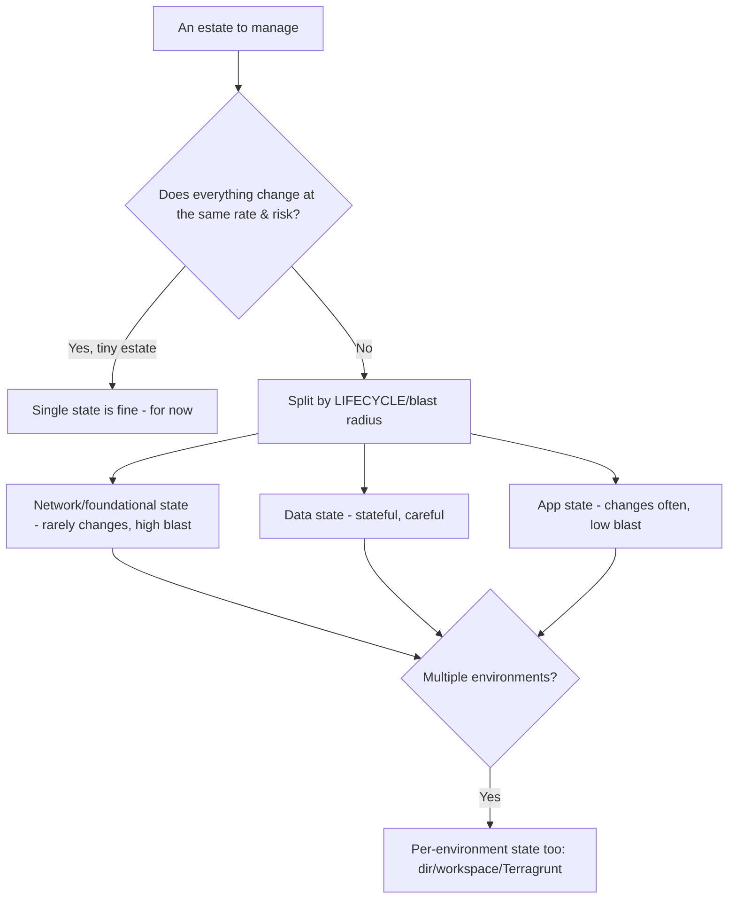
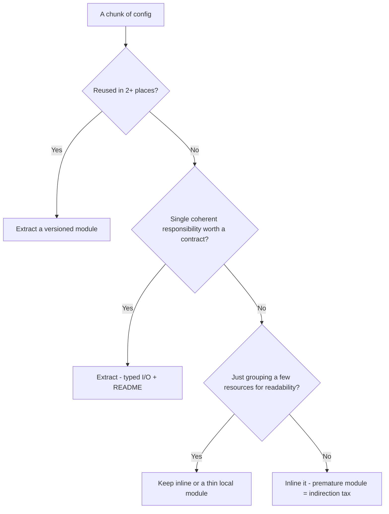

# Terraform & IaC — Decision Trees

_Decision trees + a dated capability map. Capability rows are `[verify-at-build]` — re-check against the vendor before quoting. Last reviewed: 2026-06-04._

Traverse before splitting state or drawing a module boundary.

## Decision Tree: How to isolate state

Isolate by blast radius and change cadence, not by team org-chart.

_Cross-state references via remote-state data sources or outputs — keep them few._

## Decision Tree: Module boundary — extract or inline?

Extract a module when it's reused or is a coherent single responsibility; don't over-abstract.

## Capability map (dated — verify at build)

| Capability | 2026 state `[verify-at-build]` | Notes |
|---|---|---|
| Terraform | GA (BSL license since 1.6) | Verify licensing fit |
| OpenTofu | GA (MPL, Linux Foundation fork) | Drop-in for many; verify provider/module parity |
| State locking backends | mature (S3+DynamoDB/GCS/azurerm/TFC) | Locking is non-negotiable |
| Terragrunt | mature | DRY + explicit; extra tool |
| OPA/Conftest, Sentinel | mature | Evaluate plan JSON; preventive guardrails |
| terraform test | GA | Native module testing |
