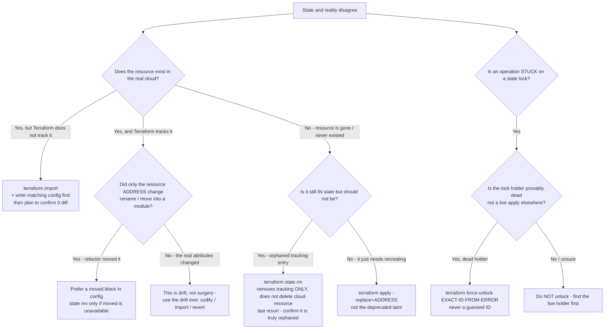
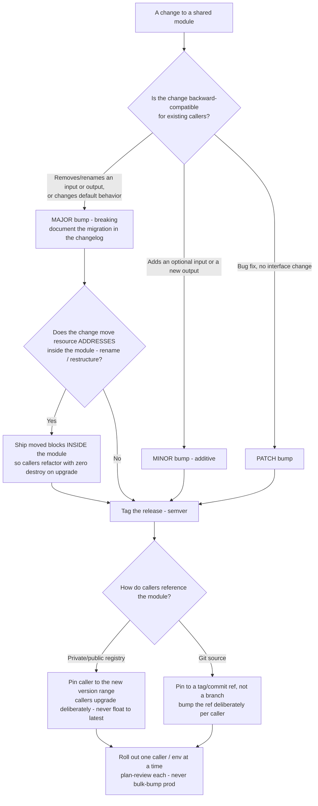

# Terraform & IaC — State-Operation & Module-Refactor Decision Trees

_Topic-specific trees that **complement** [`terraform-iac-decision-trees.md`](terraform-iac-decision-trees.md) (state-isolation, module-boundary, remote-backend, env-promotion, drift, Terraform-vs-OpenTofu). These two cover the **state-surgery command triage** and the **module-versioning/refactor** decisions that the base file points at but doesn't resolve. Capability rows are `[verify-at-use]`. Last reviewed: 2026-06-05._

State surgery is **high-blast and operator-reviewed** (Capability Grounding Protocol): every leaf below that mutates state — `import`, `state mv`, `state rm`, `force-unlock`, `taint`/`-replace` — is a recommendation to review with the operator, never an auto-run. Traverse the tree, name the operation, and get sign-off before touching state.

## Decision Tree: Which state operation fits this situation?

**When this applies:** State and reality have diverged, or a refactor moved a resource's address, and you must pick the *right* state command. The wrong command corrupts or orphans. The observable inputs: is the resource real in the cloud, is it tracked in this state, did its *address* change, or is something *stuck*?

**Last verified:** 2026-06-05 against Terraform state-command documentation and the marketplace state-surgery skill.

**Rationale per leaf:**
- *`import`* — the resource exists but Terraform doesn't track it (created out-of-band). Write the matching config **first**, import, then `plan` until 0 diff; a non-zero post-import diff means your config doesn't match reality yet. (Terraform 1.5+ also supports declarative `import` blocks — `[verify-at-use]` whether your version/team prefers the block over the CLI.)
- *`moved` block* — a refactor that only changed a resource's **address** (rename, or pulling it into a module) should be expressed as a `moved` block in config, not a manual `state mv`. The `moved` block is reviewable in the plan, version-controlled, and safe for everyone who applies; `state mv` is a manual side effect only the runner sees. Reach for `state mv` only when a `moved` block can't express the change.
- *drift, not surgery* — if the resource's real **attributes** changed (not its address), that's drift; go to the drift tree (codify / import / revert) in the base file, not a state command.
- *`state rm`* — removes Terraform's *tracking* of a resource without deleting the real resource. It **orphans** the resource — last resort, only when the entry is genuinely stale, never as a way to "fix" a diff or scrub a secret (it does neither).
- *`-replace`* — to force-recreate a resource, use `apply -replace=ADDRESS`; `terraform taint` is deprecated.
- *`force-unlock`* — only when the holder is provably dead (a killed CI run, not a live apply on another machine) and only with the **exact lock ID the error printed**. The danger is unlocking a *live* operation.

**Tradeoffs / danger summary:**

| Operation | Mutates state? | Touches the real cloud resource? | Danger if wrong | Prefer instead |
|---|---|---|---|---|
| `import` | Yes (adds tracking) | No | Imports under a config that doesn't match → endless diff | Declarative `import` block (1.5+) |
| `moved` block | Yes (re-addresses) | No | — (reviewable, safe) | — this *is* the safe option |
| `state mv` | Yes (re-addresses) | No | Address drift only the runner sees | `moved` block |
| `state rm` | Yes (drops tracking) | No (orphans it) | Orphaned resource, surprise re-create | Almost always something else |
| `apply -replace` | Via plan | Yes (destroy+create) | Recreates a stateful resource → data loss | `prevent_destroy` guards it |
| `force-unlock` | Releases lock | No | Two concurrent applies corrupt state | Wait / find the live holder |

---

## Decision Tree: How should this module change be versioned and rolled out?

**When this applies:** A shared/published module needs a change, or callers are pinned to an old version, and you must decide the version bump and the rollout/refactor mechanism so callers don't break unexpectedly. Observable inputs: is the change backward-compatible, does it move resource addresses, and how many callers consume it.

**Last verified:** 2026-06-05 against semantic-versioning conventions, Terraform `moved`-block documentation, and the module-as-a-versioned-contract best practice.

**Rationale per leaf:**
- *MAJOR / MINOR / PATCH* — a module's input/output surface **is its public API**. Removing or renaming an input/output, or changing a default, breaks callers → MAJOR. Adding an optional input or a new output is additive → MINOR. A no-interface bug fix → PATCH. This lets callers read the version and know whether an upgrade is safe.
- *ship `moved` blocks inside the module* — if a MAJOR restructures resources (rename, split into submodules), include `moved` blocks **in the module** so a caller who upgrades gets an address remap instead of a destroy/recreate. This turns a scary breaking upgrade into a no-op plan for the moved resources.
- *registry vs git pin* — both must be **pinned** (a version range for registry, a tag/commit for git) and never floated to `latest`/a branch. Floating makes `init` non-deterministic and turns an unrelated upstream change into a surprise diff (CLAUDE.md §2 #5).
- *roll out one caller/env at a time* — even a correct bump is reviewed per caller with a `plan`; never bulk-bump every environment (especially prod) on one PR.

**Tradeoffs summary:**

| Change type | Version bump | Caller action | Extra mechanism |
|---|---|---|---|
| Remove/rename input or output | MAJOR | Read migration notes, update calls | `moved` blocks if addresses move |
| Add optional input / new output | MINOR | Upgrade when convenient | — |
| Bug fix, no interface change | PATCH | Upgrade freely | — |
| Internal restructure (addresses move) | MAJOR | Upgrade gets a clean plan | `moved` blocks **inside** the module |

---

## Capability map (dated — verify at use)

| Capability | 2026 state `[verify-at-use]` | Notes |
|---|---|---|
| `moved` blocks | GA (since Terraform 1.1) | Config-native, reviewable refactor — prefer over `state mv` |
| Declarative `import` blocks | GA (since Terraform 1.5) | Reviewable import in config; CLI `import` still works |
| `apply -replace` | GA (replaced `taint`) | `terraform taint` is deprecated |
| `terraform force-unlock` | mature | Exact-ID-from-error only; dead-holder only |
| `state rm` / `state mv` | mature | Manual, runner-only side effect — prefer `moved`/`import` blocks |
| Private module registry | mature (TFC/TFE, Spacelift, etc.) | Semver + changelog; pin caller ranges |

> **Sources (retrieved 2026-06-05):** Terraform state-command + `moved`-block + `import`-block + `-replace`/`taint` documentation at https://developer.hashicorp.com/terraform/cli/commands/state and https://developer.hashicorp.com/terraform/language/modules/develop/refactoring . Version-introduced facts (1.1 `moved`, 1.5 `import` block) are version-volatile — re-confirm at use against the docs for the user's Terraform/OpenTofu version (OpenTofu tracks these but verify parity).
