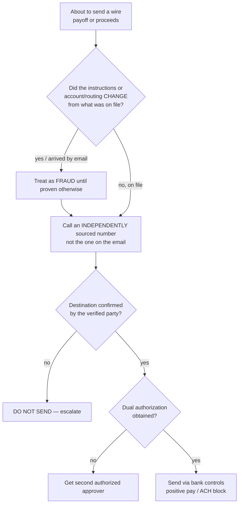
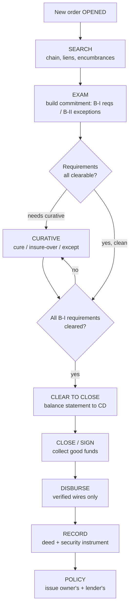

# Title / Escrow / Settlement — Decision Trees

> Reference decision trees for the `title-escrow-settlement` team. Agents **traverse the relevant tree top-to-bottom before deciding** (the proactive complement to the Capability Grounding Protocol). Each `## Decision Tree` section is a Mermaid graph plus the rule it encodes.
>
> **Advisory operations knowledge, not legal, title-underwriting, or financial advice.** Anything touching an underwriter guideline, a good-funds rule, a recording requirement, or an ALTA/CFPB/TRID specific is `[verify-at-use]` — confirm against the underwriter, counsel, or the recording jurisdiction before acting. Wire-fraud sensitive. No PII.
>
> _Last reviewed: 2026-07-02 by `claude`. Principles are durable; dated specifics live in [`title-escrow-reference-2026.md`](title-escrow-reference-2026.md)._

---

## Decision Tree: clear a title exception — cure, insure over, or except?

```mermaid
flowchart TD
    A[Defect / encumbrance found in exam] --> B{Can it be eliminated<br/>with reasonable effort?}
    B -- "yes (payoff+release,<br/>corrective deed, affidavit)" --> C[CURE it<br/>-> Schedule B-I requirement]
    B -- "no / impractical" --> D{Risk acceptable to<br/>the underwriter?<br/>[verify-at-use]}
    D -- "yes, within guidelines" --> E{Underwriter approval<br/>obtained?}
    E -- no --> F[Get written approval FIRST<br/>often + indemnity]
    E -- yes --> G[INSURE OVER<br/>documented approval on file]
    D -- "no / off-guideline" --> H{Must the matter<br/>stay on title?}
    H -- yes --> I[EXCEPT it<br/>-> Schedule B-II, disclose to insured]
    H -- "no, but unresolved" --> J[Escalate to underwriter /<br/>counsel — do not insure]
```

**Rule:** the path follows the **risk to marketability and the underwriter's appetite**. Cure what should be cured; insure over **only with documented underwriter approval** within guidelines; except knowingly and disclose. Never insure past your delegated authority — `[verify-at-use]`.

---

## Decision Tree: escrow disbursement authorization — is this file cleared to disburse?

```mermaid
flowchart TD
    A[Request to disburse] --> B{Schedule B-I requirements<br/>cleared, title insurable?}
    B -- no --> C[HOLD — return to curative<br/>title-examiner]
    B -- yes --> D{Lender clear-to-close +<br/>conditions met?}
    D -- no --> E[HOLD — satisfy lender conditions]
    D -- yes --> F{Settlement statement<br/>balances to lender CD?}
    F -- no --> G[HOLD — reconcile the variance<br/>before signing]
    F -- yes --> H{Funds COLLECTED / good,<br/>not merely deposited?<br/>[verify-at-use good-funds rule]}
    H -- no --> I[HOLD — wait for collected funds]
    H -- yes --> J{Every wire destination<br/>verified by callback?}
    J -- no --> K[HOLD — verify the wire<br/>out-of-band first]
    J -- yes --> L[DISBURSE -> RECORD -> FUND<br/>in the jurisdiction's order]
```

**Rule:** disbursement is a **gate, not a step** — all five conditions must be true (requirements cleared, lender clear-to-close, statement balances, funds collected, wire verified). Any false condition is a HOLD. Never disburse against uncollected funds; `[verify-at-use]` the good-funds and funding-order rules for your state.

---

## Decision Tree: wire verification before sending funds



**Rule:** verify **every** wire by **out-of-band callback to an independently sourced number** before sending, and treat any email-delivered change to instructions on file as fraud until re-verified. Dual authorization on outgoing wires. A callback is cheap; a wire loss is often unrecoverable — `[verify-at-use]` your bank's control products.

---

## Decision Tree: order-to-policy production workflow — where is this file?



**Rule:** the file moves **open -> search -> exam -> clear -> close -> record -> policy**, and each stage **gates** the next — you never close on open requirements or disburse before good funds and a verified wire. Know which stage each file is in and what is aging. Recording and policy-issuance requirements are `[verify-at-use]` by jurisdiction/underwriter.

---

## See also

- [`title-escrow-reference-2026.md`](title-escrow-reference-2026.md) — dated ALTA-pillar, exception, and recording reference (verify-at-use).
- Skills: [`../skills/title-search-and-examination/SKILL.md`](../skills/title-search-and-examination/SKILL.md), [`../skills/commitment-and-curative/SKILL.md`](../skills/commitment-and-curative/SKILL.md), [`../skills/escrow-closing-and-disbursement/SKILL.md`](../skills/escrow-closing-and-disbursement/SKILL.md), [`../skills/wire-fraud-and-trust-account-controls/SKILL.md`](../skills/wire-fraud-and-trust-account-controls/SKILL.md).
