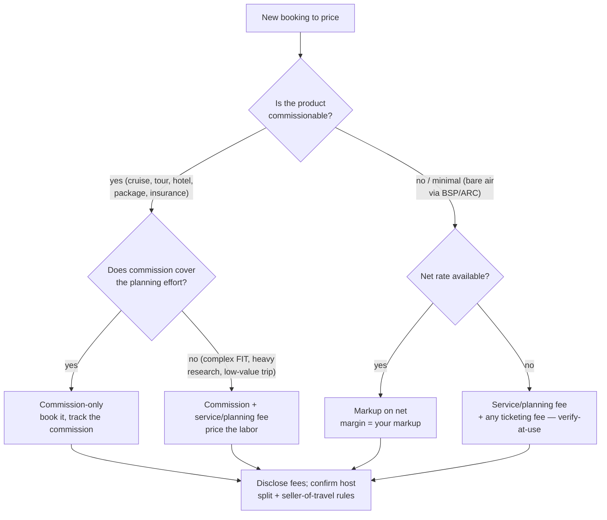
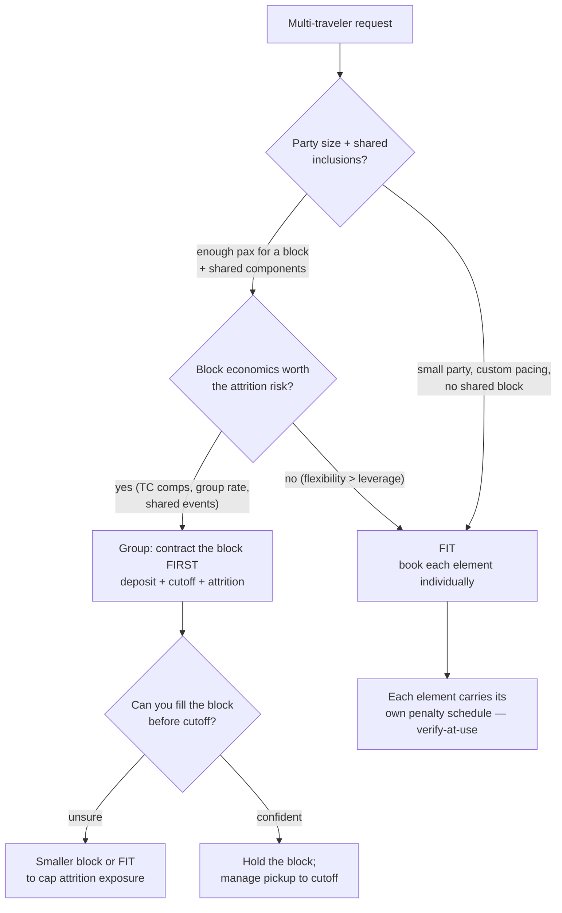
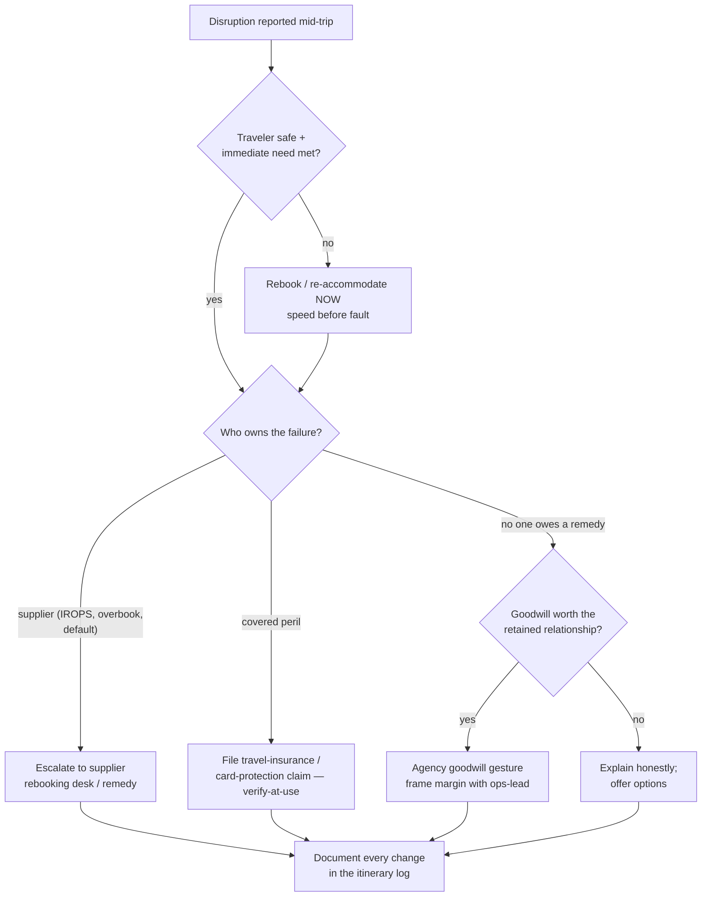
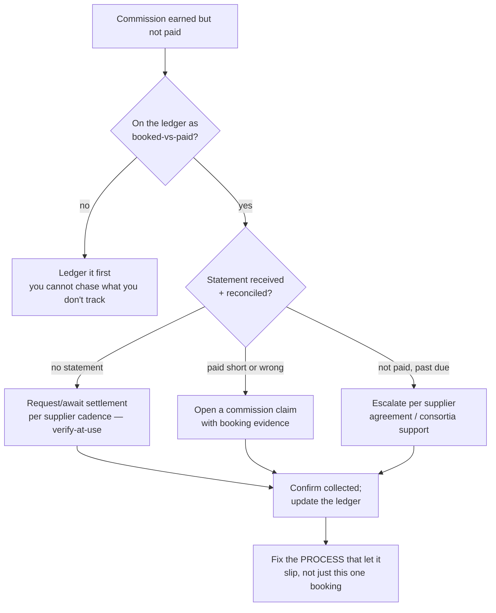

# Travel Agency / Tour Operations — Decision Trees

> Reference decision trees for the `travel-agency-tour-operations` team. Agents **traverse the relevant tree top-to-bottom before deciding** (the proactive complement to the Capability Grounding Protocol). Each `## Decision Tree` section is a Mermaid graph plus the rule it encodes.
>
> **Advisory operations knowledge, not legal, tax, or financial advice.** Anything touching a supplier fare rule, commission rate, cancellation penalty, settlement mechanic, or seller-of-travel requirement is `[verify-at-use]` — confirm against the live supplier agreement, settlement statement, or jurisdiction before acting. No traveler PII.
>
> _Last reviewed: 2026-07-02 by `claude`. Principles are durable; dated norms and numbers live in [`travel-agency-reference-2026.md`](travel-agency-reference-2026.md)._

---

## Decision Tree: revenue model — commission, service fee, or markup?

**Rule:** match the revenue model to the **work and the commissionability**. Commission subsidizes your time; when it won't cover the effort — or the product isn't commissionable — charge a **service fee** or price a **markup on net**. Disclose fees, honor the host split, and confirm seller-of-travel obligations. Rates and rules are `[verify-at-use]`.

---

## Decision Tree: structure this trip as group or FIT?

**Rule:** choose on **block economics vs flexibility**. A group is a contracted liability (deposit, cutoff, attrition) — build and hold the block **before** you sell against it; if you can't confidently fill it, cap exposure with a smaller block or FIT. Tour-conductor comps and group rates are `[verify-at-use]`.

---

## Decision Tree: travel disruption / service recovery

**Rule:** **rebook first, litigate fault second.** Route the remedy to whoever owes it (supplier, insurer, card), decide goodwill deliberately when no one does, and **document every change**. A well-run recovery earns the repeat booking. Policy/supplier remedies are `[verify-at-use]`.

---

## Decision Tree: commission-recovery chase

**Rule:** **booked is not paid.** Track every commission, reconcile against the statement, and chase shorts/non-payments with booking evidence on a cadence — then fix the process that let it slip. Settlement timing and supplier remedies are `[verify-at-use]`.

---

## See also

- [`travel-agency-reference-2026.md`](travel-agency-reference-2026.md) — dated norms + numbers (verify-at-use).
- Skills: [`../skills/itinerary-design-and-quoting/SKILL.md`](../skills/itinerary-design-and-quoting/SKILL.md), [`../skills/supplier-and-commission-management/SKILL.md`](../skills/supplier-and-commission-management/SKILL.md), [`../skills/group-vs-fit-trip-operations/SKILL.md`](../skills/group-vs-fit-trip-operations/SKILL.md), [`../skills/service-recovery-and-disruption/SKILL.md`](../skills/service-recovery-and-disruption/SKILL.md).
