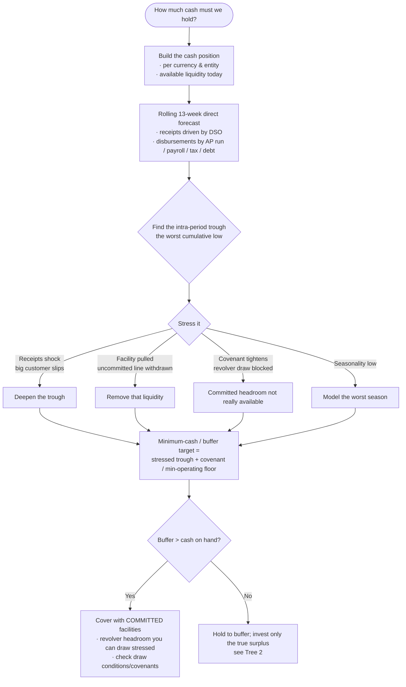
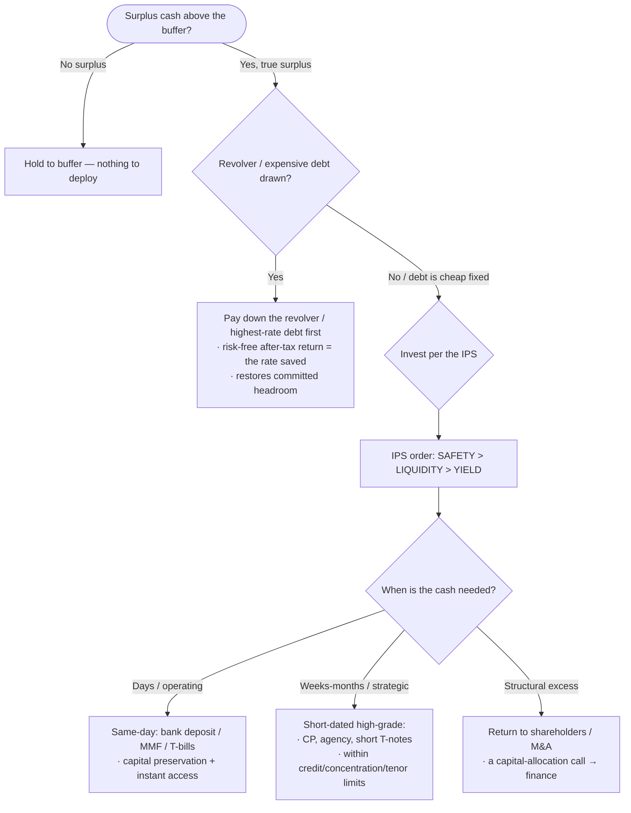
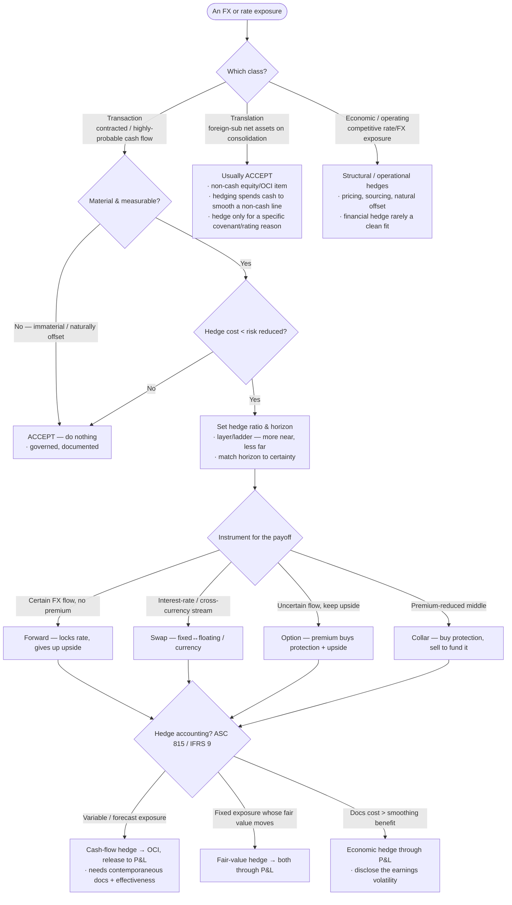
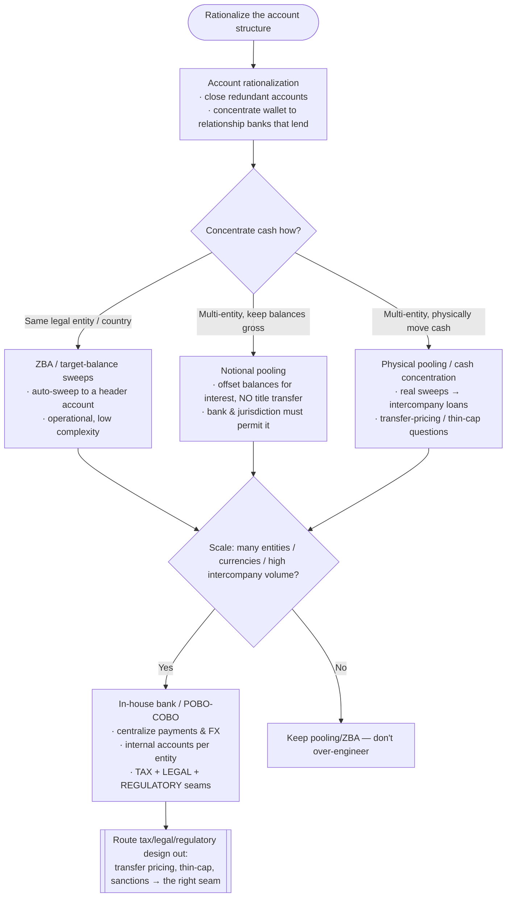
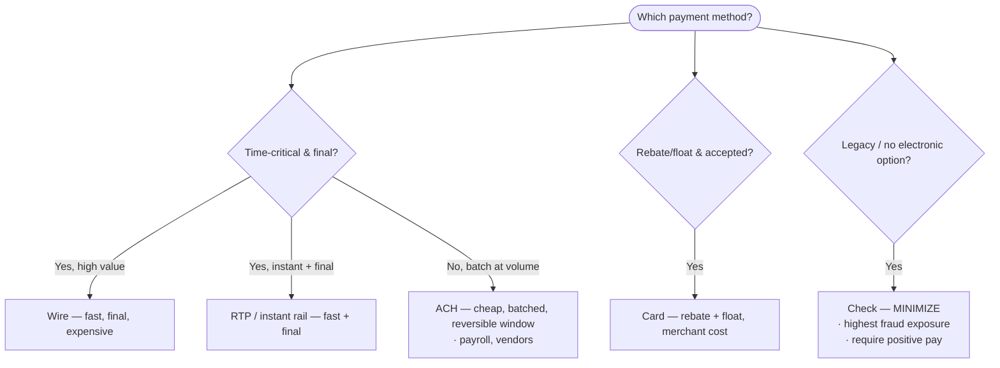

# Knowledge — Treasury-management decision trees

> **Last reviewed:** 2026-07-14 · **Confidence:** Medium-High (consensus on the liquidity-buffer, invest-vs-payoff, hedge-vs-accept, pooling/in-house-bank, and payment-method framings, and on the safety>liquidity>yield ordering; **specific hedge-accounting mechanics (ASC 815 / IFRS 9), bank-fee/AFP codes, ISO 20022 migration timing, and rating criteria are volatile — re-verify before a board/bank commitment**).
> The most-asked treasury questions are "how much cash do we need and where?", "invest the surplus or pay down debt?", "hedge this exposure or accept it?", "pool/sweep or run an in-house bank?", and "which payment method?". These are the decision trees the `treasury-strategy-lead` traverses **before** naming a structure or instrument, plus the trade-off tables and the seams to adjacent plugins.

The team's discipline: **name the objective first (solvency/liquidity before yield), name the exposure before the hedge, and name the structure before the instrument.** This is **not legal, tax, or accounting advice** — volatile rule and bank specifics carry a retrieval date and are verified at use. FP&A/budget/P&L questions — the *earnings plan* — leave this layer for `finance`; treasury owns the **cash** and the **bank relationship**.

---

## Decision Tree 1: sizing the minimum-cash / liquidity buffer

Gate on the **forecast trough under stress**, not the average month.

---

## Decision Tree 2: invest the surplus vs pay down debt (and the IPS gate)

Only the **true surplus** above the buffer is investable; the IPS orders **safety > liquidity > yield**.

> **The classic failure:** reaching for yield with **operating** cash. Operating cash is for solvency and access; only the strategic surplus, within the IPS limits, chases return — and paying down drawn expensive debt is usually the best risk-free "investment."

---

## Decision Tree 3: hedge the exposure vs accept it

Scope the **exposure class first**; **"do nothing" is a valid, governed outcome.**

---

## Decision Tree 4: account structure & cash concentration (pooling / in-house bank)

Structure follows the **cash map**; scale justifies the structure.

> **Notional vs physical:** *notional* offsets balances for interest with **no** movement of title (simplest, but not permitted in every jurisdiction/bank); *physical* actually sweeps cash, creating **intercompany loans** with transfer-pricing and thin-cap implications. An **in-house bank** (payments-on-behalf-of / collections-on-behalf-of) is a scale play — powerful, but its tax/legal/regulatory design is **not** decided here.

---

## Decision Tree 5: payment-method choice

Match method to **value, urgency, finality, and cost**.

---

## Trade-off table — liquidity facilities

| Facility | Sweet spot | Watch out for |
|---|---|---|
| **Committed revolver** | Backstop liquidity you can rely on when stressed | Commitment fee; covenants can block the draw exactly when needed — check them |
| **Uncommitted line** | Cheap day-to-day flexibility | Can be withdrawn at the bank's discretion — don't size the buffer on it |
| **Term debt** | Funding a known long-dated need | Rate/covenant lock; less flexible than a revolver |
| **Money-market / MMF / T-bills** | Parking the operating surplus with same-day access | Yield ≠ the goal; watch credit quality & the IPS limits |

## Trade-off table — DPO levers (working capital)

| Lever | Sweet spot | Watch out for |
|---|---|---|
| **Extend payment terms** | Free cash when suppliers can absorb it | Pushed too far → price increases, supply risk |
| **Supply-chain finance (reverse factoring)** | Buyer rating ≫ supplier rating; supplier gets cheap early cash, buyer holds DPO | Accounting/disclosure — can look like hidden debt to rating agencies/regulators |
| **Dynamic discounting** | Cash-rich buyer; discount yield beats the MMF alternative | It's an *investment* of surplus cash — don't deploy the buffer |
| **Inventory financing / warehouse receipts** | Bridge a seasonal build (a timing gap) | Costs interest — not a fix for a permanent DIO problem |

## Trade-off table — cash concentration structures

| Structure | Sweet spot | Watch out for |
|---|---|---|
| **ZBA / target-balance** | Same-entity/country auto-concentration | Operational only; doesn't cross legal entities cleanly |
| **Notional pooling** | Interest offset without moving cash | Not permitted in every jurisdiction/bank; regulatory constraints |
| **Physical pooling** | Actually concentrating multi-entity cash | Creates intercompany loans → transfer-pricing / thin-cap |
| **In-house bank (POBO/COBO)** | Large, multi-entity, high intercompany volume | Heavy tax/legal/regulatory design — route out; don't over-engineer for small scale |

---

## Seams (treasury is the cash & bank layer, not the whole finance stack)

- **FP&A / budget / P&L / capital budgeting** → `finance` (the *earnings plan*; treasury forecasts the **cash**, not the earnings).
- **Payment-rail / API / ledger engineering** (building the movement of money in code) → `fintech-payments-engineering`.
- **Deep AML / OFAC / sanctions program design & screening** → `regulatory-compliance` (treasury *runs* the screen; the program is designed there).
- **Supplier payment-term negotiation & procurement** (the DPO source) → `procurement-sourcing`.
- **Independent audit of treasury controls** → `internal-audit`.
- **The tax/legal design of pooling, intercompany loans, and in-house banks** → the relevant tax/legal function (not decided in this plugin).

---

## Provenance

- Durable framings (solvency/liquidity before yield, stressed-trough buffer sizing, the safety>liquidity>yield IPS ordering, exposure-class-before-hedge, "do nothing" as a governed hedge choice, notional vs physical pooling, in-house-bank as a scale play, the payment-method and DPO-lever trade-offs, the cash-conversion cycle) are consensus corporate-treasury practice reviewed 2026-07-14 — **High confidence**.
- Hedge-accounting mechanics (ASC 815 / IFRS 9 cash-flow vs fair-value, documentation & effectiveness), bank-fee/AFP service codes, ISO 20022 (`camt`/`pain`) migration timing, and rating-agency criteria are **volatile**, carry retrieval dates, and are **not legal/tax/accounting advice** — re-verify with `ravenclaude-core/deep-researcher` and a qualified professional before a board/bank commitment. _(Reviewed 2026-07-14.)_
