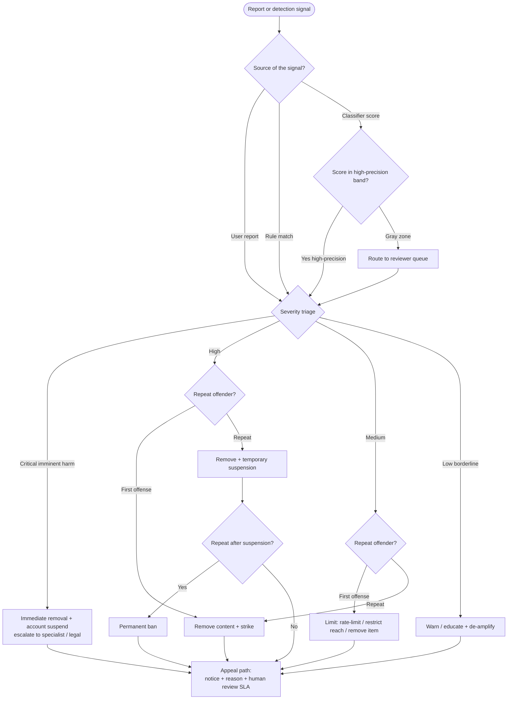

# Knowledge — Enforcement decision tree

> **Last reviewed:** 2026-06-17 · **Confidence:** High (consensus Trust & Safety operating practice; domain-neutral).
> This file is the **enforcement-routing tree** for the plugin: from a report or detection signal, through severity triage, onto a **proportional action ladder** (remove / limit / warn / ban), and out to an **appeal path**. It is the pre-action traversal the Capability Grounding Protocol requires — walk it top-to-bottom **before** naming an enforcement action.
>
> **How the agents use it:** the `trust-safety-policy-lead` traverses it to map a violation to a proportional action; the `abuse-detection-engineer` uses the score-band branch to decide auto-action vs. reviewer-queue. Resolve each node against *observable* facts — severity, user history, detector confidence — not against the reporter's framing.

---

## Decision Tree: report/signal → severity triage → action ladder → appeal

**When this applies:** A piece of content or an account has been flagged — by a user report, a rule, or a classifier score — and you must decide what enforcement action it earns and how it can be contested. Not for designing the taxonomy itself (that is the `design-moderation-policy` skill upstream of this tree).

**Last verified:** 2026-06-17 against consensus T&S enforcement-ladder practice (proportionality + due-process principles).

### Per-leaf rationale

| Leaf | When | Why |
|---|---|---|
| **Warn / educate + de-amplify** | Low-severity, borderline, first contact | Proportionality — the cheapest reversible nudge; preserves the user relationship |
| **Limit (rate-limit / restrict reach / remove item)** | Medium-severity first offense | Contains harm without the heavier penalty of a strike or suspension |
| **Remove content + strike** | High-severity first offense | The content is clearly violating; the strike records history for the ladder |
| **Remove + temporary suspension** | High-severity repeat, or escalation | History plus severity justifies an account-level, *reversible* penalty |
| **Permanent ban** | Repeat after suspension; or critical | The irreversible top rung — reserved for clear, severe, or persistent abuse |
| **Immediate removal + suspend + escalate** | Critical / imminent-harm class | Speed dominates; route to a specialist queue and (where required) legal/NCMEC-class reporting |
| **Reviewer queue** | Classifier gray zone | Auto-action only in the high-precision band; the gray zone is a human-review case |
| **Appeal path** | **Every** action above | Due process — notice, a reason, and a route to contest with a human-review SLA. Non-optional. |

### Tradeoffs

| Lever | Tighten when | Loosen when |
|---|---|---|
| Auto-action threshold | False-positive cost (wronged users) is high | False-negative cost (harm slipping through) dominates |
| Ladder steepness (how fast to the ban) | Severity is high / repeat is clear | The category is ambiguous or the overturn rate is high |
| SLA tightness | Harm tier is critical / virality is high | Tier is low and queue volume is unsurvivable otherwise |

## Provenance

Codifies consensus Trust & Safety enforcement-ladder and due-process practice (proportionality of response; notice-and-appeal). Domain-neutral; no vendor-specific policy bundled. Pairs with the [`trust-safety-metrics.md`](trust-safety-metrics.md) measurement frame and the [`design-moderation-policy`](../skills/design-moderation-policy/SKILL.md) skill that authors the taxonomy this tree acts on.

---

_Last reviewed: 2026-06-17 by `claude`_
