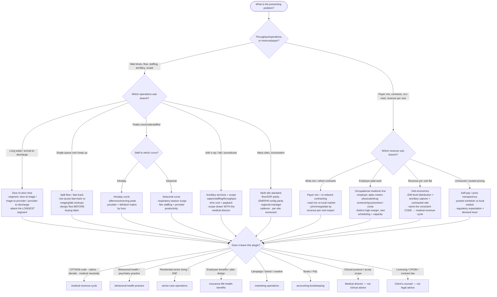

# Knowledge — Urgent-care operations decision tree

> **Last reviewed:** 2026-07-13 · **Confidence:** Medium-High (consensus on the throughput-vs-revenue framing, door-to-door time as the product, split-flow/fast-track, demand-curve staffing, occ-med as a distinct high-margin line, and the payer-mix/visit-economics split; **specific EMR/PM features, UCA benchmarks, payer contract norms, occ-med prices, and price-transparency/regulatory rules are volatile — re-verify with a retrieval date before a client commitment. This is operational and economic guidance: clinical protocols, coding/billing determinations, and licensing questions are flagged to a professional, not decided here.**).
> The first question in any urgent-care engagement is "is this a *throughput/operations* problem or a *revenue* problem?" This is the decision tree the `urgent-care-operations-lead` traverses to scope and route, and the `urgent-care-revenue-and-payer-specialist` traverses to reach its revenue sub-branch — **before** prescribing a fix, a staffing add, or a contract move.

The team's discipline: **name the branch before the fix; segment door-to-door time before any throughput call; read payer mix + contracted rate before any revenue-per-visit call; flag every clinical / coding / legal question to the medical director / `medical-revenue-cycle` / counsel with a retrieval date.** The CPT/E/M code and the claim leave this plugin for `medical-revenue-cycle`; the behavioral-health variant is `behavioral-health-practice`; the residential-senior variant is `senior-care-operations`.

---

## Decision Tree: scope & route an urgent-care engagement

Traverse top-to-bottom. Gate on **operations vs revenue** first, then the sub-branch.

---

## Door-to-door time: the three segments you must not lump together

| Segment | Definition | The usual lever |
|---|---|---|
| **Door-to-triage** | Arrival → triage / registration start | Front-desk / kiosk registration, greeter, online check-in |
| **Triage-to-provider** | Triage → seen by a provider | Flow model (split-flow/fast-track), provider coverage vs the demand curve, room turnover |
| **Provider-to-discharge** | Seen → discharged | Ancillary turnaround (x-ray/POCT), documentation/EMR efficiency, discharge process |

Total arrival-to-discharge time is what the patient buys and what the review rates. **Attack the longest segment** — adding a provider does nothing for a long *provider-to-discharge* wait driven by slow ancillary turnaround, and buying an x-ray does nothing for a long *triage-to-provider* wait driven by a single queue.

---

## The staffing-model sub-choice (after "it's a staffing/demand-curve problem")

| Approach | Fits when | Watch out for |
|---|---|---|
| **Flat staffing** | Rarely optimal; only very low-variance sites | Over-pays the trough, buckles at the afternoon/respiratory-season peak |
| **Intraday-curve staffing** | Every site with a clear afternoon/evening peak | Requires provider + MA/tech flex; measure provider productivity (patients/provider-hour) to size it |
| **Seasonal-flex staffing** | Sites with a strong respiratory-season swing | Needs a flex pool (per-diem/PRN providers, cross-trained MA/tech) contracted ahead of the season |

Labor is the largest controllable operating line in an urgent-care center — the model is where an operator wins or loses it. Match the provider + MA/tech matrix to both the intraday and the seasonal curve; don't staff to an average.

---

## Occupational medicine: a distinct, contracted, high-margin line

Occ-med is employer-paid, directly contracted work — **pre-employment physicals, drug/alcohol screens, injury care, workers'-comp, DOT physicals, and employer wellness** — that runs *alongside* the acute walk-in line but is a different business:

- **Sales motion:** built on **employer relationships** (HR/safety managers), not walk-in demand.
- **Insulated from payer-mix erosion:** the employer or the workers'-comp carrier pays on a contracted schedule.
- **Own scheduling + capacity:** occ-med volume is often scheduled/appointment-based and can be run in the morning trough of the acute curve — a capacity synergy (route the capacity design to the operations lead).
- **Often higher-margin** than episodic acute care and more predictable — treat it as its own P&L line, not a byproduct.

---

## Revenue per visit: three drivers, not one

**Revenue per visit = E/M level distribution × ancillary capture × contracted rate.** Diagnose which driver is the constraint before prescribing:

- **E/M level distribution** — the spread of visit levels; an under-leveled distribution depresses revenue. _(The **code on the claim** is `medical-revenue-cycle`'s determination — this team diagnoses the *distribution*, not the code.)_
- **Ancillary capture** — an x-ray taken but the read not captured, a POCT run but not billed; leakage between the service delivered and the revenue recorded.
- **Contracted rate** — a stale or low payer contract caps revenue regardless of level or ancillary.

---

## Seams (this plugin operates the urgent-care BUSINESS — not the revenue-cycle mechanics, the behavioral-health variant, or the residential-senior variant)

- **The CPT/E/M code assignment, claim scrubbing, denial appeals, medical-necessity determinations** → `medical-revenue-cycle` (this team decides economics and level *distribution*, not the code on the claim).
- **Therapy / psychiatry practice operations** → `behavioral-health-practice`.
- **Residential senior living / assisted living / SNF** → `senior-care-operations`.
- **Employee-benefits / individual health-plan design** → `insurance-life-health-benefits`.
- **Paid-search / local-SEO *campaign* strategy, brand, creative** → `marketing-operations` (this team decides occ-med sales-motion *economics*).
- **Bookkeeping, the P&L** → `accounting-bookkeeping`.
- **Any clinical protocol or scope-of-service acuity decision** → the center's medical director (this team gives operational guidance, not clinical advice).
- **Licensing / corporate-practice-of-medicine / contract law** → the client's counsel (not legal advice).

---

## Provenance

- Durable framing (door-to-door time as the product and its three segments, split-flow/fast-track, demand-curve staffing, provider productivity, occ-med as a distinct high-margin contracted line, revenue-per-visit as level-distribution × ancillary-capture × contracted-rate, the operations-vs-revenue split) is consensus urgent-care operating practice, reviewed 2026-07-13 — **Medium-High confidence**.
- **EMR/PM platform features (Experity / DocuTAP lineage, Athenahealth), UCA benchmarks, payer contract norms, occ-med pricing, and price-transparency/regulatory rules are volatile** — treat any specific claim as a 2026-07 snapshot, attach a retrieval date, and re-verify with `ravenclaude-core/deep-researcher` before a client commitment. Clinical protocols, coding/billing determinations, and licensing questions are **flagged to a professional, not decided here**.
