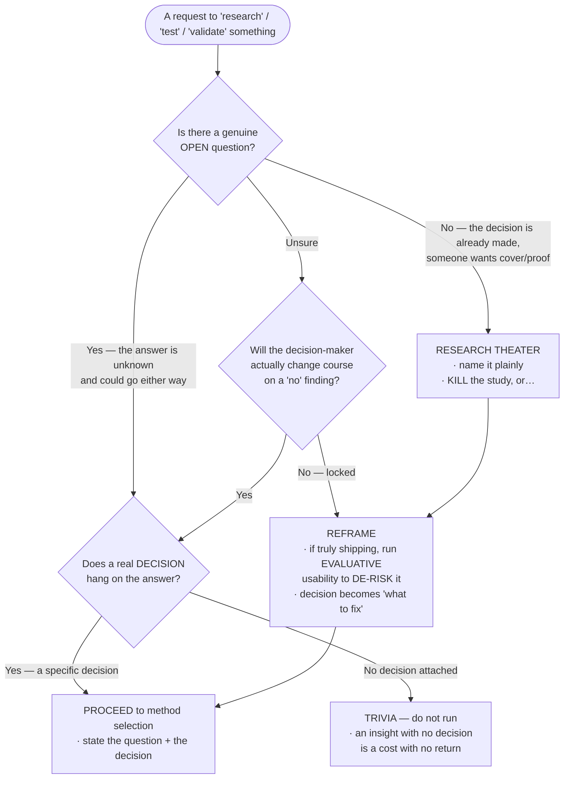
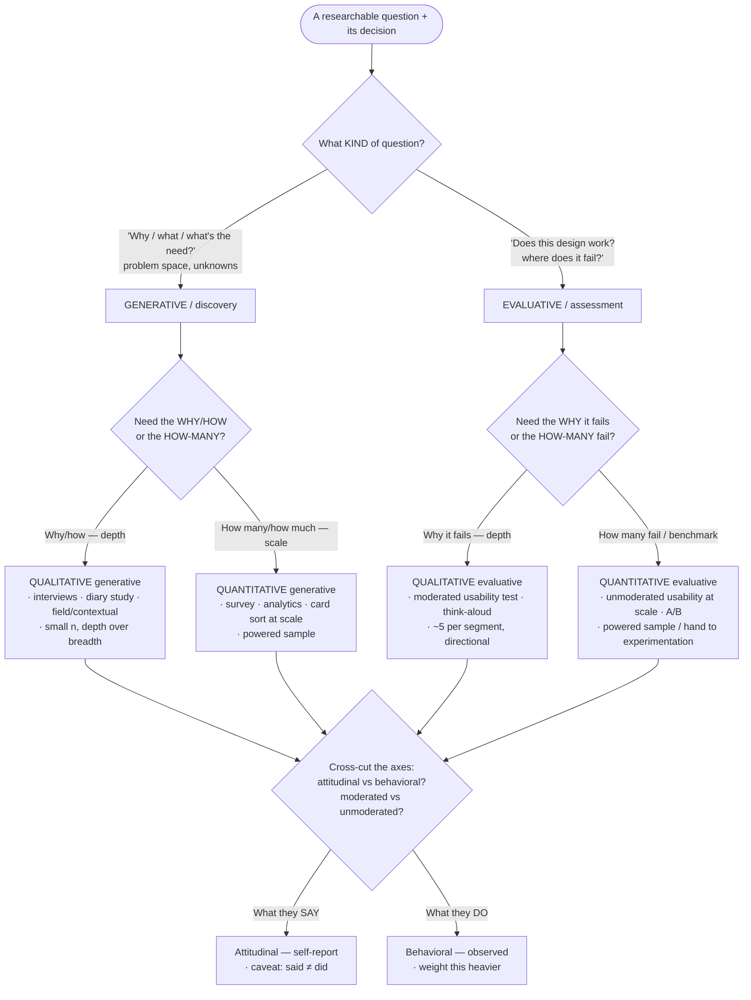
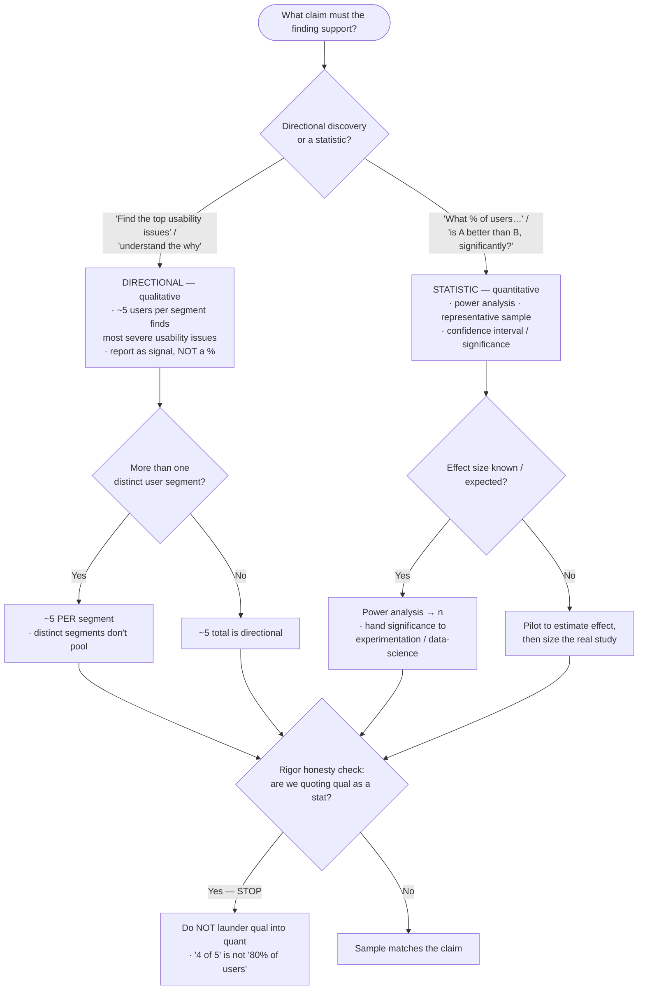
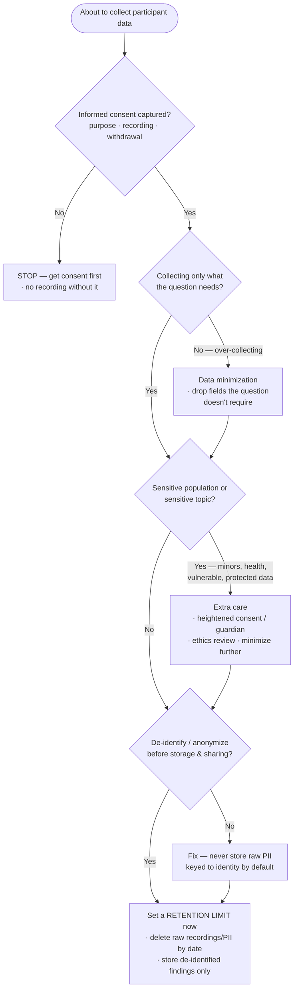

# Knowledge — UX-research decision tree

> **Last reviewed:** 2026-07-13 · **Confidence:** High on the durable framing (the research-theater gate, method-follows-question, the qual-vs-quant / attitudinal-vs-behavioral / generative-vs-evaluative axes, sample-sizing directional-vs-powered, the observation-vs-interpretation discipline, and the consent/PII gate); **Medium on specific numeric conventions (the "~5 users finds ~85% of usability issues" heuristic, exact power-analysis thresholds) and on tool/panel specifics — these are contested or volatile, re-verify before a stakeholder commitment.**
> The recurring UX-research questions are "is this even a research question, or is the decision already made?", "which method actually answers it?", "how big a sample does this claim need?", and "how do we handle participant data ethically?". This is the decision tree the two agents traverse **before** answering, plus the trade-off tables and the seams to adjacent plugins.

The team's discipline: **the research-theater gate runs first** — no study is stood up until we confirm there's a genuine open question tied to a real decision. Then method follows the question (never the reverse), sample follows the claim, and the consent/PII gate clears before a single data point is collected. Roadmap prioritization, visual/IA design, A/B-at-scale, and advanced stats **leave this layer** for `product-management`, `web-design`, `experimentation-growth-engineering`, and `data-science-research`.

---

## Decision Tree C: the research-theater gate (run this FIRST)

Traverse top-to-bottom. **No study is stood up until the gate clears.**

**The rule that catches most mistakes:** a question you already know the answer to is **not research** — it is theater. Kill it or reframe it into a real question with a real decision behind it. "Prove users love it" after the ship call is made is the canonical tell.

---

## Decision Tree A: which method? (method follows the question)

**The rule:** you **cannot A/B your way to "why", or interview your way to "how many".** The question dictates the method; naming the method first is the tell of a reflex study. Cross-cut every choice with **attitudinal (what they say) vs behavioral (what they do)** — behavior outweighs self-report — and **moderated (depth, probing, but observer effect) vs unmoderated (scale, natural, but no follow-up).**

---

## Decision Tree B: sample size & rigor (sample follows the claim)

**The rule:** **~5 users is enough for directional usability, never for a statistic.** Small-sample qualitative findings are *signals to act on*, not *proportions to quote*. The moment a "4 of 5" becomes "80% of users," the synthesis has laundered qual into quant — the cardinal rigor sin.

> The "~5 users surfaces ~85% of usability problems" figure (Nielsen/Landauer lineage) is a **heuristic for single-segment formative usability**, not a law and not a coverage guarantee for distinct segments or for measuring rates — treat it as directional and **re-verify the specifics before quoting.** _(Reviewed 2026-07-13.)_

---

## Decision Tree D: consent & participant-PII path (clears BEFORE collection)

**The rule:** **participant data is PII from first contact** — consent, minimize, de-identify, and **set a retention limit before you collect a thing**, not as cleanup afterward. Sensitive populations (minors, health, vulnerable groups) get heightened care and, where relevant, ethics review.

---

## Trade-off table — method → question it answers → what it CANNOT answer

| Method | Answers well | CANNOT answer | Typical sample |
|---|---|---|---|
| **User interviews** (generative, qual, attitudinal) | Needs, motivations, mental models, the "why" | How many / how often; what users *actually do* (said ≠ did) | 5–12, to saturation |
| **Contextual inquiry / field** (generative, qual, behavioral) | Real-world behavior, workarounds, context | Prevalence / rates; anything at scale | 5–12 |
| **Moderated usability test** (evaluative, qual, behavioral) | Where & *why* a design fails; severity | Task-success *rates* at population level; "% who love it" | ~5 per segment (directional) |
| **Unmoderated usability** (evaluative, mixed, behavioral) | Task success at scale, benchmarks | The *why* behind a failure (no probing) | Dozens–hundreds |
| **Survey** (quant, attitudinal) | How many / how much; attitudes at scale | *Why* (open text is thin); behavior; causation | Powered / representative |
| **A/B test** (quant, behavioral) | Which variant performs better, significantly | *Why* it won; anything about non-converters' reasons | Powered → `experimentation-growth-engineering` |
| **Card sort / tree test** (evaluative, behavioral) | IA/labeling fit | Visual/interaction quality; the "why" | 15–30 (quant tree test) |

> The through-line: **no single method is complete.** Generative finds the problem; evaluative checks the solution. Qual explains; quant measures. Pair them deliberately — and never ask one to answer the other's question.

## Trade-off table — the bias catalog (guarded in moderation & synthesis)

| Bias | Where it strikes | The counter |
|---|---|---|
| **Confirmation** | Synthesis — sorting data to fit the hoped-for answer | Themes emerge bottom-up; actively seek disconfirming evidence |
| **Leading** | Moderation & survey items — the question contains its answer | Open, neutral phrasing; think-aloud + silence; single-barreled items |
| **Sampling** | Recruit & survey frame — who's in/out of the frame | Screen to the real user; name who the frame excludes (e.g. only completers) |
| **Recency** | Synthesis — the last session dominates memory | Weight the whole corpus, not the freshest session |
| **Social-desirability** | Interviews & surveys — people flatter the maker | Neutral framing, third-party feel, behavioral measures over self-report |
| **Availability** | Synthesis — the vivid quote feels representative | Weight by frequency/consistency, not memorability |

---

## Seams (UX research is a discipline, not a rival to product or design)

- **Turning insight into roadmap / prioritization / a product bet** → `product-management`. This team frames, runs, and synthesizes; **the decision the research informs is theirs** — research informs it, it doesn't make it.
- **The visual / interaction / information-architecture design itself, and its own accessibility audits** → `web-design`. This team studies whether a design works; they design it.
- **Quantitative online experiments / A-B testing / statistical significance at scale** → `experimentation-growth-engineering`. When "is A significantly better than B across thousands of users" is the question, it leaves this layer.
- **Advanced quantitative / statistical modeling** (regression, segmentation/clustering, multivariate) → `data-science-research`. This team does basic descriptive + directional analysis; heavy stats are theirs.
- **WCAG conformance audits** → `accessibility-engineering`. Distinct from *usability testing with participants who have disabilities*, which **is** this team — the seam is standards-audit (theirs) vs lived-experience study (ours).

---

## Provenance

- The durable framing — research-theater gate, method-follows-question, the generative/evaluative + qual/quant + attitudinal/behavioral + moderated/unmoderated axes, directional-vs-powered sampling, observation-vs-interpretation, the bias catalog, and the informed-consent/minimization/retention discipline — is consensus practice across the UX-research literature (Nielsen Norman Group, the *Just Enough Research* / *Interviewing Users* / *Measuring the User Experience* lineage, and standard research-ethics guidance), reviewed 2026-07-13 — **High confidence**.
- Specific numbers (the "~5 users / ~85% of issues" heuristic, power thresholds) and tool/panel specifics are **contested or volatile** — treat as directional and re-verify with `ravenclaude-core/deep-researcher` before a stakeholder commitment.
