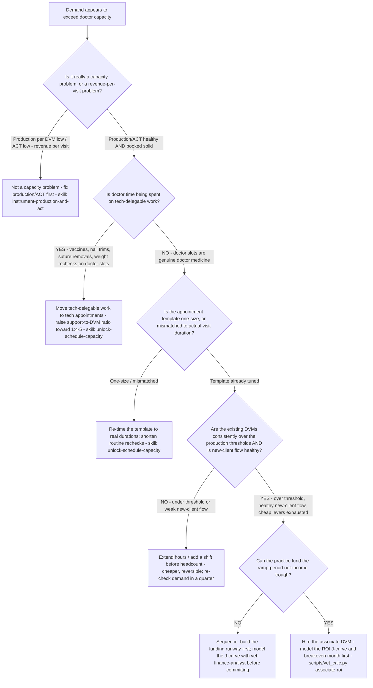

# Veterinary capacity decision tree — add an associate DVM vs. extend hours vs. fix the template

**Last reviewed:** 2026-06-05 · **Confidence:** medium (trade-literature rules-of-thumb + AAHA/AVMA benchmarks, web-verified this date). Production thresholds are rules-of-thumb, not hard rules — they carry inline `[verify-at-use]` markers and must be calibrated to the practice's case mix and segment before any deliverable (CLAUDE.md §3 #8).

> Canonical decision tree for the `practice-operations-manager` (capacity) with a finance assist from `vet-finance-analyst` (the ROI model). Traverse top-to-bottom against the observable situation **before** recommending a capacity move. The order encodes the house discipline: **rule out the cheap levers before the expensive ones** (CLAUDE.md §3 #3 — capacity gates revenue; §3 #7 — staff cost is a unit-economics issue). The single most expensive, slowest-to-reverse move (a DVM hire) sits at the bottom on purpose.

---

## When this applies

The practice is **demand-constrained at the doctor** — booked solid, owner over hours, or new clients turning away — and someone has proposed "hire a DVM" or "open more hours." Use this before committing to either; both are expensive and slow to unwind (a new-grad associate ramps over 12–24 months).

## The tree

## Rationale per leaf (cheap → expensive)

- **Not a capacity problem (fix production/ACT)** — booked-solid *and* low production-per-DVM/ACT is a revenue-per-visit problem wearing a capacity costume. Adding a doctor to a low-ACT practice just adds a second low-ACT doctor. Run [`../skills/instrument-production-and-act/SKILL.md`](../skills/instrument-production-and-act/SKILL.md) first (CLAUDE.md §3 #2).
- **Move tech-delegable work** — the cheapest capacity win. Doctor minutes spent on work a credentialed tech can legally do is capacity the practice already owns. AAHA Benchmarking attributes a gross-revenue lift of **~$161,000 per added credentialed veterinary technician per veterinarian** [verify-at-use], and AVMA cites an optimal **1 DVM : 4–5 staff** ratio [verify-at-use]. See [`../skills/unlock-schedule-capacity/SKILL.md`](../skills/unlock-schedule-capacity/SKILL.md).
- **Re-time the template** — a one-size 30-minute slot wastes doctor minutes on short visits and rushes long ones. Match slot length to real duration before adding supply.
- **Extend hours** — reversible and cheap relative to a hire, but a band-aid if the real issue is the template. Use when demand is genuine but the practice is *not* yet clearly over the production thresholds.
- **Hire the associate DVM** — the most expensive, slowest-to-reverse move. Only after the cheap levers are exhausted, the production thresholds are exceeded, new-client flow is healthy, and the ramp-period net-income trough is fundable. Model the J-curve first.

## Production thresholds that gate the hire (rules-of-thumb — `[verify-at-use]`)

| Signal | Rule-of-thumb | Read |
|---|---|---|
| Invoices / FTE DVM / year | ~3,000 per full-time practitioner; ~5,000 per FTE doctor at the practice level | Consistently above → demand may support a hire |
| Patients / DVM / day | ~20 sustainable; >20 trends toward burnout, <20 underloaded | Persistently >20 → capacity pressure is real |
| New clients / FTE DVM / month | ~25 | Low *despite* demand can mean clients can't get a convenient slot (a template problem, not a doctor shortage) |

These are trade-literature figures, not hard rules — calibrate to segment and case mix. Source: dvm360 "When to add an associate" (https://www.dvm360.com/view/qa-when-add-associate-your-team, retrieved 2026-06-05).

## The ROI J-curve (why the hire trough is fundable, not free)

A new-grad associate's production ramps over **12–24 months** while compensation (salary, or production-% with a salary floor) is paid from day one — so net income dips before it rises. Model: incremental production (ramped) − associate compensation − the support/COGS load that scales with added production = monthly net contribution. The trough depth and the breakeven month are what the owner must be able to fund. [`../scripts/vet_calc.py`](../scripts/vet_calc.py) `associate-roi` computes this; route the financing/structure call to [`vet-finance-analyst`](../agents/vet-finance-analyst.md).

## Escalation & guardrails

- A compensation-structure or financing decision → [`vet-finance-analyst`](../agents/vet-finance-analyst.md).
- Anything touching staff PII / employment-law specifics → out of scope; route to the practice's HR/legal counsel (the team is not a licensing or legal authority, CLAUDE.md §2).
- Every figure entering a deliverable carries a source URL + retrieval date or an `[unverified — training knowledge]` / `[ESTIMATE]` mark (CLAUDE.md §3 #8).

## Sources (retrieved 2026-06-05)

- dvm360 — *Q&A: When to add an associate to your team* (production thresholds, new-client signal): https://www.dvm360.com/view/qa-when-add-associate-your-team
- AAHA + Petabyte — *AAHA Benchmarking* (credentialed-tech revenue lift, staffing): https://www.aaha.org/american-animal-hospital-association-and-petabyte-technology-unveil-aaha-benchmarking/
- AVMA — *Increasing practice profitability requires benchmarking* (staffing ratios): https://www.avma.org/news/increasing-practice-profitability-requires-benchmarking-defining-core-values
- AAHA — *Following a formula for fair associate veterinarian compensation*: https://www.aaha.org/newstat/publications/following-a-formula-for-fair-associate-veterinarian-compensation/
