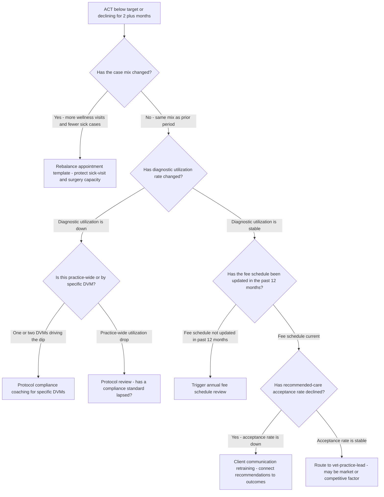
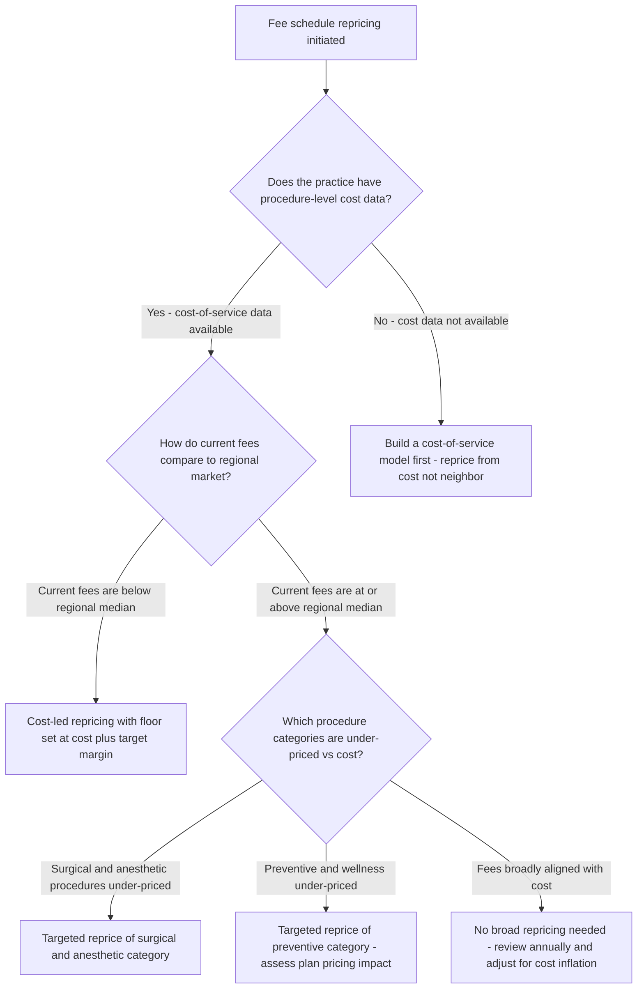
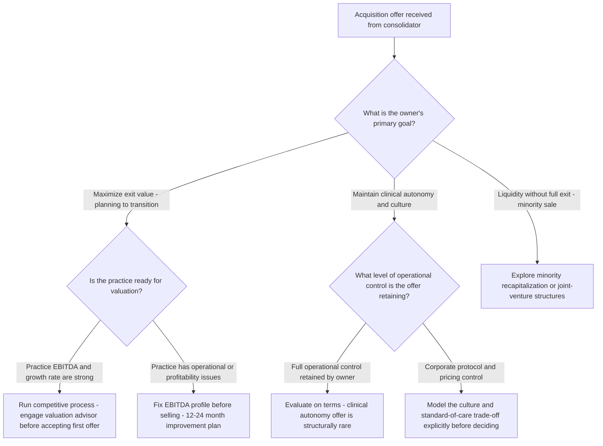

# Veterinary practice decision trees

Which analysis for which symptom — traverse top-to-bottom before picking a method.

## Decision Tree: Profit is down

1) Read production/ACT first (§3 #2). 2) Check capacity/utilization (§3 #3). 3) Check recommended-care acceptance (§3 #4). 4) Then the cost stack and fees (§3 #6).

## Decision Tree: Booked solid but revenue flat

1) Find the doctor bottleneck (§3 #3). 2) Fix the appointment template. 3) Tune the support ratio (§3 #7).

## Decision Tree: Sell to a consolidator?

1) Read the practice's economics honestly. 2) Frame against the consolidation market (§3 #5). 3) Compare value/control trade-offs.

## How to read these trees

Traverse top-to-bottom and stop at the first matching branch — the order encodes the cheap-checks-before-expensive-checks discipline (§3). Each leaf names a skill, a specialist, or a house-opinion to apply. Never skip a higher branch because a lower one looks more interesting; a denominator, seasonal, or definitional artifact masquerades as a finding more often than not.

## Decision Tree: Which skill for which task

- **Instrument production and ACT** → use when: Read practice revenue as production per DVM and average client transaction × visits, never one alone, so a revenue problem is diagnosed correctly. ([`../skills/instrument-production-and-act/SKILL.md`](../skills/instrument-production-and-act/SKILL.md))
- **Design a care protocol** → use when: Build an evidence-aligned, standardized care protocol as decision-support for the licensed DVM, to reduce unwarranted variation. ([`../skills/design-care-protocol/SKILL.md`](../skills/design-care-protocol/SKILL.md))
- **Unlock schedule capacity** → use when: Find the doctor bottleneck and fix the appointment template so a fully-booked practice can grow throughput. ([`../skills/unlock-schedule-capacity/SKILL.md`](../skills/unlock-schedule-capacity/SKILL.md))
- **Lift recommended-care compliance** → use when: Read recommended-care acceptance as a communication metric and raise it, instead of treating it as fixed demand. ([`../skills/lift-care-compliance/SKILL.md`](../skills/lift-care-compliance/SKILL.md))
- **Reprice the fee schedule** → use when: Reprice fees from the cost-of-service stack and medical value, not the neighbor's prices, to recover margin without losing position. ([`../skills/reprice-the-fee-schedule/SKILL.md`](../skills/reprice-the-fee-schedule/SKILL.md))

## Decision Tree: Which specialist owns this

- **The engagement** → [`vet-practice-lead`](../agents/vet-practice-lead.md)
- **Standardized care** → [`clinical-protocol-specialist`](../agents/clinical-protocol-specialist.md)
- **Capacity and the floor** → [`practice-operations-manager`](../agents/practice-operations-manager.md)
- **The economics** → [`vet-finance-analyst`](../agents/vet-finance-analyst.md)

When two leaves apply, route to the **lead** first to scope and sequence — overlapping symptoms usually mean two drivers at once, and the lead keeps the analysis from collapsing into a single-cause story.

## Decision Tree: Which house-opinion gates the call

Before picking any method, check whether one of the standing biases (§3) already decides the framing:

1. Standardize protocols to kill unwarranted variation — if this is in question, apply §3 #1 before any method.
2. Production per DVM and ACT are the revenue engine — if this is in question, apply §3 #2 before any method.
3. Capacity gates revenue — the schedule is the constraint — if this is in question, apply §3 #3 before any method.
4. Compliance is medicine and revenue — track it — if this is in question, apply §3 #4 before any method.
5. Read the independent-vs-corporate position honestly — if this is in question, apply §3 #5 before any method.
6. Price to value and cost, not to the practice down the road — if this is in question, apply §3 #6 before any method.
7. Staff cost and DVM burnout are a unit-economics issue — if this is in question, apply §3 #7 before any method.
8. Cite the source and date for every market number — if this is in question, apply §3 #8 before any method.

## Escalation & guardrails

- Anything touching client PII / regulated records → stop and route to `ravenclaude-core` `security-reviewer`.
- Any external figure entering a deliverable → carry a source URL + retrieval date, or mark it `[unverified — training knowledge]` / `[ESTIMATE]` (§3, final house opinion).
- A recommendation ships only with an owner, a date, and an expected metric movement.
## Sourcing note

Figures in this file are from the author's domain knowledge and are marked `[unverified — training knowledge]` or `[ESTIMATE]` at point of use. Validate against a primary source before putting any figure in a client deliverable (§3 cite-or-mark rule).

---

## Decision Tree: Veterinary Practice — Why ACT Is Below Benchmark

**When this applies:** Average client transaction is below the practice's target or has declined for 2+ consecutive months. The vet-finance-analyst or vet-practice-lead needs to identify whether the root cause is case mix, compliance, fee schedule, or appointment template before recommending a fix.

**Last verified:** 2026-06-05 against standard veterinary practice economics frameworks.

**Rationale per leaf:**
- *Rebalance appointment template* — case mix shift toward lower-ACT visit types is a scheduling architecture problem; protecting sick-visit and surgery slots restores the mix.
- *Protocol compliance coaching for specific DVMs* — single-DVM utilization drop is a behavior or coaching issue, not a systemic one; targeted coaching is the right-sized fix.
- *Protocol review - has a compliance standard lapsed?* — practice-wide utilization drops suggest the protocol standard itself has eroded; review and re-set the standard before coaching.
- *Trigger annual fee schedule review* — a stale fee schedule silently reduces ACT as costs rise; the review is the fix, not a coaching intervention.
- *Client communication retraining* — declining acceptance rate with stable utilization means recommendations are being made but not accepted; the presentation is the variable.
- *Route to vet-practice-lead* — stable fees, stable compliance, stable acceptance with declining ACT suggests a market or competitive force that needs engagement-level framing.

**Tradeoffs summary:**

| Method | Cost / time | Blast radius | Approval gate? | Use when |
|---|---|---|---|---|
| Appointment template rebalance | Low - scheduling change | Small | Practice manager | Case mix shift confirmed |
| DVM-specific compliance coaching | Low - 1-on-1 sessions | Small | Medical director | Single-DVM utilization gap |
| Protocol refresh | Medium - team meeting and retraining | Medium | Medical director | Practice-wide utilization drop |
| Fee schedule review | Medium - pricing analysis | Medium | Owner | Stale fees confirmed |

---

## Decision Tree: Veterinary Practice — Fee Schedule Repricing Approach

**When this applies:** The practice owner or vet-finance-analyst wants to reprice the fee schedule. The starting point is undefined — should repricing be anchored on cost, market, or value? This tree selects the right primary anchor before modeling begins.

**Last verified:** 2026-06-05 against standard veterinary practice fee management frameworks.

**Rationale per leaf:**
- *Build a cost-of-service model first* — repricing from market comps without cost data risks setting fees below cost on time-intensive procedures; cost is the floor, market is the ceiling.
- *Cost-led repricing with floor set at cost plus target margin* — below-market fees combined with available cost data allow a principled cost-plus reprice that moves toward market without guessing.
- *Targeted reprice of surgical and anesthetic category* — surgical and anesthetic procedures have the highest time and supply cost; under-pricing them is the most damaging category misalignment.
- *Targeted reprice of preventive category - assess plan pricing impact* — preventive services are bundled into wellness plans; repricing them requires simultaneous plan repricing to maintain plan economics.
- *No broad repricing needed - review annually* — fees aligned with cost and market require maintenance, not overhaul; annual inflation adjustment preserves alignment.

**Tradeoffs summary:**

| Method | Cost / time | Blast radius | Approval gate? | Use when |
|---|---|---|---|---|
| Build cost model first | Medium - 2-4 weeks analysis | None | Owner + finance | No current cost data |
| Cost-led full reprice | Medium - analysis + PIMS update | Medium - client communication needed | Owner | Broad fee-to-cost misalignment |
| Targeted category reprice | Low - scoped to category | Small | Owner | Specific category misalignment |
| Annual inflation adjustment | Low - % increase | Small | Owner | Fees broadly aligned, annual maintenance |

---

## Decision Tree: Veterinary Practice — Responding to a Corporate Acquisition Offer

**When this applies:** A corporate consolidator or PE-backed practice group has approached the practice owner with an acquisition offer. The vet-practice-lead needs to help the owner structure a decision before engaging in negotiations.

**Last verified:** 2026-06-05 against veterinary consolidation market context (CLAUDE.md §3 #5) and standard practice-valuation frameworks.

**Rationale per leaf:**
- *Explore minority recapitalization* — owners who want liquidity without a full exit can sell a minority stake to a PE firm or consolidator, retaining operational control; increasingly common in the veterinary market.
- *Run competitive process* — a strong EBITDA practice has leverage; the first offer is rarely the best; engaging a veterinary M&A advisor to run a competitive process typically increases the final multiple.
- *Fix EBITDA profile before selling* — selling with operational problems depresses valuation multiples; a 12–24 month improvement typically yields a significantly higher multiple than a distress sale.
- *Evaluate on terms - clinical autonomy offer is structurally rare* — consolidators who genuinely retain full clinical control are rare; verify the terms are legally binding and not just marketing language.
- *Model the culture and standard-of-care trade-off* — corporate protocol standardization and pricing control change the clinical experience; owners who value autonomy should model this explicitly, not assume it will be benign.

**Tradeoffs summary:**

| Method | Cost / time | Blast radius | Approval gate? | Use when |
|---|---|---|---|---|
| Minority recapitalization | Medium - legal and negotiation | Medium - partial exit only | Owner + legal counsel | Liquidity wanted without full exit |
| Competitive sale process | High - 6-12 months | Large - full exit | Owner + M&A advisor | Strong EBITDA, maximizing exit value |
| Pre-sale improvement plan | High - 12-24 months investment | Medium | Owner + ops team | Distressed EBITDA depressing valuation |
| Accept current offer | Low - quick close | Large - full exit or partnership | Owner + legal | Offer terms are genuinely competitive |
