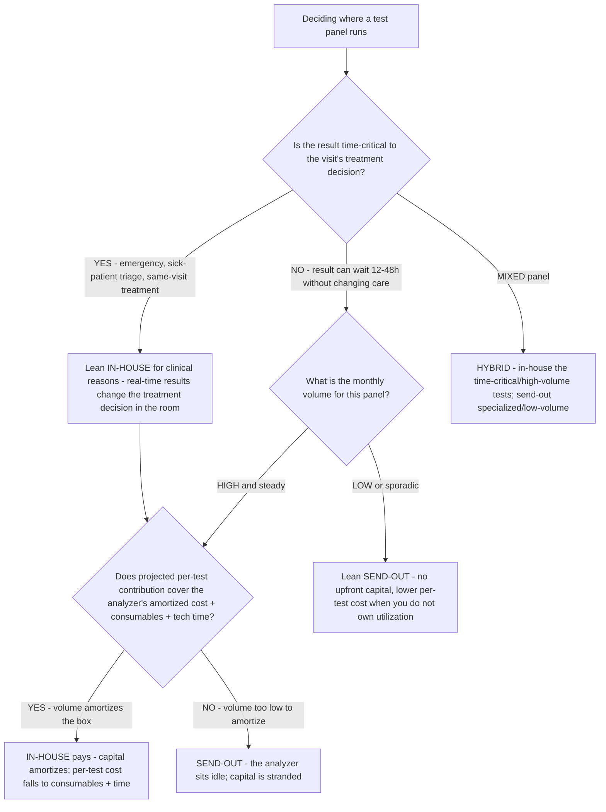

# Veterinary diagnostics decision tree — in-house lab vs. reference (send-out) lab

**Last reviewed:** 2026-06-05 · **Confidence:** medium (industry cost-framing sources + clinical-turnaround literature, web-verified this date). Equipment cost, per-test cost, and turnaround figures are vendor- and volume-dependent — they carry inline `[verify-at-use]` / `[ESTIMATE]` markers and must be validated against the practice's actual volume and supplier quotes before any deliverable (CLAUDE.md §3 #8).

> Canonical decision tree for the `vet-finance-analyst` (the economics) with a clinical assist from `clinical-protocol-specialist` (turnaround → patient-care value). Traverse top-to-bottom before recommending an analyzer purchase or a send-out contract. The decision is **not** "in-house is cheaper" — it is a volume + turnaround + clinical-value trade where the right answer is usually a **hybrid** (in-house for time-critical/high-volume, send-out for low-volume/specialized). This is decision-support for the practice owner, not a clinical order (CLAUDE.md §2).

---

## When this applies

A practice is deciding whether to buy (or keep) an in-house analyzer for a given test panel, or to send that work to a reference lab — or how to split the two. Common triggers: an equipment-vendor pitch, a reference-lab contract renewal, or a margin review on diagnostics.

## The tree



## Rationale per leaf

- **In-house for clinical reasons** — when the result **changes the treatment decision in the room** (emergency, sick-patient triage), real-time matters more than per-test cost. Send-out results — even a fast 12-hour turnaround — arrive *after* important treatment decisions have already been made, giving only a retrospective view of a patient already under treatment. Rapid in-house tests can return in **<15 minutes** [verify-at-use]. The clinical-value side is owned by [`clinical-protocol-specialist`](../agents/clinical-protocol-specialist.md).
- **Send-out for low/sporadic volume** — a reference lab has **no upfront capital** and is typically more affordable per individual test when you can't keep an analyzer busy. Buying a ~$25,000 [ESTIMATE] analyzer you run a few times a week strands capital.
- **In-house pays when volume amortizes the box** — with an in-clinic analyzer, the marginal cost per test is **kit + tech time**; one manufacturer reports most customers saving **over 50% on testing cost** [verify-at-use, vendor-sourced — treat skeptically]. That saving is real **only at sufficient utilization** — the box must run enough to cover its amortized capital + consumables + tech time.
- **Hybrid (the usual answer)** — in-house the time-critical and high-volume panels; send out the specialized, low-volume, or send-out-only work (histopath, advanced endocrine, culture). Most practices land here.

## The economic test (the load-bearing arithmetic)

In-house is justified for a panel when, **at projected monthly volume**, per-test contribution covers the full cost:

```
in-house per-test cost = (analyzer amortization / tests per period) + consumables/test + tech-time/test
```

If `send-out per-test cost < in-house per-test cost` at your real volume, send out. The variable that flips the answer is **volume** — the analyzer's fixed cost spreads thin only when it runs. [`../scripts/vet_calc.py`](../scripts/vet_calc.py) `lab-breakeven` computes the monthly-volume breakeven where in-house overtakes send-out.

## Gotchas

- **Vendor "save 50%" claims assume your volume, not the average** — re-run the breakeven on *your* projected volume, not the vendor's reference customer (`[verify-at-use]`).
- **Tech time is a real cost** — in-house diagnostics consume staff time and supplies; don't model it as free. (This is also a capacity draw — cross-check the [`vet-add-associate-vs-extend-capacity-decision-tree.md`](vet-add-associate-vs-extend-capacity-decision-tree.md).)
- **Quality-control and calibration** are an ongoing cost and compliance obligation for in-house analyzers — fold them into the amortized cost, not an afterthought.
- **Don't price the test off the neighbor's shelf** — reprice diagnostics from the cost stack and clinical value (CLAUDE.md §3 #6); see [`../skills/reprice-the-fee-schedule/SKILL.md`](../skills/reprice-the-fee-schedule/SKILL.md).

## Escalation & guardrails

- Clinical-appropriateness of a test panel → [`clinical-protocol-specialist`](../agents/clinical-protocol-specialist.md) (decision-support for the licensed DVM, never an order — CLAUDE.md §2).
- Capital-financing structure for the analyzer → [`vet-finance-analyst`](../agents/vet-finance-analyst.md).
- Every figure entering a deliverable carries a source URL + retrieval date or an `[unverified — training knowledge]` / `[ESTIMATE]` mark (CLAUDE.md §3 #8).

## Sources (retrieved 2026-06-05)

- Vet Advantage — *The Economics of the In-House Lab*: https://vet-advantage.com/vet-advantage/the-economics-of-the-in-house-lab/
- Safepath — *Cost of In-house Testing vs Send-Out Laboratory Testing*: https://safepath.com/cost-of-in-house-testing-for-veterinary-diseases-vs-cost-of-send-out-laboratory-testing/
- Veterinary Practice News — *The real cost of equipment acquisitions*: https://www.veterinarypracticenews.com/real-cost-of-equipment-acquisitions/
