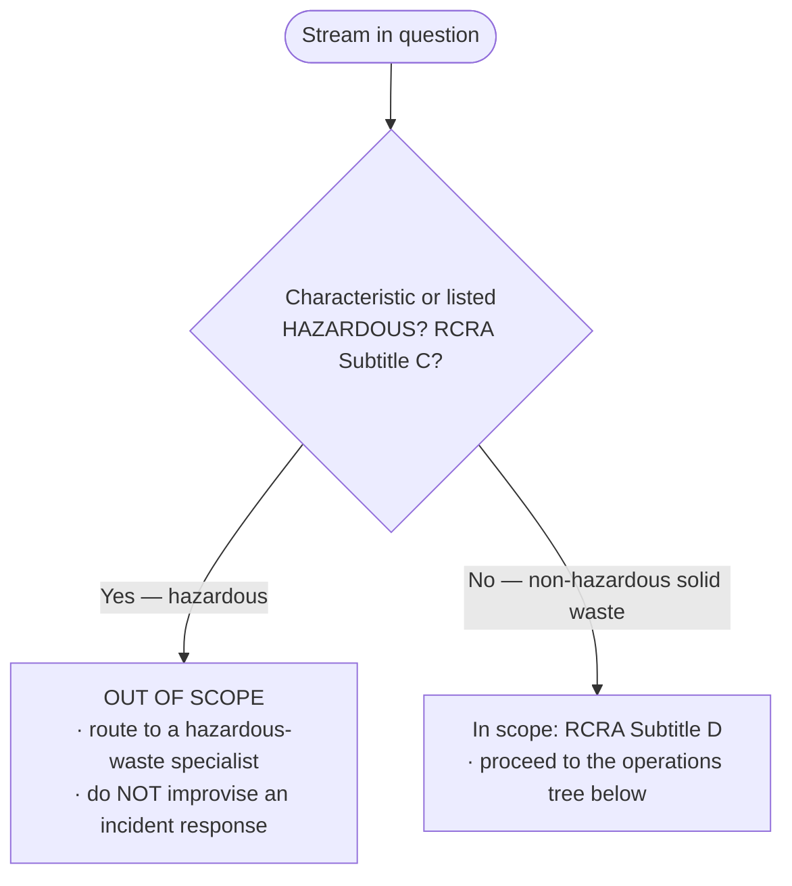
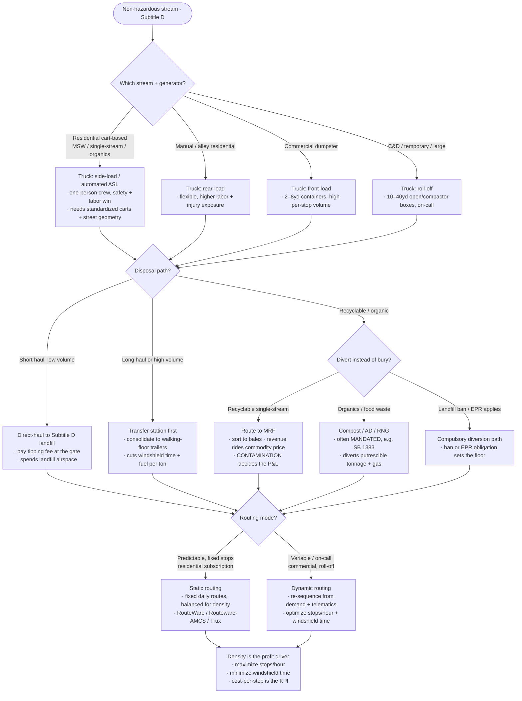

# Knowledge — Waste-operations decision tree

> **Last reviewed:** 2026-07-09 · **Confidence:** Medium-High (consensus on the truck-to-stream match, the direct-haul-vs-transfer-station and static-vs-dynamic-routing framing, and the Subtitle-D-vs-C scope line; **specific tipping fees, bale/commodity prices, and EPR/landfill-ban statutes are volatile — re-verify with a retrieval date before a client commitment**).
> The most-asked operations questions are "what truck for this stream?", "landfill direct or through a transfer station?", "static or dynamic routing?", and "landfill it or divert it?". This is the decision tree the agents traverse **before** naming a truck, a disposal path, a routing mode, or a diversion tactic, plus the trade-off table, the Subtitle-D-vs-C scope gate, and the seams to adjacent plugins.

The team's discipline: **classify the stream first (and confirm it's Subtitle D, not Subtitle C), match the truck, choose the disposal path by haul economics, pick the routing mode by demand predictability, and measure diversion from the scale.** Corporate ESG/disclosure and hazardous (Subtitle C) handling are **not** in this layer — they leave for `esg-sustainability-reporting` and a hazardous-waste specialist respectively.

---

## Scope gate (run this FIRST — before any other branch)

**Subtitle D = non-hazardous solid waste (MSW, recycling, organics, most C&D)** — this team's whole remit. **Subtitle C = hazardous waste** — out of scope; route it out. When in doubt about characterization, treat it as Subtitle C until proven otherwise and escalate.

---

## Decision Tree: truck, disposal, routing, diversion

Traverse top-to-bottom, once the scope gate passes.

---

## Trade-off table

### Trucks (match to stream + container)

| Truck | Sweet spot | Watch out for |
|---|---|---|
| **Side-load / automated (ASL)** | Cart-based residential MSW/recycling/organics; one-person crew | Needs standardized carts + set-out discipline + street geometry; higher capital cost |
| **Rear-load** | Manual/alley residential, mixed/bulky set-outs; flexible | Higher labor + hopper/lifting injury exposure; slower per stop |
| **Front-load** | Commercial dumpsters (2–8yd), high per-stop volume | Overhead clearance / access; not for scattered residential |
| **Roll-off** | C&D, temporary, and large-volume open/compactor boxes (10–40yd) | On-call/low density by nature; drop-and-swap logistics |

### Disposal & routing

| Choice | Pick when | Watch out for |
|---|---|---|
| **Direct-haul to landfill** | Short haul to a Subtitle D cell, lower volume | Spends finite airspace; long hauls burn windshield time + fuel |
| **Transfer station** | Long haul or high volume; consolidate to trailers | Extra handling cost per ton; only pays above a distance/volume threshold |
| **MRF (recyclables)** | A single-stream program with saleable grades | Contamination flips a load from revenue to a tipping-fee cost |
| **Organics (compost/AD/RNG)** | Food/yard waste, often mandated (SB 1383) | Needs clean feedstock; siting + odor; hauling cadence for putrescibles |
| **Static routing** | Predictable residential subscription | Drifts out of balance as the territory grows — re-balance periodically |
| **Dynamic routing** | On-call commercial / roll-off | Needs live telematics + demand signal; tooling + discipline to run well |

> **Volatile:** tipping fees ($/ton), bale/commodity prices, airspace valuations, alt-fuel (RNG/EV) incentives, and EPR / landfill-ban / organics-mandate statutes vary by market and change frequently. Treat the framing above as durable and the specific numbers/laws as a 2026-07 snapshot — re-verify with `ravenclaude-core/deep-researcher` before a client commitment.

---

## "Landfill vs divert" sub-choice (the economics behind the branch)

Three forces decide whether a ton is buried or diverted — and two of them aren't optional:

- **Economics** — divert when the diverted ton's net value (commodity revenue − processing − contamination cost) beats the avoided tipping fee. When bale prices crash, this alone can favor landfill.
- **Mandate** — but **SB 1383 (organics), EPR (packaging), and landfill bans override the economics**: where a stream is compulsorily diverted, "landfill it" isn't a legal option regardless of price.
- **Airspace** — every buried ton spends a finite, appreciating asset; a market with scarce airspace tilts toward diversion even at thin commodity margins.

The rule: **run the economics, then let the mandate and airspace override it.** Never quote the trade-off as pure commodity math when a mandate is in force.

---

## Seams (this layer operates; others report / support / handle-the-hazardous)

- **Corporate ESG / sustainability disclosure — diversion & emissions as a *reported* metric** → `esg-sustainability-reporting` (the "what we disclose" question — distinct from "how we operate the diversion").
- **Generic fleet telematics / DOT compliance / vehicle routing as a cross-industry function** → `fleet-logistics` (not waste-specific route density or the refuse fleet mix).
- **Hazardous waste (RCRA Subtitle C) handling + incident response** → a hazardous-waste specialist; **out of scope** here — route it out, never improvise.
- **Field dispatch / work-order scheduling as a service-desk function** → `field-service-management`.
- **Downstream commodity buyers / recovered-material end-markets** → `supply-chain-planning`.

---

## Provenance

- Industry-consensus framing for the truck-to-stream match (front/rear/side-load ASL/roll-off), transfer-station-vs-direct-haul economics, static-vs-dynamic routing, and the RCRA Subtitle D (non-hazardous) vs Subtitle C (hazardous) scope line, reviewed 2026-07-09 — **High confidence** on the framing.
- Tipping fees, bale/commodity prices, airspace valuations, and EPR / landfill-ban / SB 1383 statutes are a **2026-07 snapshot**; they vary by market and change frequently — carry a retrieval date and re-verify before quoting.
