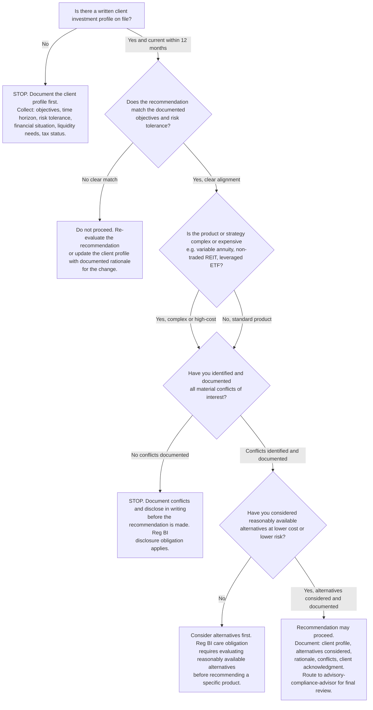
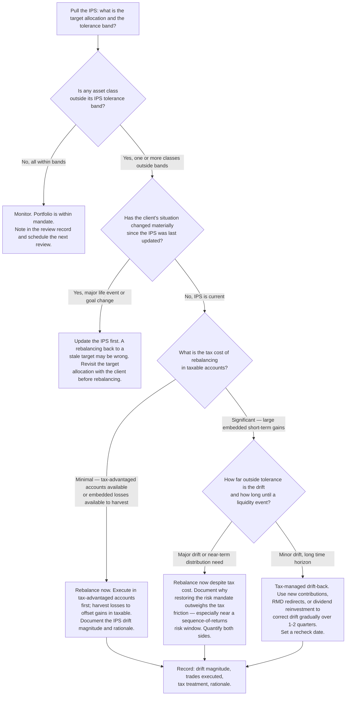
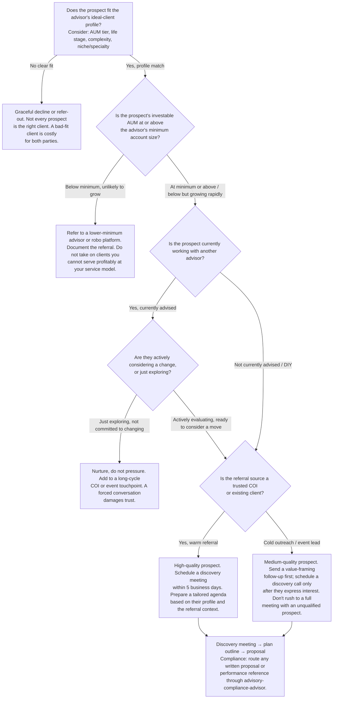

# Wealth Management Advisory — Decision Trees + 2026 Capability Map

> Canonical knowledge bank for `wealth-management-advisory`. **Traverse the relevant Mermaid tree
> top-to-bottom before recommending.** This is the proactive complement to the Capability Grounding
> Protocol. Volatile product/version facts in the capability map carry `[verify-at-use]`.

---

## Decision Tree 1: Suitability / Reg BI Clearance Before Any Recommendation

**Leaf rule:** no recommendation reaches a client without a documented client investment profile,
a best-interest rationale tied to that profile, a conflicts-of-interest disclosure, and a record of
reasonably available alternatives considered. A "technically suitable" recommendation is the floor;
fiduciary best-interest is the standard. Route every product recommendation through
`advisory-compliance-advisor` before delivery.

---

## Decision Tree 2: Rebalance Now or Not

**Leaf rule:** rebalance to the IPS, not to recent performance or market outlook. Tax cost is a
factor (and often tilts toward tax-managed drift-back), but letting a portfolio run materially
outside its IPS tolerance to avoid taxes is a risk-management failure — especially within 5 years
of a major distribution event. Document the tree path and the rationale for every rebalancing
decision or deliberate hold.

---

## Decision Tree 3: Prospect Qualification

**Leaf rule:** qualify prospects on fit (ideal-client profile), financial threshold (minimum AUM
or clear trajectory), and relationship warmth (referral vs. cold) before investing full meeting
time. A warm referral from a COI or existing client closes faster, retains longer, and generates
more referrals than a cold contact. A below-minimum prospect you take on out of optimism typically
costs more in service time than they generate in revenue.

---

## 2026 Capability Map — Planning Tools, CRM, and Custodians

_Orientation only. Product availability, pricing, and positioning are volatile. Re-verify at use
before recommending a specific tool to an advisory firm. Sources are noted below. No invented
products._

### Financial Planning Software

| Tool | Best fit | Notes |
|---|---|---|
| **eMoney Advisor** | Comprehensive planning, cash-flow modeling, client portal | Market-leader for full-plan presentation with aggregation; strong cash-flow and estate planning module; pricing is per-advisor, typically $[verify-at-use] |
| **RightCapital** | Mid-market advisors, strong tax and Roth modeling | Strong Roth conversion optimizer and tax-bracket visualization; often preferred for its modern UX; lower price point than eMoney [verify-at-use] |
| **MoneyGuide Pro (Envestnet)** | Goals-based planning, probability of success framing | Long-standing tool; strong for goals-based / probability-of-success narrative; integrates with Envestnet portfolio management [verify-at-use] |
| **Orion Planning** | Advisors already on Orion ecosystem | Integrated with Orion portfolio management; best for existing Orion users [verify-at-use] |
| **Advyzon Financial Planning** | All-in-one CRM + planning + reporting | Single-platform for smaller RIAs; less deep than dedicated planning tools [verify-at-use] |

### CRM (Client Relationship Management)

| Tool | Best fit | Notes |
|---|---|---|
| **Redtail CRM** | Independent RIAs, broad integration | One of the most widely used advisor CRMs; strong integration with most custodians and planning tools; web-based [verify-at-use] |
| **Wealthbox** | Modern UX, team workflows | Growing adoption; clean interface; good for team-based practices; integrates with custodians and planning software [verify-at-use] |
| **Salesforce Financial Services Cloud** | Larger RIAs, enterprise needs | Deep customization and reporting; significant implementation cost; best for larger practices with a dedicated ops resource [verify-at-use] |
| **Practifi** | Enterprise RIA networks | Salesforce-based; designed for multi-advisor practices and enterprise RIAs [verify-at-use] |

### Custodians (Advisor-Facing)

| Custodian | Market position (2026) | Notes |
|---|---|---|
| **Schwab Advisor Services** | Largest by AUM (post-TD Ameritrade merger) | Dominant custodian; broad technology integrations; iRebal rebalancing tool included [verify-at-use] |
| **Fidelity Institutional** | Second-largest | Strong technology stack (Wealthscape); proprietary and third-party fund access [verify-at-use] |
| **Pershing Advisor Solutions (BNY Mellon)** | Large-RIA focus | Known for complex accounts, alternatives, global; NetX360 platform [verify-at-use] |
| **Altruist** | Tech-forward RIAs, emerging | Modern, low-cost custodian; strong API and integration story; growing rapidly among tech-forward RIAs [verify-at-use] |
| **Interactive Brokers (IBKR)** | Fee-sensitive, international exposure | Lower cost; stronger for international; less advisor-service oriented than traditional custodians [verify-at-use] |

### Portfolio Management and Rebalancing

| Tool | Notes |
|---|---|
| **iRebal (Schwab)** | Included with Schwab custody; threshold-based rebalancing [verify-at-use] |
| **Tamarac Rebalancing (Envestnet)** | Deep tax-aware rebalancing; strong for tax-managed drift-back workflows [verify-at-use] |
| **Riskalyze / Nitrogen** | Risk profiling and alignment; "risk number" for client-IPS alignment [verify-at-use] |
| **Orion Rebalancing** | Integrated within Orion platform [verify-at-use] |

> **Sources and confidence:** product positioning is based on publicly available advisor industry
> surveys and vendor descriptions current as of early 2026 [verify-at-use before acting].
> Custodian AUM rankings from public disclosures and advisor industry research [verify-at-use].
> Pricing for all tools is volatile — do not quote pricing from this map; verify with the vendor.

---

## See also

- [`../CLAUDE.md`](../CLAUDE.md) — team constitution and seams.
- [`../best-practices/README.md`](../best-practices/README.md) — the six named, citable rules.
- [`../templates/investment-policy-statement.md`](../templates/investment-policy-statement.md) — IPS template.
- [`../templates/financial-plan-outline.md`](../templates/financial-plan-outline.md) — plan outline template.

_Last reviewed: 2026-06-08 by `claude`._
