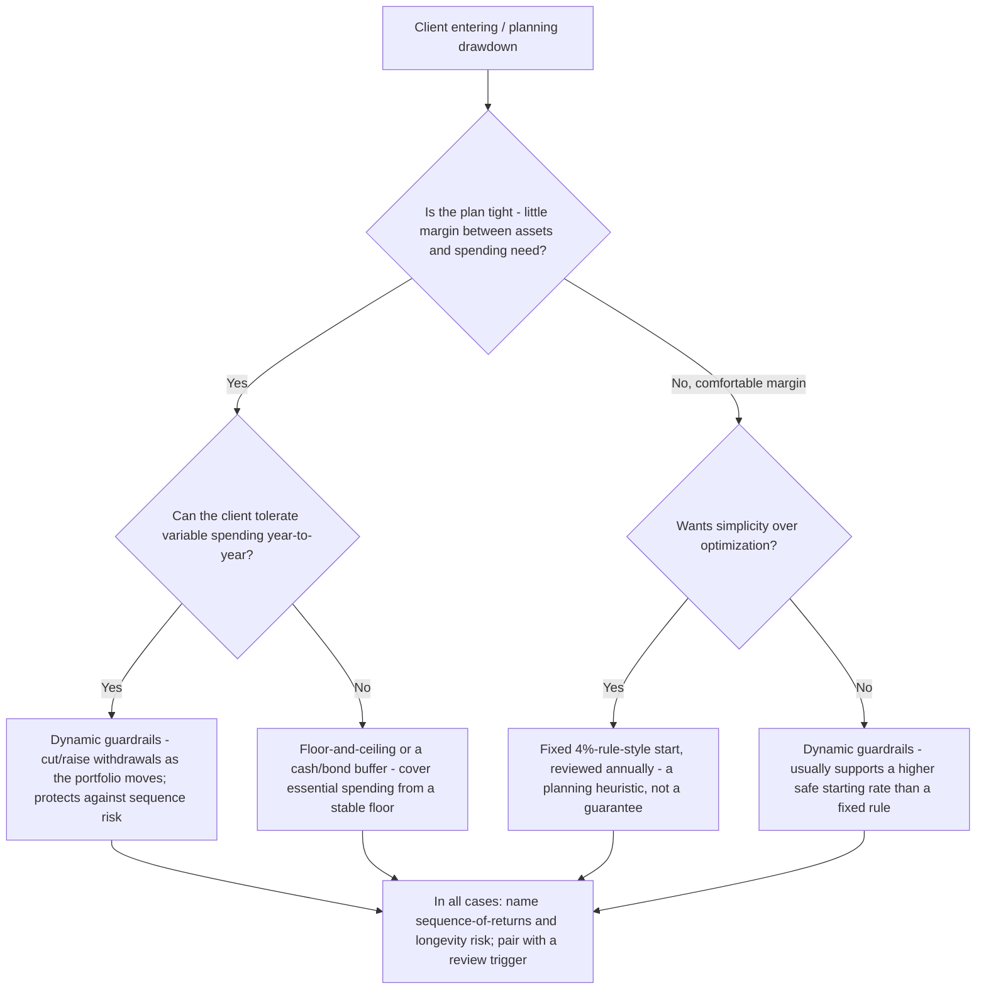

# Wealth Management (RIA) — Decision Trees

_Decision trees + a dated reference map. Reference rows are `[verify-at-build]` — re-check the current-year figure/rule against the IRS / SEC / a primary source before quoting. Last reviewed: 2026-06-08._

> **Not investment advice.** These are educational decision frameworks for an advisory practice, not personalized recommendations. The licensed adviser applies them to a specific client after confirming the client-specific facts; a CPA / attorney owns the tax and legal conclusions.

Traverse before deciding an account-funding order, a withdrawal strategy, whether something is education vs personalized advice, or which standard applies.

## Decision Tree: What's the tax-aware account-funding order?

Capture free money first, then sort by tax treatment — but the client-specific bracket and eligibility change the answer.

```mermaid
graph TD
  A[A dollar to save] --> B{Is there an employer match available and unfunded?}
  B -- Yes --> C[Fund to the full match first - it's the one unambiguous, near-universal move]
  B -- No / already captured --> D{High-interest debt outstanding?}
  D -- Yes --> E[Pay it down - a guaranteed return that beats most allocations]
  D -- No --> F{Emergency fund in place?}
  F -- No --> G[Build the cash buffer first - it's a prerequisite, not an investment]
  F -- Yes --> H{HSA-eligible (HDHP) and not yet maxed?}
  H -- Yes --> I[Consider the HSA - triple tax advantage for eligible clients]
  H -- No --> J{Tax-advantaged space (Roth/Traditional IRA, 401k) remaining?}
  J -- Yes --> K[Fund it - Roth vs Traditional depends on now-vs-later bracket; confirm with a CPA]
  J -- No --> L[Taxable brokerage - mind asset location and tax efficiency]
```

_Capture the match → clear high-interest debt → emergency fund → HSA (if eligible) → tax-advantaged → taxable. The order is a framework; eligibility, bracket, and goals are client-specific facts to confirm._

## Decision Tree: Which retirement withdrawal strategy?

The number is less important than surviving a bad sequence of early returns.



_The 4% rule is a starting heuristic, not a guarantee. Sequence-of-returns risk (bad early years) is the retirement-planning fault line; guardrails and a cash buffer exist to survive it._

---

## Reference map (2026, `[verify-at-build]`)

| Item | 2026 reference point | Notes |
|---|---|---|
| Withdrawal heuristic | The "4% rule" (Bengen / Trinity-study lineage) | A planning heuristic from historical US data, not a guarantee — pair with guardrails `[verify-at-build]` |
| Dynamic withdrawals | Guyton-Klinger guardrails, floor-and-ceiling, bucket/cash-buffer | Adjust spending to portfolio performance; usually supports a higher safe start `[verify-at-build]` |
| IRA / 401(k) contribution limits | Set annually by the IRS, with catch-up over age 50 | Re-check the current-year figure at the IRS before quoting any number `[verify-at-build]` |
| HSA (HDHP-linked) | Triple tax advantage; annual limit set by the IRS | Eligibility requires a qualifying HDHP — confirm before recommending `[verify-at-build]` |
| RMDs | Required minimum distributions begin at the statutory age | The starting age has changed via recent legislation — verify the current age `[verify-at-build]` |
| Wash-sale rule | Disallows the loss if a substantially identical security is bought within 30 days (±) | Gates tax-loss harvesting; route the specifics to a CPA `[verify-at-build]` |
| Adviser standard (RIA) | Fiduciary duty under the Investment Advisers Act — duty of care + loyalty | Client's interest first; conflicts disclosed and managed `[verify-at-build]` |
| Broker-dealer standard | Regulation Best Interest (Reg BI) | A *different* best-interest standard — never conflate with the RIA fiduciary duty `[verify-at-build]` |
| Form ADV | Part 1 (registration), Part 2A (brochure), Part 2B (supplement), Form CRS (relationship summary) | The disclosure documents; firm-specific filing routes to counsel `[verify-at-build]` |
| Marketing rule | The SEC marketing rule governs testimonials/endorsements, performance, substantiation | Performance/testimonial claims need substantiation and the required disclosures `[verify-at-build]` |
| Books-and-records | Advisers Act recordkeeping requirements | Retain the basis for advice, reviews, the IPS, disclosures — verify retention specifics with counsel `[verify-at-build]` |

_Every figure (contribution limits, RMD age, withdrawal rate) and every rule citation above is a `[verify-at-build]` placeholder: confirm against the IRS / SEC / a primary source for the current year before quoting it to a consumer. Tax conclusions route to a CPA; legal conclusions and firm-specific filings route to counsel. None of this is personalized investment advice._
