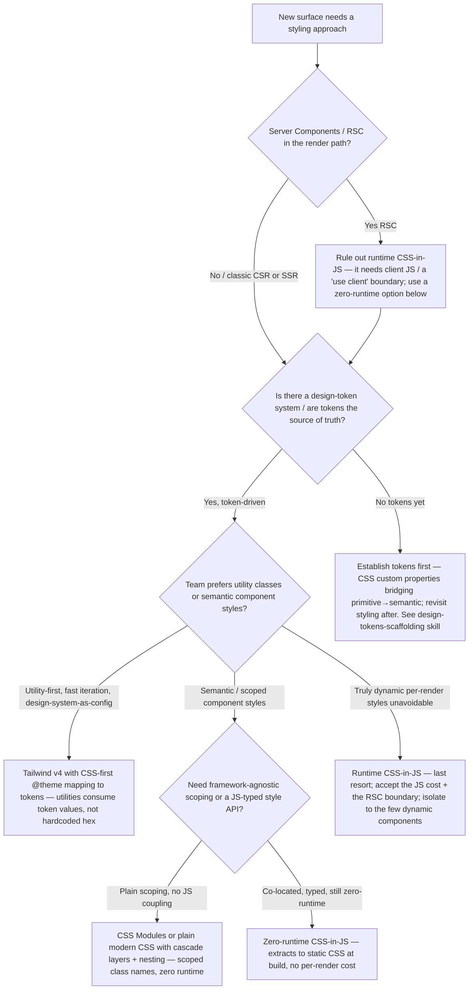
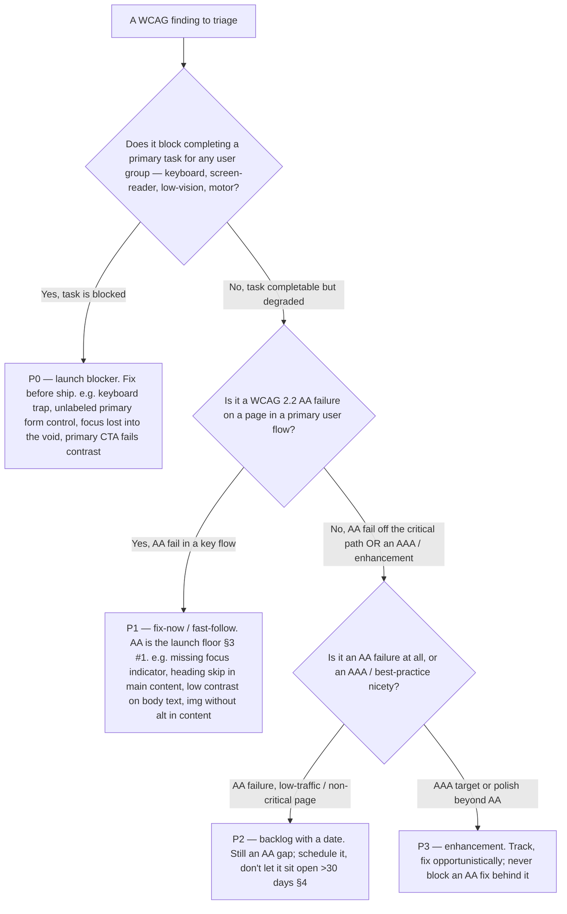

# CSS architecture & accessibility-remediation decision trees

**Last reviewed:** 2026-06-05 · **Confidence:** medium-high — these encode the web-design team's standing positions (`../CLAUDE.md` §3) and the 2026 platform briefs in this `knowledge/` directory. The WCAG version and any browser-support claim are volatile (`[verify-at-use]`); re-verify on the Researcher sweep.
**Owner:** the web-design team — `visual-designer` + `frontend-implementer` own the CSS-architecture tree; `accessibility-auditor` owns the remediation-priority tree.

These two trees **complement** [`web-design-decision-trees.md`](web-design-decision-trees.md) (which already covers a11y native-vs-ARIA, CWV-by-symptom, rendering strategy, image format, design-system foundation, IA, conversion, responsive, CMS, motion, dark mode, form labels, content SEO). The gaps they fill: **how to pick a styling approach / CSS architecture**, and **how to rank a11y findings for remediation** once an audit has produced a backlog. Same marketplace convention as the sibling file ([`../../../docs/best-practices/decision-trees-in-knowledge-files.md`](../../../docs/best-practices/decision-trees-in-knowledge-files.md)): traverse the Mermaid graph top-to-bottom when the entry condition matches; the first branch that resolves cleanly is the leaf to apply. Do **not** keyword-match on the user's phrasing.

> **Decision-tree traversal (priors).** When a request matches an entry condition below, traverse that tree before selecting an approach. The trees encode the constitution's house opinions (`../CLAUDE.md` §3) and the dated 2026 knowledge briefs in this directory.

---

## Decision Tree: CSS architecture — which styling approach for a new surface

**When this applies:** You're starting a new site/app surface (or consolidating a drifting one) and must choose how CSS is authored and delivered: plain modern CSS, CSS Modules, a utility framework (Tailwind), a zero-runtime CSS-in-JS / styled system, or a runtime CSS-in-JS library. The observable trigger: you're about to add a styling dependency, or you're choosing between `className` conventions for a fresh codebase.

**Last verified:** 2026-06-05 against [`modern-css-2026.md`](modern-css-2026.md), [`design-systems-and-component-architecture-2026.md`](design-systems-and-component-architecture-2026.md), and the constitution's "design tokens, not hardcoded values" (§3 #4) + "static-first" (§3 #9). The **default bias is zero-runtime**: prefer styling that ships no per-render JS cost, and let tokens (CSS custom properties) carry theming. Runtime CSS-in-JS is the last resort, and is RSC-hostile.

**Rationale per leaf:**
- *TOKENS (establish first)* — styling choice is downstream of the token system. Picking Tailwind or CSS Modules before tokens exist just relocates where the hardcoded hex lives (§3 #4, §3 #12). Stand up primitive→semantic tokens, then choose how components consume them.
- *TAILWIND* — utility-first is fast and, with Tailwind v4's CSS-first `@theme`, maps cleanly onto design tokens so utilities pull *token values* rather than ad-hoc colors; good for product UIs iterating quickly with a design-system-as-config posture. Guard against arbitrary values (`text-[#3b82f6]`) re-introducing drift.
- *MODULES / plain modern CSS* — modern CSS (cascade layers, native nesting, `:has()`, container queries, `oklch()`) plus CSS Modules gives scoped, zero-runtime styling with no JS coupling — the strongest default for content/marketing sites and RSC-heavy apps. Static-first (§3 #9).
- *ZERO_CSS_IN_JS* — when a team wants co-located, typed style APIs but no runtime cost, a build-time-extracted (zero-runtime) CSS-in-JS keeps the ergonomics and ships static CSS — RSC-compatible.
- *RUNTIME* — runtime CSS-in-JS injects styles per render (a measurable JS/INP cost) and needs a client boundary, so it's hostile to Server Components. Reserve it for genuinely per-render-dynamic styling and isolate it; don't make it the app-wide default.

**Tradeoffs summary table:**

| Leaf | Runtime cost | RSC-compatible | Theming via tokens | Best for |
|---|---|---|---|---|
| Tailwind v4 (`@theme`) | zero (build) | yes | yes (`@theme` → CSS vars) | Product UIs, fast iteration, utility-first teams |
| CSS Modules / modern CSS | zero | yes | yes (CSS custom properties) | Content/marketing sites, RSC apps, scoping without JS |
| Zero-runtime CSS-in-JS | zero (extracted) | yes | yes | Typed/co-located styles without a runtime |
| Runtime CSS-in-JS | per-render JS | no (client boundary) | yes | Only genuinely dynamic per-render styling (last resort) |

See [`modern-css-2026.md`](modern-css-2026.md) for the CSS-feature baseline and [`design-tokens-scaffolding`](../skills/design-tokens-scaffolding/SKILL.md) for the token layer these all consume.

---

## Decision Tree: Accessibility remediation — how to prioritize a finding

**When this applies:** A WCAG audit (manual + automated) has produced a backlog of findings, and you must rank them for remediation — what blocks launch, what's a fast-follow, what's a backlog item. The observable trigger: you have ≥1 a11y finding with a WCAG success-criterion reference and need a defensible severity + sequencing, not "fix the Lighthouse list top-to-bottom."

**Last verified:** 2026-06-05 against the [`accessibility-review`](../skills/accessibility-review/SKILL.md) skill, the `a11y-*` best-practices, and the constitution's "accessibility is a P1 design constraint" (§3 #1) + "rank by user impact, not by tool count." WCAG 2.2 AA is the launch floor; the version is `[verify-at-use]`.

**Rationale per leaf:**
- *P0 (launch blocker)* — anything that **blocks completing a primary task** for a user group is a launch blocker regardless of how many tools flagged it: a keyboard trap, an unlabeled primary form field, focus that disappears, the primary CTA failing contrast. One blocked path for keyboard/AT users is a broken product, not a polish item (§3 #1).
- *P1 (fast-follow)* — a WCAG **2.2 AA** failure on a page in a **primary flow** that degrades but doesn't fully block (missing focus ring, a heading skip in main content, low body-text contrast, a content image with no `alt`). AA is the floor, so these are fix-now, just behind the P0 blockers.
- *P2 (backlog with a date)* — an **AA** failure on a low-traffic or non-critical page. Still a real gap; it gets an owner and a date and must not sit "open" beyond 30 days (§4 anti-pattern), but it doesn't hold the release.
- *P3 (enhancement)* — an **AAA** target or a best-practice nicety beyond AA. Track it; fix opportunistically; **never** sequence it ahead of an AA fix or let it block a P0/P1.

**Severity assignment is by user impact, not tool count.** Automated tools (axe/Lighthouse) find ~30–40% of issues and don't judge "blocks the primary task" — contrast on gradients/overlays and focus-order are largely in the manual 60–70%. A Lighthouse 100 is not a pass; every finding gets a **WCAG SC reference, a severity, an owner, and a target date.**

**Tradeoffs / sequencing table:**

| Priority | Definition | Gate | Example | Sequence |
|---|---|---|---|---|
| P0 | Blocks a primary task for a user group | **Blocks launch** | Keyboard trap; unlabeled primary input; primary CTA contrast fail | First |
| P1 | AA fail in a primary flow (degraded, not blocked) | Fix-now / fast-follow | Missing focus indicator; heading skip; body contrast; content `` no `alt` | Second |
| P2 | AA fail off the critical path | Backlog **with a date** (< 30 days, §4) | Low contrast on a footer caption | Third |
| P3 | AAA target / polish beyond AA | Opportunistic | AAA contrast (7:1); enhanced motion controls | Last, never blocks AA |

The contrast arithmetic behind P0/P1 contrast findings is mechanizable with [`../scripts/contrast_ratio.py`](../scripts/contrast_ratio.py); see the [`2026-06-05-wcag-contrast-and-focus-order-audit`](../scenarios/2026-06-05-wcag-contrast-and-focus-order-audit.md) scenario for the worked example, and [`../templates/accessibility-audit-report.md`](../templates/accessibility-audit-report.md) for the output format that carries SC + severity + owner + date.

---

## See also

- [`web-design-decision-trees.md`](web-design-decision-trees.md) — the primary tree file (13 trees); this file is its CSS-architecture + a11y-remediation complement
- [`../best-practices/`](../best-practices/) — the named rules these trees terminate in (`a11y-*`, `visual-*`, `css-custom-properties-bridge-tokens-to-components`, `frontend-fluid-type-and-space`)
- [`modern-css-2026.md`](modern-css-2026.md), [`design-systems-and-component-architecture-2026.md`](design-systems-and-component-architecture-2026.md) — the dated freshness anchors these trees lean on
- [`../scripts/contrast_ratio.py`](../scripts/contrast_ratio.py) — the runnable contrast checker for the P0/P1 contrast leaves
- [`../CLAUDE.md`](../CLAUDE.md) §3 (house opinions) + §4 (anti-patterns) — the constraints these trees encode
- [`../../../docs/best-practices/decision-trees-in-knowledge-files.md`](../../../docs/best-practices/decision-trees-in-knowledge-files.md) — the marketplace convention this file follows
