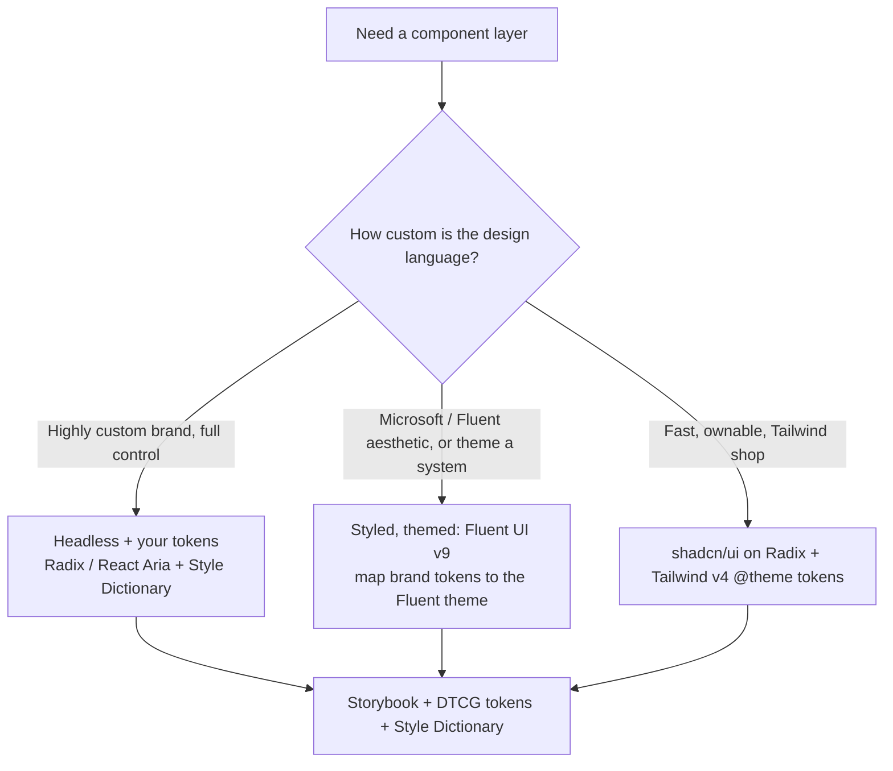

# Design systems & component architecture (2026)

**Last reviewed:** 2026-05-28 · **Confidence:** high (durable principles + current tooling; tooling versions dated). Sources: W3C DTCG + Style Dictionary + Storybook + the existing design-tokens skill.
**Owner:** `visual-designer` + `frontend-implementer`. **Complements** the [`design-tokens-scaffolding`](../skills/design-tokens-scaffolding/SKILL.md) + [`design-system-audit`](../skills/design-system-audit/SKILL.md) skills with the architecture-level reference. **This is the foundation the Fluent-UI-v9-for-web work sits on** (see [`fluent-react-for-web-2026.md`](fluent-react-for-web-2026.md) once it lands).

## A design system is three layers
1. **Foundations (tokens)** — the single source of truth. **Primitive** tokens (raw values: `color.blue.500 = oklch(...)`, `space.4 = 16px`) → **semantic/alias** tokens (intent: `color.bg.brand`, `color.text.danger`, `space.inline.sm`) → **component** tokens (`button.bg.rest`). Components consume *semantic*, never primitive. (House opinion #4 — tokens, not hardcodes; #12 — one source of truth.)
2. **Components** — the reusable UI built on the tokens, with a disciplined API (below).
3. **Patterns & docs** — how components compose into page patterns + the usage guidance (when/why), in a living catalog.

## Tokens: the modern toolchain
- **W3C Design Tokens (DTCG) format** — the emerging standard token JSON (`$value`/`$type`); author once, transform everywhere.
- **Style Dictionary** — the dominant transformer: DTCG/JSON → CSS custom properties, JS/TS, iOS/Android, Tailwind theme. One token source → every platform.
- **Color in `oklch()`** for perceptually-uniform ramps + accessible contrast (see [`modern-css-2026.md`](modern-css-2026.md)); ship sRGB fallbacks for old targets.
- **Theming = swapping the semantic layer.** Light/dark/brand themes re-map semantic tokens to different primitives; components don't change. Drive via CSS custom properties (`:root` + `[data-theme]`) or the library's theme provider.

## Component API design (where systems live or die)
- **Composition over configuration.** Prefer compound components (`<Card>`/`<Card.Header>`) + `children` over a 30-prop "god component." Slots beat boolean prop explosions.
- **Controlled + uncontrolled** support; sensible uncontrolled defaults.
- **Polymorphism** (`as`/`asChild`) for semantic-element correctness without restyling (house opinion #5 — semantic HTML).
- **Accessibility is built in, not bolted on** — keyboard, focus, ARIA, `prefers-reduced-motion` baked into the primitive (house opinion #1). Lean on accessible primitives (Radix/React Aria/Fluent) rather than re-implementing a combobox.
- **Headless vs styled.** *Headless* (Radix, React Aria, TanStack) = behavior+a11y, you own the styles (max design control — best when you have a strong design language). *Styled* (Fluent UI, MUI, Chakra) = batteries-included theme system (fast, consistent — best when the library's design language fits or you theme it). Tailwind/shadcn = styled-on-headless (copy-in components on Radix). **The choice depends on how custom the design language is** — the bridge to the Fluent work.

## Tooling & delivery
- **Storybook** — the component workbench + living docs + visual-regression + a11y addon; the system's source of truth for behavior.
- **Monorepo** (pnpm/Turborepo/Nx) when tokens + components + apps share a repo; **versioned package** (changesets, semver) when consumed across repos.
- **Drift control** (house opinion #12): lint hardcoded values toward tokens; the `design-system-audit` skill catches token coverage gaps; CI visual-regression catches unintended UI change.

## Decision Tree: which component foundation?

## Sources (retrieved 2026-05-28)
W3C Design Tokens Community Group format; Style Dictionary docs; Storybook docs; Radix/React Aria; the design-tokens-scaffolding skill. Tooling versions move — re-verify on the Researcher sweep.
