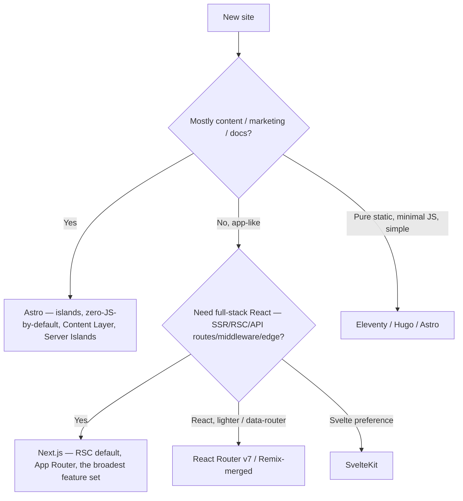

# Modern web stacks & rendering models (2026)

**Last reviewed:** 2026-05-28 · **Confidence:** medium-high — the JS framework landscape moves fast; re-verify on the Researcher sweep. Sources: official framework docs + 2026 design/dev discourse (retrieval-dated below).
**Owner:** `web-architect` (stack selection) + `frontend-implementer` (build).

Complements the `web-architect`'s stack-selection judgment and the `information-architecture` skill with a current reference. Pairs with the "cutting edge yet simple" donor set in [`design-references.md`](design-references.md).

## Rendering models (decide this before the framework)
| Model | What | Pick when |
|---|---|---|
| **SSG** (static) | pre-rendered HTML at build | content/marketing sites, docs — fastest, cheapest, most cacheable |
| **ISR** (incremental static regen) | static + background revalidation | large content sites that change but not per-request |
| **SSR** | rendered per request on the server | personalized/auth'd pages, fresh data |
| **RSC** (React Server Components) | server-rendered component tree, minimal client JS | 2026 default for React apps — server is the primary render env, ship minimal JS |
| **CSR** (client) | rendered in the browser | app-shell behind auth where SEO doesn't matter — needs a reason (house opinion #9: static-first) |
| **Islands** | static page + hydrate only interactive parts | content-heavy sites with pockets of interactivity (Astro) |

## Framework selection (the recurring call)

- **Astro 5+** — islands architecture, **zero JS by default**, View Transitions, **Content Layer API**, **Server Islands** (mix static + dynamic per-component). The performance default for content sites. (Cloudflare acquired Astro, 2026.)
- **Next.js 16 (GA 2025-10-21; current stable 16.x, 16.2.x as of mid-2026)** — **RSC default**, App Router, Server Actions; SSR/SSG/ISR/API routes/middleware/edge — the most versatile full-stack React choice. Heavier; needs a reason over Astro for content sites. Two headline shifts in 16: **Turbopack is now the DEFAULT bundler** for both `next dev` and `next build` (graduated from experimental to stable — up to 5–10× faster Fast Refresh, 2–5× faster builds), and **caching flips to explicit opt-in** via the new `use cache` directive / **Cache Components** — dynamic code runs at request time by default, so you now cache deliberately rather than opt out of implicit caching. (Prior line noted here as `16.x` with RSC default; superseded by the GA specifics above.) _Verified 2026-07-09: [nextjs.org/blog/next-16](https://nextjs.org/blog/next-16) · [Next.js 16 upgrade guide](https://nextjs.org/docs/app/guides/upgrading/version-16)._
- **React 19** — Server Components + Actions are the baseline; treat the server as the primary render environment, ship minimal client JS.
- **React Router v7** (Remix merged in) — lighter data-router alternative to Next.
- **SvelteKit / Hugo / Eleventy** — Svelte preference / pure-static / minimal-build.

## House-opinion alignment
- **Static-first** (#9): SSG/ISR/RSC before CSR; CSR needs a reason.
- **Performance budget** (#2): the framework choice has a JS-shipped cost — Astro islands ship near-zero by default; Next RSC ships less than a classic SPA but more than Astro. Budget it ([`web-platform-capabilities-2026.md`](web-platform-capabilities-2026.md)).
- **Mobile-first** (#3) is independent of framework.

## Sources (retrieved 2026-05-28)
Astro vs Next.js 2026 comparisons (pagepro.co, cosmicjs.com, alexbobes.com); patterns.dev React 2026; Next.js + Astro official docs. Re-verify framework majors on the Researcher sweep.
