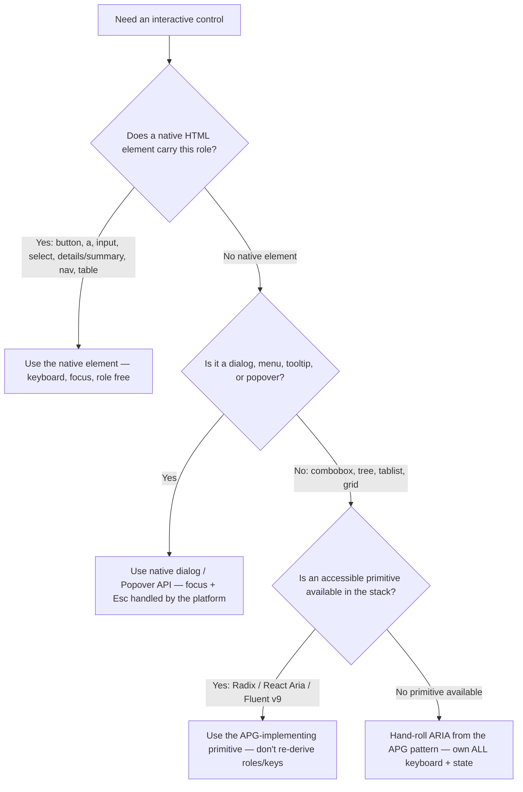
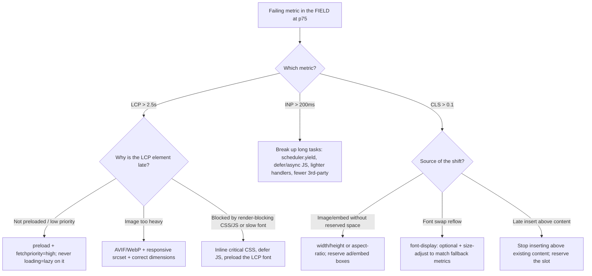
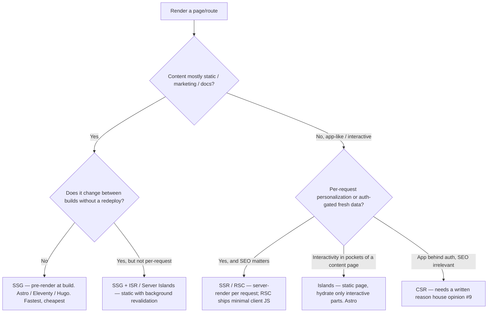
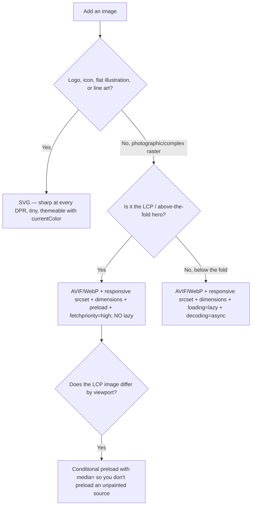
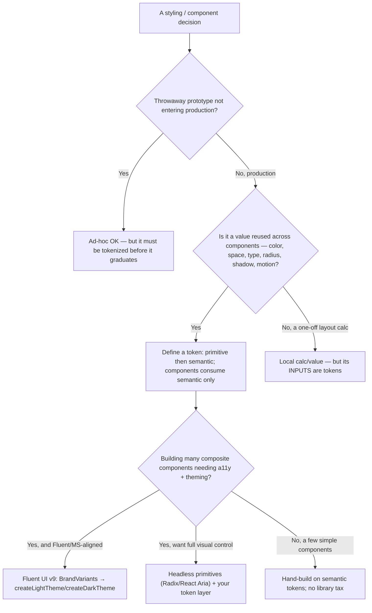

# Web design decision trees

**Last reviewed:** 2026-05-30 · **Confidence:** medium-high — these encode the web-design team's standing positions and the 2026 platform briefs in this `knowledge/` directory. The CWV thresholds and WCAG version are volatile (`[verify-at-build]`); re-verify on the Researcher sweep.
**Owner:** the web-design team (entry tree per discipline noted inline).

These are the canonical branching decisions the web-design agents face repeatedly. Each follows the marketplace decision-tree convention ([`../../../docs/best-practices/decision-trees-in-knowledge-files.md`](../../../docs/best-practices/decision-trees-in-knowledge-files.md)): traverse the Mermaid graph top-to-bottom when the entry condition matches; the first branch that resolves cleanly is the leaf to apply. Do **not** keyword-match on the user's phrasing.

> **Decision-tree traversal (priors).** When a request matches an entry condition below, traverse that tree before selecting an approach. The trees encode the constitution's house opinions (`../CLAUDE.md` §3) and the dated 2026 knowledge briefs in this directory.

---

## Decision Tree: Accessibility — native element vs ARIA widget

**When this applies:** You're building an interactive control (button, menu, modal, tabs, combobox, disclosure) and must decide whether to use a native HTML element, a native platform primitive (`<dialog>`/Popover), an accessible library primitive, or hand-rolled ARIA. The observable trigger: you're about to add `role=` / `tabindex` / `aria-*` to a `
` or ``.

**Last verified:** 2026-05-30 against the `accessibility-auditor` agent + `reach-for-semantic-html-before-aria.md` + `web-platform-capabilities-2026.md`. WCAG 2.2 version `[verify-at-build]`.

**Rationale per leaf:**
- *NATIVE* — the element already ships the role, focus, and keyboard handling; reinventing it on a `
` is how a Lighthouse-100 page stays keyboard-broken. First rule of ARIA: don't.
- *PLATFORM* — native `<dialog>` and the Popover API handle focus trap, Esc, and return-focus without a JS library; reach for them before a bespoke modal/menu. **requires:** target browser support — check Baseline for the audience.
- *PRIMITIVE* — when no native element exists (combobox, tree, tablist), an APG-faithful library (Radix / React Aria / Fluent v9) gives you the roles/states/keys correctly instead of you re-deriving them.
- *ARIA* — only when no native element and no primitive exists; you now own the full APG keyboard map, roving tabindex, and every `aria-*` state staying in sync with the UI.

**Tradeoffs summary table:**

| Leaf | A11y cost to you | Maintenance | Keyboard handling | Use when |
|---|---|---|---|---|
| NATIVE | ~zero | lowest | free | A native element carries the role (the common case) |
| PLATFORM (`<dialog>`/Popover) | low | low | platform-provided | Dialog/menu/tooltip/popover + supported browsers |
| PRIMITIVE (Radix/React Aria/Fluent) | low | medium (dep) | library-provided | Composite widget with no native element |
| ARIA hand-rolled | high (you own it all) | highest | you implement it | No native element AND no primitive available |

---

## Decision Tree: Performance — which Core Web Vital is failing → which fix

**When this applies:** Field data (CrUX / RUM at p75) shows a failing metric, or a page "feels" slow/janky/jumpy. The observable trigger is a specific failing metric, not a vibe — get the field number first. Thresholds: LCP < 2.5 s, INP < 200 ms, CLS < 0.1 `[verify-at-build — 2026 CWV thresholds]`.

**Last verified:** 2026-05-30 against the `performance-engineer` fix-by-symptom maps + `web-platform-capabilities-2026.md` + the `perf-*` best-practice docs.

**Rationale per leaf:**
- *LCP_PRIO* — late discovery / low priority is the most common and cheapest LCP regression; preload + `fetchpriority="high"` moves it by seconds. (`perf-protect-lcp-with-preload-and-priority.md`)
- *LCP_IMG* — an oversized hero blows the byte budget; modern format + responsive `srcset` + dimensions fix weight and CLS together.
- *LCP_BLOCK* — when the LCP is text or the image waits on render-blocking resources, the fix is the critical path (inline critical CSS, defer JS, preload the font), not the image.
- *INP* — INP is the most-failed 2026 metric and almost always long main-thread tasks; yield, defer, and shed third-party JS. (`perf-keep-inp-under-200ms.md`)
- *CLS_DIM / CLS_FONT / CLS_INSERT* — every shift is unreserved late content; reserve the box, match font metrics, or stop inserting above existing content. (`perf-reserve-space-to-prevent-cls.md`)

**Tradeoffs summary table:**

| Failing metric | First-line fix | Effort | Risk if ignored |
|---|---|---|---|
| LCP > 2.5 s | preload + priority + right-sized format | low–medium | Page feels slow to appear; bounce |
| INP > 200 ms | break up long tasks, shed third-party JS | medium | Taps/typing feel laggy (most-failed metric) |
| CLS > 0.1 | reserve space, match font metrics | low | Mis-taps; "jumpy" feel; trust loss |

---

## Decision Tree: Architecture — rendering strategy (SSG / SSG+ISR / SSR / RSC / islands / CSR)

**When this applies:** Choosing how a page (or route) is rendered for a new build or a re-platform. The observable trigger: you're picking a framework or a per-route render mode and need to justify deviating from static-first (house opinion #9: SSG > SSR > CSR).

**Last verified:** 2026-05-30 against `modern-web-stacks-2026.md` + the `web-architect` opinions + `frontend-progressive-enhancement.md`.

**Rationale per leaf:**
- *SSG* — static content with no per-request change is fastest, cheapest, most cacheable, and most resilient; the default for marketing/docs.
- *ISR* — large content sites that change but not per-request get freshness without paying SSR's per-request cost (Astro Server Islands / Next ISR).
- *SSR / RSC* — personalized/auth'd/fresh-data pages where SEO still matters; RSC is the 2026 React default because the server is the primary render env and ships minimal client JS.
- *ISLANDS* — content-heavy pages with localized interactivity hydrate only the interactive parts, keeping the rest zero-JS (Astro). **requires:** an islands-capable framework.
- *CSR* — only defensible behind auth where SEO is irrelevant, and even then it needs a written reason (house opinion #9); keep error/auth states resilient.

**Tradeoffs summary table:**

| Leaf | JS shipped | SEO/AEO | Freshness | Use when |
|---|---|---|---|---|
| SSG | minimal | excellent | build-time | Marketing/docs, no per-request change |
| ISR / Server Islands | minimal | excellent | near-fresh | Large content site, changes between builds |
| SSR / RSC | low (RSC) | good | per-request | Personalized/auth + SEO matters |
| Islands | near-zero + island JS | excellent | build-time | Content page with interactive pockets |
| CSR | highest | poor | per-request | App behind auth, SEO irrelevant (needs a reason) |

---

## Decision Tree: Performance — image format & loading choice

**When this applies:** Adding any image to a page and choosing its format and loading behavior. The observable trigger: you're writing an ``/`<picture>` and must pick format, responsive sources, and `loading`/priority.

**Last verified:** 2026-05-30 against the `performance-engineer` image surface + `perf-image-format-and-loading-discipline.md` + `perf-protect-lcp-with-preload-and-priority.md`.

**Rationale per leaf:**
- *SVG* — vector art (logos/icons/illustrations) is smaller, resolution-independent, and themeable; never rasterize it to a JPEG.
- *HERO* — the LCP image defines the loading score: modern format + responsive sources + dimensions + preload + high priority, and *never* `loading="lazy"`, which would defer it.
- *BELOW* — below-the-fold images should defer (`loading="lazy"` + `decoding="async"`) so they don't compete with the LCP image for bandwidth.
- *MEDIA* — if the hero differs by breakpoint, preload conditionally (`media=`) or you preload bytes you never paint.

**Tradeoffs summary table:**

| Leaf | Format | Loading | Priority | Use when |
|---|---|---|---|---|
| SVG | SVG | inline / eager | n/a | Logos, icons, flat illustration, line art |
| HERO | AVIF→WebP→JPEG | eager (never lazy) | preload + high | The LCP / above-the-fold image |
| BELOW | AVIF→WebP→JPEG | `lazy` + `decoding=async` | default/low | Any image below the fold |
| MEDIA | per-breakpoint | conditional preload | high (matched) | LCP image varies by viewport |

---

## Decision Tree: Design systems — reach for a token system / component foundation vs ad-hoc

**When this applies:** Deciding whether a styling decision should go through a token/design-system layer (or adopt a component foundation) or be a one-off. The observable trigger: you're about to type a hex, a magic spacing number, or `npm install` a component library — or the same value is appearing in a third place.

**Last verified:** 2026-05-30 against the `visual-designer` opinions + `visual-design-tokens-not-hardcoded-values.md` + `design-systems-and-component-architecture-2026.md`. House opinions #4, #12.

**Rationale per leaf:**
- *ADHOC* — a genuine spike can hardcode, but it cannot reach production without tokenization; otherwise it's the drift the rule prevents.
- *TOKEN* — any value reused across components is a single-source-of-truth decision (house opinions #4, #12): primitive layer defined once, semantic layer consumed by components.
- *CALC* — a truly contextual value (a container-derived `calc()`) isn't a token, but its inputs are.
- *FLUENT* — when building many a11y-built-in components in a Microsoft-aligned stack, Fluent v9's `BrandVariants` → `createLightTheme`/`createDarkTheme` is the design-language core. **requires:** React + the Fluent v9 stack.
- *HEADLESS* — full visual control with correct a11y comes from headless primitives plus your own token layer.
- *OWN* — a handful of simple components don't justify a library; build on semantic tokens directly.

**Tradeoffs summary table:**

| Leaf | Upfront cost | Consistency | Theming/dark-mode | Use when |
|---|---|---|---|---|
| ADHOC | lowest | none | none | Throwaway prototype only |
| TOKEN (primitive+semantic) | medium | high | built-in | Any reused value in production |
| FLUENT v9 | medium-high | high | built-in (Brand→theme) | Many components, MS-aligned, React |
| HEADLESS + tokens | medium-high | high | your layer | Full visual control + correct a11y |
| OWN on tokens | low-medium | medium | your layer | A few simple components |

---

## See also

- [`../best-practices/`](../best-practices/) — the named rules these trees terminate in (`perf-*`, `a11y-*`, `visual-*`, `frontend-*`, `content-*`, `seo-*`)
- [`web-platform-capabilities-2026.md`](web-platform-capabilities-2026.md), [`modern-web-stacks-2026.md`](modern-web-stacks-2026.md), [`modern-css-2026.md`](modern-css-2026.md), [`answer-engine-optimization-2026.md`](answer-engine-optimization-2026.md), [`design-systems-and-component-architecture-2026.md`](design-systems-and-component-architecture-2026.md) — the dated freshness anchors
- [`../CLAUDE.md`](../CLAUDE.md) §3 (house opinions) + §4 (anti-patterns) — the constraints these trees encode
- [`../../../docs/best-practices/decision-trees-in-knowledge-files.md`](../../../docs/best-practices/decision-trees-in-knowledge-files.md) — the marketplace convention this file follows
