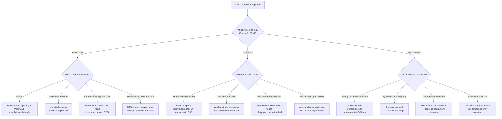

# Skill: core-web-vitals-tuning

**Purpose:** Diagnose and improve Core Web Vitals. Used by `performance-engineer` (primary).

## When to use

- CrUX / RUM data shows CWV regression
- Lighthouse audit flags CWV issues
- Pre-launch budget enforcement
- Slow-page complaint from users / stakeholders
- New feature added; verify no perf regression

## The three vitals

| Vital | Threshold (Good) | What it measures |
|---|---|---|
| **LCP** (Largest Contentful Paint) | ≤ 2.5s | Time to render the largest visible element above the fold |
| **CLS** (Cumulative Layout Shift) | ≤ 0.1 | Unexpected layout movement across the page lifecycle |
| **INP** (Interaction to Next Paint) | ≤ 200ms | Worst-case interaction-response time (replaces FID since 2024) |

Field data (CrUX / RUM) at the **75th percentile** is the standard measurement target.

## Decision Tree: CWV root-cause triage

**When this applies:** any CWV regression that needs diagnosis before fix-selection. **Traverse this tree top-to-bottom before picking a fix** — diagnosing the wrong vital wastes the budget.

**Last verified:** 2026-05-22 against web.dev current guidance + Core Web Vitals 2024 INP transition.

**Rationale per leaf:**

- *LCP_IMG* — most common LCP cause. Preload + fetchpriority=high gets the bytes into the browser first; WebP/AVIF cuts bytes 30-50%; explicit dimensions prevent reflow that pushes LCP further out.
- *LCP_FONT* — `font-display:swap` shows fallback immediately; the swap-in is a CLS risk but typically the LCP win is bigger. If CLS becomes an issue, use `size-adjust` to match metrics.
- *LCP_JS* — render-blocking is the silent LCP killer. `defer` on non-critical JS, inline critical CSS, audit with Coverage tab in DevTools.
- *LCP_TTFB* — if TTFB > 800ms, fix the server first. Static / CDN cache for marketing pages. Edge function for dynamic. SSR is fine; CSR is the LCP enemy.
- *CLS_DIMS* — the single highest-impact CLS fix. Every ``, `<video>`, `<iframe>` gets explicit width + height OR aspect-ratio.
- *CLS_FONT* — `size-adjust` + `ascent-override` + `descent-override` match the fallback metrics to the web font so swap-in is invisible.
- *CLS_AD* — late-injected ads or embeds shift everything below. Reserve container `min-height`; lazy-load if below the fold.
- *CLS_ANIM* — animating `width` / `height` / `top` / `left` triggers reflow; animating `transform` / `opacity` is composited and doesn't shift layout.
- *INP_JS* — long tasks block the main thread. `scheduler.yield()` (modern) or `requestIdleCallback` / `setTimeout(fn, 0)` chunks the work.
- *INP_3P* — synchronous third-party scripts (chat widgets, A/B test SDKs) are common INP killers. Defer/async OR remove.
- *INP_REACT* — large lists virtualize (React Virtuoso, TanStack Virtual); state updates that cascade memoize with `useMemo`/`useCallback`/`React.memo`.
- *INP_PAINT* — slow paint after JS often means the layer isn't composited. `will-change: transform` hints the browser to promote.

**Tradeoffs summary:**

| Vital | Default fix | Time to fix | Risk |
|---|---|---|---|
| LCP (image) | Preload + fetchpriority + WebP/AVIF | 1-2 hours | Low — well-supported |
| LCP (font) | font-display:swap | 30 min | Medium — may cause CLS if metrics don't match |
| LCP (TTFB) | CDN / static rendering | 4-8 hours | High — may require platform change |
| CLS (dimensions) | width/height attributes everywhere | 2-4 hours | Low |
| CLS (font swap) | size-adjust / ascent-override | 1-2 hours | Low |
| INP (heavy JS) | scheduler.yield + chunking | 4-12 hours | Medium — refactor scope |
| INP (third-party) | Remove or defer | 30 min — 4 hours | Depends on stakeholder pushback |

**Failure modes to avoid:**
- Diagnosing the wrong vital. If CrUX shows LCP > 2.5s but INP is fine, fix LCP first. Don't burn the budget on the wrong vital.
- Treating Lighthouse lab data as field truth. Field (CrUX / RUM) at p75 is the standard target; lab data is a debugging tool, not a goal.
- Optimizing for the median when p75 is what gets graded.
- Fixing CLS by hiding content (visibility:hidden) — that just moves the problem; users still see broken layout.

## LCP — fix-by-symptom

### Symptom: LCP is an image

Most common cause. The fix:

1. Identify the LCP element (Chrome DevTools → Performance → Web Vitals lane).
2. Add `<link rel="preload" as="image" href="..." fetchpriority="high">` in `<head>`.
3. Add `fetchpriority="high"` to the `` itself.
4. Remove `loading="lazy"` from the LCP image.
5. Serve it in modern format (AVIF / WebP).
6. Right-size it (responsive `srcset` + `sizes`); don't ship a 4000px image to a 400px slot.
7. Compress aggressively (90-quality WebP is usually indistinguishable from 100).
8. Serve via image CDN.

### Symptom: LCP is text, blocked by web font

1. Self-host fonts (or use a fast CDN).
2. `font-display: swap` (or `optional`).
3. Preload critical fonts: `<link rel="preload" href="..." as="font" type="font/woff2" crossorigin>`.
4. Subset fonts (Latin only when content is Latin; drop unused weights).
5. Reduce number of weights / styles loaded.

### Symptom: LCP blocked by render-blocking CSS

1. Inline critical CSS (above-the-fold styles) in `<head>`.
2. Defer non-critical CSS via `<link rel="preload" as="style" onload="this.rel='stylesheet'">` pattern.
3. Avoid `@import` chains.

### Symptom: LCP blocked by render-blocking JS

1. `defer` or `async` every non-essential script.
2. Move analytics / chat / A/B-test scripts to load post-interaction or post-LCP.
3. Code-split the framework if possible (Astro / Next handle this; vanilla SPAs need manual care).

### Symptom: Server response slow (TTFB > 600ms)

1. Move to a CDN-edge-rendered platform (Vercel / Netlify / Cloudflare Pages).
2. Static-generate pages (SSG) where possible; SSR + edge caching otherwise.
3. Investigate backend / DB latency (escalate to `ravenclaude-core/backend-coder`).

## CLS — fix-by-symptom

### Symptom: Image shifts in

1. Always specify `width` and `height` (or `aspect-ratio`) on ``.
2. Use `aspect-ratio` CSS for responsive containers.

### Symptom: Web font swaps in, text reflows

1. `font-display: optional` (no swap; user without font cached sees system font; LCP not affected by font).
2. Or `font-display: swap` + `size-adjust` / `ascent-override` / `descent-override` on `@font-face` to match system-font metrics.

### Symptom: Ad / embed loads in late, pushes content down

1. Reserve space with `min-height` or `aspect-ratio` for the ad / embed container.
2. Defer ad / embed load until below-the-fold visibility (intersection observer).

### Symptom: Element animated using `width` / `height` / `top` / `left`

1. Animate `transform` and `opacity` instead.
2. Add `will-change: transform` where genuinely needed (don't sprinkle widely).

### Symptom: Cookie banner / notification jumps content

1. Position as overlay (fixed / absolute) so it doesn't reflow content.
2. Or reserve space for it from initial render.

## INP — fix-by-symptom

### Symptom: Click handler runs long task on main thread

1. Break long tasks into smaller chunks (yield to main thread with `await new Promise(r => setTimeout(r, 0))` or `scheduler.yield()`).
2. Move CPU work to a Web Worker.
3. Debounce / throttle high-frequency handlers.

### Symptom: React re-renders too much on interaction

1. Memoize expensive components.
2. Move state down (lift fewer state changes high in the tree).
3. Use `useDeferredValue` / `useTransition` for non-urgent updates.

### Symptom: Hydration on a partially-static site

1. Astro islands / Qwik / partial hydration.
2. Don't hydrate components that don't need interactivity.

### Symptom: Third-party script blocks main thread

1. Catalogue every third-party script + its main-thread cost.
2. Defer non-critical (analytics, chat, A/B test) until after Idle.
3. Replace with first-party where possible.

## Measurement tooling

- **CrUX**: PageSpeed Insights for field data
- **RUM**: web-vitals.js library, Vercel Speed Insights, Cloudflare Web Analytics, custom integration
- **Lab**: Lighthouse (DevTools / CLI), WebPageTest (slow 3G + Moto G4 simulates real mobile)

**Field beats lab.** Always show field data in audit reports when available.

## Performance budget

Set per-page budgets:

| Metric | Marketing site | Product app |
|---|---|---|
| LCP (P75) | ≤ 2.5s | ≤ 2.5s |
| CLS (P75) | ≤ 0.05 | ≤ 0.1 |
| INP (P75) | ≤ 200ms | ≤ 200ms |
| Page weight (transfer) | ≤ 1 MB | ≤ 2 MB |
| JS bundle (compressed) | ≤ 100 KB | ≤ 250 KB |
| Image budget | ≤ 500 KB | ≤ 1 MB |
| Third-party scripts | ≤ 3 | ≤ 5 |

Enforce in CI where possible (Lighthouse CI, bundle-size action).

## See also

- Template: [`../templates/performance-budget.md`](../templates/performance-budget.md)
- Agent: [`../agents/performance-engineer.md`](../agents/performance-engineer.md)
