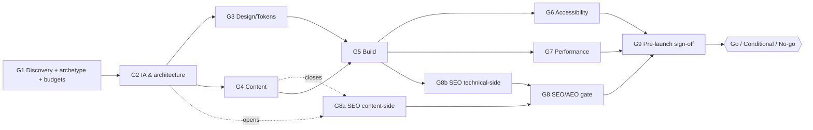

# Skill: gold-standard-website-pipeline

**Purpose.** Give the **Team Lead** — the orchestrator role defined in [`web-design/CLAUDE.md`](../../CLAUDE.md) (the one role that delegates to the 7 web-design specialists; *not* an 8th specialist agent itself) — one ordered, fail-closed gate ladder to drive **every** new website build through — from greenfield discovery to launch sign-off — so nothing ships that hasn't cleared a named gate with a checkable, standards-anchored bar. It is the orchestration layer *above* the 12 execution skills: it says **what order to run them in, who owns each gate, what the numeric pass condition is, where the pipeline parallelizes, and where it hands off** — while the skills themselves say *how* to do the work. Used by the Team Lead (primary) and by all 7 `web-design` agents when reporting into a gate.

A single site build touches all 7 specialists and 12 execution skills. Left unsequenced, the failure modes are predictable: a11y audited *after* the build hardens (P0s cost 10× to fix), tokens invented per-component because design ran after build started, content written to fit a layout instead of the layout serving the content, "responsive" claimed from CSS inspection with no rendered check, and a launch that trails off without an explicit go/no-go. This pipeline fixes the *sequence*, the *gate*, and the *seam*, so each discipline lands on the inputs it actually needs and cannot pass by omission.

**Standards basis (plugin-internal, durable).** Every acceptance bar below traces to knowledge that ships *inside* this plugin, so a consumer who installs `web-design` carries the provenance on disk — no gate depends on a dangling link into a dated research-scratch directory:

- **CWV thresholds** (LCP/INP/CLS @p75, field-over-lab), **WCAG 2.2 AA floor** + the EU Accessibility Act, image/font/third-party budgets → [`knowledge/web-platform-capabilities-2026.md`](../../knowledge/web-platform-capabilities-2026.md).
- **Full WCAG 2.2 success-criterion set** + the 5-pass audit ladder + severity guide → the [`accessibility-review`](../../skills/accessibility-review/SKILL.md) skill; contrast arithmetic → [`scripts/contrast_ratio.py`](../../scripts/contrast_ratio.py) (runnable, CI-gateable).
- **AEO/GEO** (crawlable-without-JS, AI-crawler policy, the hedged `llms.txt` position) → [`knowledge/answer-engine-optimization-2026.md`](../../knowledge/answer-engine-optimization-2026.md); classic technical SEO → [`seo-technical-audit`](../../skills/seo-technical-audit/SKILL.md).
- **Stack / rendering** selection → [`knowledge/modern-web-stacks-2026.md`](../../knowledge/modern-web-stacks-2026.md); modern-CSS surface → [`knowledge/modern-css-2026.md`](../../knowledge/modern-css-2026.md).
- **Security headers** (the HSTS / CSP / COOP-CORP-COEP set) + **consent mechanics** are encoded directly in G9 below and the plugin's [`templates/launch-checklist.md`](../../templates/launch-checklist.md); consent-gating mechanics also live in [`third-party-script-hygiene`](../../skills/third-party-script-hygiene/SKILL.md).

Scored against the plugin's own **Family A** (built site) / **Family B** (this pipeline artifact) yardstick — **both are enumerated inline in §9** (the consolidated Family-A A1–A8 dimension table and the Family-B self-check), and each Family A bar is *also* restated within its owning gate's acceptance criteria, so the whole yardstick travels on-disk to any consumer. **Last verified: 2026-07-06** — the volatile figures (CWV thresholds, WCAG 2.2 SC, Lighthouse bands) ship continuously; re-confirm at use against the dated knowledge files above (each carries its own `Last reviewed:` anchor).

> **Derived from (one-time provenance, not a live dependency).** The durable knowledge files above were reconciled during authoring against a session research pass — external standards fetched from w3.org / web.dev / developer.chrome.com / OWASP, plus a house dispatch-map/idiom review of the plugin's own agents and skills — scored against a gold-standard rubric. That derivation is a *how these bars were set* record, **not** a link any gate depends on: every gate's provenance resolves **plugin-internally** to the knowledge files, skills, and templates cited above, so a consumer who installs `web-design` carries all of it on disk. The curated exemplar set that informed the gate lessons is captured durably in-plugin at [`knowledge/gold-standard-website-references-2026.md`](../../knowledge/gold-standard-website-references-2026.md).

## When to use

- **Greenfield build** — any new site or app; start at G1 before a single wireframe or line of code.
- **"Build me a marketing site / web app / storefront"** — the Team Lead's first move on any build-shaped request. Classify the archetype at G1, then walk the gates.
- **Full re-platform / redesign** — an existing site moving stacks, CMS, or IA runs the whole ladder (the redirect plan at G2 and the migration rows in the launch checklist exist for exactly this).
- **Pre-launch readiness sweep / retrofit** — a build that skipped the early gates can enter at G6–G9 to run the audit-and-sign-off tail as a gate ladder onto existing work.
- **Periodic gold-standard re-certification** of a live site (annual/quarterly) — run G6–G9 only.
- Any point where "is this ready to launch?" needs an answer sharper than a verbal "looks good."

## When NOT to use

- **A single-discipline task** — "this page is slow" (→ `core-web-vitals-tuning` directly), "audit our contrast" (→ `accessibility-review`), "refactor this component" (→ `frontend-implementer`). Reach for the individual skill; don't spin up a 9-gate pipeline for a one-lane job.
- **An audit-only engagement on a site you won't rebuild** — run the audit skills in parallel (a11y / CWV / content / technical-SEO) and synthesize; you don't need the discovery/IA/build gates.
- **App-grade product engineering with no brand/marketing surface** — that is `frontend-engineering`'s pipeline (see the web-app branch below). This skill owns brand/UX/marketing-site + the WCAG audit; it seams the app build out. Native mobile → `mobile-engineering`.
- **The whether/what of commerce** (assortment, pricing, LTV:CAC, channel spend) — that is `ecommerce-dtc`'s lane, upstream of any build. This pipeline starts when that decision has produced an actual storefront build task.

**Scoping note — the pure-web-app case (read before over-scoping this pipeline onto an app).** For a web app with **no marketing/brand surface of its own**, **all nine gates still close** — the thin slice is in *substance*, not in *which gates run* (G9's entry requires G3–G8 all closed or waived, so silently omitting G5/G8 would stall it). What changes: **G5** closes via the **`frontend-engineering` seam-return** (they own the build; G5 passes when their build returns and still clears the G6/G7 bars), and **G8** closes as an explicit **`N/A — authenticated views behind login, not indexable by design`** (marketing/landing pages fronting the app still gate at full weight). The gates carrying the real work are **G1–G4** (discovery, IA, design system/tokens, in-app content/microcopy) **+ G6/G7** (the WCAG audit + CWV/perf verdict) **+ G9** (sign-off); **G5 and G8 close on a seam-return and an N/A respectively — recorded, never skipped.** Use this as the **brand / UX / a11y / perf wrapper** around someone else's build — not the app's build pipeline. If the app has *no* brand/UX/a11y surface you own either, this is the wrong tool: go straight to `frontend-engineering`.

---

## 1. Site-type adaptivity — declared once at G1, adapts every gate after

The archetype is the **first output of G1** and it re-weights the ladder. Declare exactly one; a build that is genuinely two (e.g. a marketing site *with* a self-serve app) runs the shared gates once and forks the app/commerce concerns to the seam. Every gate runs for every site type — what changes per type is **weight, N/A status, and which sub-checks apply.**

| Gate | Marketing site | Web app | Ecommerce / DTC |
|---|---|---|---|
| **G1 Discovery** | Full weight. Stack bias: static-first (Astro / 11ty / Hugo). | Full weight. Stack bias: app framework (Next / SvelteKit); state/data-layer named early. **Flag the `frontend-engineering` handoff now if the app surface is substantial** (see §6). | Full weight. **Mandatory sub-step:** run `ecommerce-dtc`'s platform-vs-headless decision (themed Shopify vs. headless, 3-yr payback) *before* G5 Build. |
| **G2 IA** | Flat / hub-and-spoke sitemap; ≤2 clicks to any page is the common bar. | Task-flow / app-shell IA; nav models around user goals, not page hierarchy. | Catalog taxonomy + faceted nav; category/product URL taxonomy is the highest-stakes IA call (SEO + findability both ride on it). |
| **G3 Design/Tokens** | Full weight — brand is the product. | Full weight, but component-density (data tables, forms, dashboards) drives the semantic-token set more than brand expression does. | Full weight; product-card / PDP / cart component tokens are the acceptance-critical subset. |
| **G4 Content** | Full weight — editorial / landing-page copy, blog/resource density is the deliverable. | Weighted toward microcopy: error states, empty states, in-app help; "editorial voice" is thin. | Full weight on product copy + trust-signal placement (reviews, shipping/return policy at the decision point). |
| **G5 Build** | `frontend-implementer` owns it end-to-end. | `frontend-implementer` owns the brand/marketing shell; **substantial interactive surfaces escalate to `frontend-engineering`** per the named seam — do not duplicate their build. | `frontend-implementer` owns a themed build; a headless/app-grade storefront escalates the storefront app to `frontend-engineering`, while `web-design` still owns PDP/cart copy + conversion-design. |
| **G6 Accessibility** | Full weight, no exception. | Full weight — **a11y is never down-weighted for "MVP."** | Full weight; the checkout flow is the single highest-stakes a11y surface (WCAG 3.3.8 accessible-auth applies to any login-to-buy flow). |
| **G7 Performance** | Full weight; image/font budget dominates (asset-heavy, JS-light). | Full weight; **JS/interactivity budget dominates** — INP is the metric most at risk, not LCP. | Full weight; image budget (product photography) *and* third-party-script budget (payment SDKs, reviews, chat) both matter — `third-party-script-hygiene` is load-bearing. |
| **G8 SEO/AEO** | **Highest weight** — organic discovery is frequently the primary acquisition channel. | Often **partially N/A** — authenticated in-app views are not indexable and are not graded on SEO; state it explicitly, don't silently skip. Marketing/landing pages *in front of* the app get full weight. | High weight; product/category schema (`Product`, `Offer`, `AggregateRating` JSON-LD) is the acceptance-critical addition beyond the base checklist. |
| **G9 Pre-launch** | Full weight; Legal/compliance section may be thin (no payments/PII beyond a contact form). | Full weight; **`security-reviewer` sign-off is mandatory** whenever auth/sessions/user data exist. | Full weight; **`security-reviewer` sign-off is mandatory** for payments/checkout/PII, and privacy/consent mechanics (§4, G9) are acceptance-critical given PII at checkout. |

**N/A discipline (binding).** When a sub-check genuinely does not apply to a site type (e.g. checkout economics on a pure marketing site, or SEO on an authenticated app view), the gate output must record `N/A — <one-line reason>`. A silent omission is scored as a *miss*, not an N/A — exactly per the Family A scoring rule (the yardstick this pipeline is scored against; Family A/B dimensions in §9).

**Seam rule (house-mandated, zero exceptions).** Any surface touching **auth, sessions, user data, untrusted input, file upload, or payments** routes through `ravenclaude-core/security-reviewer` regardless of archetype. Its teeth are **pipeline-side, not per-agent**: the mandatory, no-waiver **G9 gate** (and the mandatory row in the §6 seam table) that every build converges on, enforced by the Team Lead regardless of which specialist first touches the surface. **Per-agent state (closed 2026-07-06):** `security-reviewer` is now named in the escalation routes of **all 7** agents — `web-architect` and `frontend-implementer` carried it before; `accessibility-auditor`, `content-strategist`, `performance-engineer`, `ux-designer`, and `visual-designer` each gained an archetype-appropriate `security-reviewer` escalation row this PR, so the routing is uniform per-agent as well as pipeline-side. The gate never depended on that per-agent routing — **G9 is the enforcement, and it never waives** — but the seam-rule assertion is now true at both layers. This is the one cross-cutting gate that never waives.

---

## 2. The gate ladder (overview)

| Gate | Name | Primary owner(s) | Dispatches (skill) | Depends on | Parallel with | Terminal artifact |
|---|---|---|---|---|---|---|
| **G1** | Discovery & budget-setting | `web-architect` (lead/accountable) + `ux-designer` & `content-strategist` (co-owners) | — (kickoff; `templates/design-brief.md`) | — | — | Filled brief + declared archetype + numeric perf/a11y budgets |
| **G2** | IA & architecture | `web-architect` (primary) + `ux-designer` | `information-architecture` | G1 | — | 5-artifact IA set + URL→template map |
| **G3** | Design system & tokens | `visual-designer` (primary) + `frontend-implementer` | `design-tokens-scaffolding`, `design-system-audit`, `card-tile-ui` | G2 | **G4** | Token JSON (light+dark) + audited design-system spec |
| **G4** | Content & conversion copy | `content-strategist` (primary) + `ux-designer` | `content-audit`, `conversion-design` | G2 | **G3** | Final copy + microcopy + populated content model |
| **G5** | Build *(seam gate)* | `frontend-implementer` *(marketing)* / **seam** *(web-app, headless ecommerce)* | `fluent-react-implementation` (+ consumes G3 skills) | G3 **and** G4 | — | Rendered, browser-verified build + CI wiring; dual-analytics wired per `third-party-script-hygiene` §8 (empty-until-provisioned; authed/internal surfaces off by default, `[TF6]`) |
| **G6** | Accessibility audit | `accessibility-auditor` (sole owner) | `accessibility-review` (+ `scripts/contrast_ratio.py`) | G5 | **G7**, G8b | WCAG 2.2 AA audit, P0–P3 findings |
| **G7** | Performance & CWV | `performance-engineer` (primary) | `core-web-vitals-tuning`, `third-party-script-hygiene` | G5 | **G6**, G8b | G7a pre-launch: Lighthouse ≥90 + CI budget + RUM wired · G7b post-launch: CWV field verdict (standing G9 Condition for greenfield); **the dual-analytics pair is ONE inventory line but MEASURED — fail if it adds ≥50 ms TBT or regresses LCP (`third-party-script-hygiene` §8, never a blanket pass)** |
| **G8** | SEO / AEO | **split:** `web-architect` (technical) + `content-strategist` (content) | `seo-technical-audit` | G8a opens at G2, closes at G4 · G8b: G5 | G8a alongside G3/G4 | Structured-data + crawlability + AEO-proxy verdict |
| **G9** | Pre-launch sign-off | Team Lead + all 7 (+ `security-reviewer` where in scope) | → `templates/launch-checklist.md` | G3–G8 all closed/waived | — (convergence) | Federated sign-off + terminal Go / Conditional / No-go |

Each gate is **fail-closed**: it either passes, loops back to its owner with named findings, or takes an explicit **waiver** (owner + reason + condition, recorded — not a silent skip). No stage passes by omission. The ladder terminates in exactly one go/no-go verdict at G9.

---

## 3. Dependency DAG — what actually parallelizes

The ladder is *not* strictly linear. Two facts drive the DAG: **tokens don't depend on content** (G3 ∥ G4, both need only G2), and **the three post-build audits are independent of each other** (G6 ∥ G7 ∥ G8b, all depend only on G5). Serializing them is false serialization; a scorer credits the parallelism (yardstick B4).



- **Critical path:** G1 → G2 → **max(G3, G4)** → G5 → {G6 ∥ G7 ∥ G8b} → G8 → G9. Because G5 joins on **both** G3 (tokens) and G4 (content), the path runs through **whichever of the two parallel branches finishes later** — often G3 on a marketing site ("brand is the product," full-weight design system). Shortening the schedule means shortening IA→(the slower of tokens/content)→build, not the audits (which parallelize).
- **Parallel branch 1 — G3 (tokens) ∥ G4 (content):** both consume only the G2 IA/content-model output. A visual-designer building the token scale doesn't need final copy; a content-strategist drafting microcopy doesn't need the token scale. Running them sequentially wastes a full cycle.
- **Parallel branch 2 — G6 (a11y) ∥ G7 (perf) ∥ G8b (SEO technical-side):** all three depend on a built surface (G5) but not on each other. They are commonly serialized by habit when nothing structurally requires it.
- **Join node — G5 (build):** requires all of G2 (URL/template map), G3 (tokens to consume), and G4 (real copy — lorem hides layout bugs). A build that starts before these exist is running on inputs that don't exist yet — the exact failure B4 penalizes.
- **Split within G8 (asymmetric edge):** SEO is **not** one monolithic gate that waits for Build. Its **content-side half (G8a)** — keyword/search-intent briefs, structured-data planning — **opens as soon as G2's content model + G1 personas exist and is refined through G4** (only its *close* gates on G4's close, not its open — hence the dashed `opens`/`closes` edges in the DAG, not a hard `G4 → G8a` serialization); its **technical-side half (G8b)** — "crawlable without JS," "valid JSON-LD on the live markup" — can only close once G5 exists (those checks need real HTML). Technical-SEO is owned by `web-architect`, content-SEO by `content-strategist`; a single owner would orphan half of it (B3).
- **Designed-in, not bolted-on:** a11y (contrast pre-checked at **G3** via `scripts/contrast_ratio.py`, focus order baked into wireframes at G2/G4) and perf (budgets *declared* at G1, enforced at G7) are present from the start — G6/G7 *verify* what earlier gates *designed in*.

---

## 4. The gates in detail

Each gate states: **Entry** · **Dispatch** (agent → skill) · **Acceptance criteria** (checkable, pass/fail, sourced from the Family A yardstick in §9 + the plugin-internal standards basis) · **Objective bar** (the standards number / yardstick dimension) · **Fail-closed outcome** · **Artifact**. No gate may be marked complete by inference — every criterion is something a reviewer can point at.

### G1 — Discovery & budget-setting

- **Entry.** A request to build a new site, with no prior artifact.
- **Dispatch.** `web-architect` is the **lead/accountable owner** of the kickoff (the stack/budget owner is answerable if the brief ships incomplete), co-owning with `ux-designer` and `content-strategist`: `web-architect` (stack/hosting/CDN/i18n + the numeric budgets), `ux-designer` (users, goals, success metrics), `content-strategist` (on redesign: trigger `content-audit` on the existing site first) jointly fill [`templates/design-brief.md`](../../templates/design-brief.md). Each co-owns its sub-concern; the Team Lead escalates to `web-architect` if the brief is contested or incomplete.
- **Acceptance criteria (all must pass).**
  - [ ] Design brief complete: goals, audiences, primary conversion, constraints, competitive baseline.
  - [ ] **Archetype declared** — exactly one of marketing / web-app / ecommerce (drives §1 for every later gate + the seams).
  - [ ] Stack chosen **with a written rationale AND ≥2 alternatives considered** (not "we picked Next because Next"); static-first bias (SSG > SSR > CSR unless a reason is stated), grounded in [`knowledge/modern-web-stacks-2026.md`](../../knowledge/modern-web-stacks-2026.md). Hosting/CDN named; if Azure SWA and `azure-cloud` is installed, state the seam split. **Web-app caveat:** for the web-app archetype the hosting/CDN choice is **provisional** until `frontend-engineering`'s rendering-strategy call (SSR/SSG/RSC/CSR) is made at the G5 seam — a static-first CDN picked here can be invalidated by an SSR/RSC runtime need (edge/Node). Either **defer the final hosting commitment to after the G5 seam**, or record it here as provisional and subject to the explicit **G5→G1 loop-back** defined at G5.
  - [ ] **Perf budget declared** — numeric per-template LCP/INP/CLS targets + a critical-path KB cap, written down *now* (enforced at G7).
  - [ ] **A11y target declared** — WCAG 2.2 **AA** as the floor; note any AAA stretch items adopted on primary flows.
  - [ ] **≥1 success metric** named (conversion rate, task-completion, AOV — archetype-dependent) **with a stated measurement mechanism**, so G4/G7 can wire it.
  - [ ] **Escalation flags raised now, not discovered later:** web-app with substantial custom interactivity → note the `frontend-engineering` handoff boundary before G5; **any login / auth surface → flag the `auth-identity` seam now** (OAuth/OIDC flow, session/token strategy, MFA — reviewed *before* G5 builds it, not discovered at G9; resolved operationally like the ecommerce seam — dispatch `auth-identity` if installed, else a documented non-specialist stand-in stamped `re-run via auth-identity once installed`, with the auth-architecture decision recorded as a G9 Condition); ecommerce → schedule the platform-vs-headless decision before G5. **If `ecommerce-dtc` is installed** in the consumer project — resolved operationally per §6 (attempt the dispatch; if its agent/skill can't be resolved, treat it as not-installed), not by an assumed oracle — that decision is *its* call (3-yr payback / assortment / LTV:CAC). **If it is not installed** (a plausible split — the two are separate marketplace plugins), take the documented degraded path: `web-architect` drafts a **lightweight platform-vs-headless memo** (themed-platform vs. headless, the obvious cost/skill trade-offs it *can* judge) **explicitly stamped `non-specialist stand-in — re-run via ecommerce-dtc once installed`**, and the unit-economics call (payback horizon, LTV:CAC) is recorded as an open `Conditions:` item at G9 rather than silently assumed. The sub-step is never left undefined because its escalation target is absent.
- **Objective bar.** Budgets exist and are numeric (CWV + perf budgets per [`knowledge/web-platform-capabilities-2026.md`](../../knowledge/web-platform-capabilities-2026.md)); archetype is unambiguous. A brief with adjectives-not-numbers ("fast," "accessible") fails.
- **Fail-closed.** No archetype, no numeric budget, no stack-with-alternatives, or no success metric → cannot proceed to G2. Loop back.
- **Artifact.** `discovery-brief.md` (from the `design-brief.md` template).

### G2 — Information architecture & architecture

- **Entry.** G1 closed.
- **Dispatch.** `web-architect` (primary) + `ux-designer` → [`information-architecture`](../../skills/information-architecture/SKILL.md).
- **Acceptance criteria.**
  - [ ] **All 5 IA artifacts** present: sitemap (templates annotated), URL-taxonomy spec (slug / trailing-slash / casing / locale rules — both trailing-slash policy and case-sensitivity decided, they feed G8), navigation spec (primary/utility/footer/contextual with inclusion criteria), content model (per-template fields + relationships), redirect plan (301 chains audited for any re-architecture, old→new map *before* any page is retired).
  - [ ] Sitemap shape chosen (flat / hierarchical / hub-and-spoke / app-shell) with the one-line reason it fits the §1 site type.
  - [ ] Card-sort run (**8–12 participants**, per [`information-architecture`](../../skills/information-architecture/SKILL.md) §4) if this is a nav restructure rather than greenfield. **Fallback when no human panel is available** (e.g. a solo-founder engagement with no research budget): substitute a **synthetic-persona / stakeholder-proxy sort** — sort the content against the G1 audience personas and named stakeholders — and record it under the standard waiver (owner + reason + condition: `no user panel — validated by proxy, re-run with real participants if budget appears`). The waiver mechanism (§5) explicitly covers this criterion; a nav restructure never *silently* skips validation.
  - [ ] URL-to-template map exists (the join input G5 needs).
  - [ ] Heading/landmark structure implied by the IA is set up to nest without skips (feeds G6/G8 semantic checks).
- **Objective bar.** Semantic-structure foundation (heading ranks nest, one unambiguous `<h1>`, landmark elements) per the heading discipline in [`accessibility-review`](../../skills/accessibility-review/SKILL.md) + [`seo-technical-audit`](../../skills/seo-technical-audit/SKILL.md). Redirect plan mandatory on re-platform — a retired page without a 301 destroys link equity.
- **Fail-closed.** A "sitemap alone" is decoration — missing any of the 5 artifacts, or an unclosed content model / URL taxonomy (both load-bearing inputs to G3/G4), loops back.
- **Artifact.** `ia-plan.md` (from the `site-architecture.md` template).

### G3 — Design system & tokens *(runs parallel to G4)*

- **Entry.** G2 closed.
- **Dispatch.** `visual-designer` (primary) + `frontend-implementer` (co-owner, code-wiring half) → [`design-tokens-scaffolding`](../../skills/design-tokens-scaffolding/SKILL.md), [`design-system-audit`](../../skills/design-system-audit/SKILL.md), and [`card-tile-ui`](../../skills/card-tile-ui/SKILL.md) where the surface is card-driven.
- **Acceptance criteria.**
  - [ ] **Primitive → semantic** token layer in W3C token JSON (Style Dictionary / Tailwind / Shadcn pipeline) — no hardcoded brand values planned anywhere downstream.
  - [ ] Coherent type / space / color / radius / shadow / motion scale — no off-scale one-offs.
  - [ ] **Both light and dark themes defined**, with an explicit dark-mode residue check (zero light-mode values surviving into dark).
  - [ ] Contrast **pre-checked at design time** with [`scripts/contrast_ratio.py`](../../scripts/contrast_ratio.py) against the *actual* rendered background (states flattened): body ≥ **4.5:1**, large text / UI ≥ **3:1** (WCAG 1.4.3, AA floor); the AAA stretch (1.4.6, **7:1**) adopted as the target on primary flows (hero, primary CTA, checkout) — so G6 confirms rather than discovers.
  - [ ] Components compose on shared primitives; `design-system-audit` runs clean — consistency + completeness, no orphan one-off styles.
- **Objective bar.** Contrast ≥ 4.5:1 body / 3:1 large + UI (WCAG 1.4.3, AA — the contrast basis in [`knowledge/web-platform-capabilities-2026.md`](../../knowledge/web-platform-capabilities-2026.md), mechanized by [`scripts/contrast_ratio.py`](../../scripts/contrast_ratio.py)); dark theme with no residue; zero hardcoded brand values downstream (yardstick A7).
- **Fail-closed.** Hardcoded hex outside token files, a missing/broken dark theme, or unaudited drift → loop back before G5 consumes it. A "we'll clean it up during build" waiver is **not** permitted here — rebuild cost is why this gate exists.
- **Artifact.** `design-tokens.json` + `design-system-audit-report.md` (the [`design-system-audit`](../../skills/design-system-audit/SKILL.md) skill's own inline output format — scoring table + top-5 fixes; [`templates/design-system-spec.md`](../../templates/design-system-spec.md) is the companion spec template for the system itself).

### G4 — Content & conversion copy *(runs parallel to G3)*

- **Entry.** G2 closed.
- **Dispatch.** `content-strategist` (primary) + `ux-designer` (conversion-copy layer) → [`content-audit`](../../skills/content-audit/SKILL.md), [`conversion-design`](../../skills/conversion-design/SKILL.md). The keyword/search-intent brief refined here is part of **G8a, which opened alongside G3/G4** as soon as G2's content model + G1 personas existed (see the DAG) — G8a's *close* gates on G4's close, its *open* does not.
- **Acceptance criteria.**
  - [ ] `content-audit` run (inventory + 5-dimension scoring + KKCR matrix) if this is a redesign with existing content to triage.
  - [ ] Real copy for every template — **no lorem, no "TBD"** shipped into mocks.
  - [ ] Microcopy written for CTAs, errors, empty states, success messages.
  - [ ] **Every interactive screen carries a designed ≥5-state inventory — empty / loading / error / partial / ideal — not just the happy path** (yardstick A6's per-screen state-inventory bar; especially load-bearing for the web-app archetype, where loading/partial states are the ones most often skipped). A screen missing any of the five is a fail-closed loop-back, not a pass.
  - [ ] **Trust signals placed at the decision point** (reviews, guarantees, security/privacy assurances adjacent to the primary CTA / form / checkout) — archetype-agnostic per A6, not an ecommerce-only item.
  - [ ] Voice/tone **falsifiable, not adjectival:** copy conforms to the content style guide's explicit do/don't table (point at the table, not the word "consistent"), and **reading level hits a stated target** — Flesch-Kincaid grade ≤ the ceiling named for the G1 audience (e.g. ≤ 8 for a broad consumer site; ≤ 12 for a technical/B2B audience). Mechanized on the same tiered pattern as the rest of the pipeline: **Tier 1** — run [`scripts/flesch_kincaid.py`](../../scripts/flesch_kincaid.py) `check <prose.txt> --max <ceiling>` (stdlib, CI-gateable) on the plain-text copy; a non-zero exit fails the bar. **Tier 2** — if the copy can't be extracted to plain text this pass, cap the criterion at Conditional with a named-reviewer condition (§5) to run the checker in CI. A reproducible number, never an eyeballed "reads clearly."
  - [ ] **One primary CTA per screen** (at most two); forms reduced to essential fields, **each extra required field justified** (each costs ~5–7% completion).
  - [ ] Content model from G2 populated; conversion funnel defined **with an instrumentation/measurement plan**.
  - [ ] Redirect plan (from G2) finalized with real 301 targets before any page is retired; keyword / search-intent brief drafted per template (feeds G8a).
  - [ ] *(Ecommerce)* product-page completeness + funnel wired so `ecommerce-dtc` can read AOV / LTV:CAC.
- **Objective bar.** Yardstick A6 — single clear CTA, minimal justified forms, all copy final. Placeholder copy or competing CTAs cap the gate.
- **Fail-closed.** Lorem in a "final" mock, an unjustified bloated form, or **an interactive screen missing any of its ≥5 designed states (empty/loading/error/partial/ideal)** → loop back. A **partial waiver is permitted** for non-critical page copy (e.g. a blog post queued post-launch) but **never** for primary-flow copy (CTAs, checkout, error states) or for a missing loading/error state on an interactive screen.
- **Artifact.** `content-ledger.md` (KKCR matrix + finalized microcopy table; from `content-style-guide.md`).

### G5 — Build *(join node; seam gate for web-app / headless ecommerce)*

- **Entry.** G3 **and** G4 both closed (or G4 closed with only non-critical waivers per above).
- **Dispatch.**
  - *Marketing (and themed storefront):* `frontend-implementer` (primary; the only **`sonnet`** agent — the execution specialist) owns the build end-to-end. The **build skill it dispatches is stack-conditional** — the plugin ships **two** complementary named build skills, so there is a skill for each stack: [`fluent-react-implementation`](../../skills/fluent-react-implementation/SKILL.md) (**Fluent-UI-v9 + React only by premise** — its title/opening line scope it to *"a Fluent UI v9 + React website end-to-end"*) and [`static-site-implementation`](../../skills/static-site-implementation/SKILL.md) (the **generic non-React static build** — semantic HTML + token-driven CSS, SSG-first Astro/11ty/Hugo/plain HTML+CSS). *(The React skill's "When to use this (and when not)" `Don't` bullet excludes a **radically-bespoke-brand** project, a different constraint — do not cite it as the source of the React-only scope.)*
    - *React / Fluent stack* → `fluent-react-implementation`, consuming G3's token/system skills.
    - *Non-React static stack — the G1 marketing default (Astro-static / 11ty / Hugo, or any plain semantic-HTML/CSS build):* → [`static-site-implementation`](../../skills/static-site-implementation/SKILL.md) (consuming G3's `design-tokens-scaffolding` / `card-tile-ui` outputs, against the *same* G5 acceptance criteria below); `fluent-react-implementation` is correctly **`N/A — stack is not React/Fluent`**. This is the explicit resolution of the former G1-recommends-static ↔ no-static-build-skill gap: the primary archetype's recommended stack now has a **dedicated operationalizing skill**, not just "the agent authors it directly."
    - *Astro/Vite with React islands* → `fluent-react-implementation` for the island components; the static shell → `static-site-implementation`.
    All variants are verified with the cross-plugin [`ravenclaude-core/visual-feedback-loop`](../../../ravenclaude-core/skills/visual-feedback-loop/SKILL.md) (render → see → critique → iterate).
  - *Web app:* **seam to `frontend-engineering`** — hand off the design system + tokens + a11y-verified patterns; they own component architecture, rendering strategy (SSR/SSG/RSC/CSR), state/server-cache, in-code bundle/CWV, React component craft. Do not duplicate their build. **G5→G1 loop-back (the one backward edge):** if their rendering-strategy call invalidates the *provisional* hosting/CDN chosen at G1 (e.g. an SSR/RSC edge/Node runtime vs. the static-first CDN picked at G1), **loop back to G1 to re-commit hosting** under a recorded waiver (owner: `web-architect` + reason) — this is the only sanctioned backward edge, scoped strictly to the hosting-decision-invalidated-by-rendering-strategy case.
  - *Headless ecommerce:* **seam to `frontend-engineering`** for the app-grade storefront; `web-design` retains PDP/cart copy + conversion-design.
  - *Any auth/payments/PII surface:* **`security-reviewer` (mandatory)**.
- **Acceptance criteria.**
  - [ ] Semantic HTML first (ARIA only where semantics can't express it); exactly one `<main>`, labels associated to inputs.
  - [ ] Tokens **consumed, not defined** in components — zero hardcoded brand values.
  - [ ] **Reflow 320 → ≥1280 CSS px** with no horizontal scroll or loss of function (WCAG 1.4.10); touch targets ≥ **24×24 px** everywhere, primary controls at **44–48 px** (Apple HIG / Material).
  - [ ] **Verified against the actual rendered layout across form factors — not from CSS inspection — via a tiered path so the gate never silently blocks on an optional tool, but also never claims a reader that does not exist:**
    - **Tier 1 — a browser-driving MCP is present** (`chrome-devtools-mcp`, which this plugin documents as *recommended-not-bundled* and `security-reviewer`-gated — CLAUDE.md §13, so commonly absent by default): screenshot + `list_console_messages` + `lighthouse_audit` — the model sees the pixels. Clean close.
    - **Tier 2 — a project-local headless browser is a declared dependency** (Playwright / Puppeteer already in the build's `devDependencies`): drive it via `Bash` to dump the rendered DOM + accessibility tree + computed box geometry (`getBoundingClientRect`) at each breakpoint and assert no horizontal overflow at 320 px. Clean close. **This path is *not* provided by `ravenclaude-core/visual-feedback-loop`** — that skill's `driver.py` is a pass/fail *referee* over evidence the agent already captured, explicitly *"NOT a browser driver … cannot navigate Chrome, take a screenshot, or run Lighthouse"*, and its only structural reader is the Power BI/Tableau PBIR-JSON linter, **not** a web-DOM reader. Tier 2 therefore requires a real headless-browser dependency in the project, not any bundled web reader.
    - **Tier 3 — neither an MCP browser nor a project headless-browser dep is reachable** (no rendering engine at all): the rendered-layout check **cannot be run**, so G5 closes at **Conditional** with a standing named-reviewer Condition (`owner: frontend-implementer` + target date, §5) to run Tier 1/2 once a rendering engine is reachable — the same first-class "tool unavailable → closeable Conditional, never a silent wedge" treatment G7a/G8 use. A **static** proxy runs in this tier only (grep the built CSS for fixed pixel widths > 320 px on non-`overflow-x:auto` containers) as a weak reflow sanity check that does **not** upgrade the tier past Conditional.
    Tier 1 or Tier 2 is a valid *clean* close for G5; Tier 3 is a Conditional close; only an **un-checked** build (no tier run at all) loops back.
  - [ ] HTTPS + HTTP/2/3, modern image formats (AVIF/WebP + fallback) with `srcset`/`sizes` + below-fold `loading="lazy"`, `font-display: swap/optional` with subsetted self-hosted or preconnected fonts, critical CSS inlined, no render-blocking third-party above the fold, build pipeline with tree-shaking/minification/Brotli, tested 404.
  - [ ] Production build clean: no console errors, lint/type-check/unit tests pass, **no secrets in client bundles** (grep the *built* output, not just the source tree).
  - [ ] **`security-reviewer` has reviewed *before* G5 closes** if the build touches auth, sessions, payments, PII, untrusted input, or file upload — the design/implementation, not just the terminal G9 sign-off. Auth/session mechanics are costly to rework late (the same "audited after the build hardens → 10× cost" trap §8 names for a11y); land the review while the surface is still soft. In scope but unreviewed → G5 cannot close. (G9 remains the mandatory final gate; this makes the *first* touchpoint pre-hardening, not terminal.)
  - [ ] **CI wired: Lighthouse-CI budget assertions + axe-core/pa11y lint** — the one line that turns every downstream number from a manual check into an enforced gate.
- **Objective bar.** Yardstick A5 + A8; reflow/targets (WCAG 1.4.10 + SC 2.5.8) and the modern-stack signals per [`knowledge/web-platform-capabilities-2026.md`](../../knowledge/web-platform-capabilities-2026.md) + [`knowledge/modern-web-stacks-2026.md`](../../knowledge/modern-web-stacks-2026.md). "Responsive claimed without a rendered check" fails.
- **Fail-closed.** Horizontal scroll at a common mobile width, hardcoded values, a secret in the bundle, a build with **no rendered-layout check run at all** (Tier 3's static proxy is the minimum — absence of an MCP tool alone is *not* a fail, it drops to a Conditional close via the ladder above), **no CI wiring** (auditing an unenforced build is theater — it passes today and silently regresses tomorrow), or **an in-scope auth/payments/PII surface `security-reviewer` has not yet reviewed** → loop back. For the seam variants, G5 passes only when the receiving plugin returns its build **and** the web-design a11y/perf bars (G6/G7) still gate it.
- **Artifact.** `build-report.md` (CI run links, bundle-size table, secrets-scan result).

### G6 — Accessibility audit *(parallel with G7, G8b)*

- **Entry.** G5 closed.
- **Purpose.** Every agent enforces a11y at its own layer, but the **audited verdict** is this agent's alone. Accessibility is P1, designed in from wireframes — G6 verifies, it isn't "phase 2."
- **Dispatch.** `accessibility-auditor` (sole owner) → [`accessibility-review`](../../skills/accessibility-review/SKILL.md) (5-pass: automated → manual semantic → keyboard → screen-reader → color/contrast/motion) + `scripts/contrast_ratio.py`.
- **Acceptance criteria — the checkable AA floor (WCAG 2.2).**
  - [ ] **Evidence tier — a defined ladder, so an agent with no human AT tooling still has a deterministic close path (not an infinite "conditional" loop):**
    - **Tier A — clean pass:** automated (axe-core / pa11y) **and** manual keyboard **and** a **human** screen-reader pass (VoiceOver + NVDA min). Only Tier A can mark G6 a *clean* pass.
    - **Tier B — agent-executable substitute** (when the executing agent is a headless Linux/CI sandbox with **no macOS VoiceOver / Windows NVDA and no human AT tester**, the common fully-agentic case): automated (axe-core) **+ a structural AT surrogate** — a Playwright **accessibility-tree + ARIA computed-name/role dump** and a **programmatic focus-order simulation** (tab-sequence + `:focus-visible` + focus-not-obscured checks). Tier B **caps G6 at Conditional** with a standing **named-human-reviewer Condition** (owner + target date via §5) — the same treatment as automated-only, never a silent clean pass, but a *closeable* state that doesn't permanently wedge G9.
    - **Automated-only** (no keyboard, no AT surrogate) → Conditional at best, weaker than Tier B.
  - [ ] The **6 new-at-A/AA success criteria in WCAG 2.2** — **2.4.11** focus not obscured (AA) · **2.5.7** dragging alternative / single-pointer (AA) · **2.5.8** target size ≥24×24 px (AA) · **3.3.8** accessible auth / **no CAPTCHA-only**, paste + password-manager supported (AA) · **3.2.6** consistent help (A) · **3.3.7** redundant entry (A) — **plus the 3 carried-forward SC most likely to regress in a rebuild** — **1.4.3** contrast body ≥4.5:1 / large ≥3:1 (AA, 2.1) · **1.1.1** non-text alt (A, 2.1) · **1.4.10** reflow to 320 px (AA, 2.1) — all verified. *(The count is 9 verified SC — not "9 new in 2.2." The genuinely-new-in-2.2 set also includes three **AAA** criteria — 2.4.12, 2.4.13, 3.3.9 — which are not in this AA floor; of those only 2.4.13 is adopted as a stretch goal in the AAA line below, per the standards basis, which does not recommend site-wide AAA.)*
  - [ ] Findings carry **P0–P3 severity + named owner + target date** with the SC citation.
  - [ ] **P0 + P1 remediated** before launch; skip link visible on focus, correct `<html lang>`, no color-only signifiers, `prefers-reduced-motion` honored.
  - [ ] **AAA stretch adopted on primary flows only** (not the whole site — W3C itself doesn't endorse site-wide AAA): 1.4.6 (7:1), 2.4.13 (focus appearance), 2.5.5 (44×44 px targets).
- **Objective bar.** Full WCAG 2.2 **AA** on core paths (the WCAG 2.2 AA basis — [`accessibility-review`](../../skills/accessibility-review/SKILL.md) + [`knowledge/web-platform-capabilities-2026.md`](../../knowledge/web-platform-capabilities-2026.md)). Any AA failure on a core path caps yardstick A1 ≤ 50.
- **Fail-closed.** Any open **P0** (never waivable — includes CAPTCHA-only auth and contrast failure on body copy), or an open **P1 with no recorded Conditions waiver** → **launch-blocking**, loop back to `frontend-implementer`. An open **P1** may instead take a **Conditions waiver** at G9 (owner + target date, §5) for a 🟡 Conditional launch; **P2/P3** findings may take a waiver rather than blocking launch. (One waiver rule, identical to §5 and G9 — never a per-gate reinvention.)
- **Artifact.** `a11y-audit-report.md` (severity table: finding · SC · severity · owner · target date; from `accessibility-audit-report.md`).

### G7 — Performance & Core Web Vitals *(parallel with G6, G8b)*

- **Entry.** G5 closed.
- **Dispatch.** `performance-engineer` (primary); `web-architect` / `frontend-implementer` co-own the hosting/CDN and third-party-script halves → [`core-web-vitals-tuning`](../../skills/core-web-vitals-tuning/SKILL.md), [`third-party-script-hygiene`](../../skills/third-party-script-hygiene/SKILL.md).
- **Two explicit sub-gates — because CrUX/RUM field data cannot exist for a brand-new site until it has served real traffic** (the pipeline's headline "greenfield build" case). Splitting them makes the close rule unambiguous instead of leaving a structurally-unmeasurable field-data checkbox as the pre-launch bar.
- **G7a — pre-launch sub-gate (the mandatory close condition for a first launch; this is what G7 passes/fails on before launch):**
  - [ ] **Lighthouse ≥ 90** in Performance, Accessibility, Best Practices, SEO — the pre-launch *lab* proxy for the field metric, explicitly labeled as lab and never presented as equivalent. **Lighthouse needs a working Chromium (via `chrome-devtools-mcp` or a local `lighthouse`/`@lhci/cli`), which the agent's sandbox may not have or be able to fetch — so this bar runs on the same tier ladder as G5 (a "tool unavailable" state is closeable, never a stall):**
    - **Tier 1 — live Lighthouse run** (MCP `lighthouse_audit`, or the CLI against a local Chromium): the real ≥ 90 gate. Clean close.
    - **Tier 2 — no reachable Chromium**: substitute a **static/heuristic proxy** from the build's own stats output (webpack/Vite/Rollup bundle-analyzer JSON, or a `dist/` byte census) — critical-path transfer size, total resource count, render-blocking-resource count, image-format/lazy-load coverage — asserted against the G1 budget. This **caps G7a at Conditional** with a standing named-reviewer Condition (`owner: performance-engineer` + target date, §5) to run the real audit once a Chromium is reachable (CI's LHCI has one). A static proxy is never a *clean* ≥ 90 close — it is a closeable Conditional so a Chromium-less agent never wedges.
  - [ ] Performance **budget asserted in CI** (Lighthouse-CI budget assertions), not eyeballed: **the per-template budget declared at G1 governs**; the web.dev *default floor* of critical-path < **170 KB** compressed on a mid-tier/3G baseline and TTI < **5 s** on slow 3G applies only where G1 set no stricter number (web.dev frames 170KB/5s as starting-point defaults, not a universal mandate; the per-template budget in [`templates/performance-budget.md`](../../templates/performance-budget.md) governs). **This CI-enforced byte budget + the ≥ 90 bar (Tier 1) or the static-proxy Conditional (Tier 2) is the whole mandatory pre-launch bar.**
  - [ ] Third-party scripts inventoried, budgeted, consent-gated ([`third-party-script-hygiene`](../../skills/third-party-script-hygiene/SKILL.md)); none render-blocking above the fold.
  - [ ] **RUM / Web-Vitals reporting wired *now* (at G7, pre-launch)** so field confirmation starts the moment traffic arrives. *(Ecommerce)* funnel instrumentation live so unit economics are readable.
- **G7b — post-launch field-confirmation sub-gate (tracked as a standing G9 Condition, NEVER a pre-launch G7 blocker on a first launch):**
  - [ ] **CWV Good at p75** on **both** mobile and desktop from **field data (CrUX/RUM)** — not averaged across contexts: **LCP ≤ 2.5 s · INP ≤ 200 ms · CLS ≤ 0.1**. For a **brand-new** site this is recorded at G9 as a **mandatory post-launch Condition** (owner: `performance-engineer` + target date, via §5's P0–P3 scale), confirmed by the RUM wired in G7a. For a **re-platform / live-site re-cert** where field data *already exists*, G7b is checkable pre-launch and is enforced then.
- **Objective bar.** Yardstick A2; §2 of the CWV knowledge basis. A green one-off lab run with **no enforced budget** and **no RUM wired** caps A2 at ~75; any CWV in "Poor" (once field data exists) caps ≤ 50.
- **Fail-closed.** Pre-launch: a Tier-1 Lighthouse **lab < 90**, **no CI-enforced budget**, RUM not wired, or "we check perf manually" → loop back (all measurable before launch). A **Chromium-less** agent does *not* loop back on the unrunnable Lighthouse bar — it closes **Conditional** via Tier 2 (static proxy + named-reviewer Condition), the same no-silent-wedge rule the rest of the pipeline uses. Post-launch: any CWV Poor at p75 → the standing G9 Condition trips, remediate. A first launch is **never** blocked on field data that cannot yet exist, nor permanently stalled on a Lighthouse run it cannot execute; it *is* blocked on the budget+RUM bar it can meet today.
- **Artifact.** `perf-audit-report.md` (Lighthouse scores, budget-assertion CI link, post-launch field-monitoring plan; from `performance-budget.md`).

### G8 — SEO / AEO *(split ownership; G8a runs early, G8b parallel with G6/G7)*

- **Entry.** Content-side (**G8a**) **opens alongside G3/G4** — as soon as G2's content model + G1 personas exist — and is continuously refined through G4; only its **close** (not its open) gates on G4's close. Technical-side (**G8b**) opens at G5 close. The gate **closes** only once both halves clear.
- **Dispatch.** **Split** → `web-architect` (technical) + `content-strategist` (content-SEO) → [`seo-technical-audit`](../../skills/seo-technical-audit/SKILL.md); AEO grounded in [`knowledge/answer-engine-optimization-2026.md`](../../knowledge/answer-engine-optimization-2026.md).
- **Acceptance criteria.**
  - [ ] **Semantic:** heading ranks nest with no skip going deeper (h2→h4 fails), one unambiguous `<h1>`, landmark elements not div-soup, exactly one `<main>`, form inputs labeled.
  - [ ] **Technical:** valid **JSON-LD** describing only visible content. **Pre-deploy check is scoped to what is genuinely offline-runnable — a *syntactic* JSON-LD parse via `Bash` using the Python `json` stdlib only** (no external schema.org vocabulary): the block is valid JSON, `@context` resolves to schema.org, `@type` is present, and the **required properties for that type are present per a small hand-maintained shape map** (e.g. `Product` → `name`+`offers`; `Offer` → `price`+`priceCurrency`; `AggregateRating` → `ratingValue`+`reviewCount`). This is a presence/shape check, **not** full schema.org *shape conformance* — that is not achievable stdlib/single-dependency, so **true schema.org validation is deferred to the post-deploy `Rich Results Test`** (a JS-driven third-party web UI needing a public URL), already a standing **G9 Condition**. *(No such validator ships in the plugin today — only [`scripts/contrast_ratio.py`](../../scripts/contrast_ratio.py) — so this bar is a stdlib parse the agent writes inline at audit time, or a small shipped `validate_jsonld.py` alongside `contrast_ratio.py` if the plugin later adds one; it is deliberately NOT described as a schema.org-vocabulary checker it does not have.)* One canonical URL per page, valid `robots.txt` + `sitemap.xml` (all URLs 200, no accidental production `noindex`), non-empty unique meta descriptions, descriptive anchor text, valid `hreflang` if multi-locale, and **OG/Twitter card tags present + well-formed in the emitted `<head>`** — asserted locally over the markup (the live Twitter Card Validator / Facebook Sharing Debugger are likewise post-deploy G9 confirmations, not pre-launch gates). **Lighthouse SEO ≥ 90** on the **same Tier-1/Tier-2 ladder as G7a** (Tier 1 = live audit; Tier 2 with no reachable Chromium = assert the underlying SEO-category tags directly over the markup, capped at Conditional with a named-reviewer Condition to run the live audit in CI). *(Ecommerce:* `Product`/`Offer`/`AggregateRating` JSON-LD on PDPs.*)*
  - [ ] **AEO proxies (checkable, weighted lower):** content server-rendered/crawlable **without JS execution**; a **deliberate** allow/deny of AI-crawler user-agents (`GPTBot` / `ClaudeBot` / `Google-Extended` / `PerplexityBot`) in `robots.txt`; question-shaped headings with the answer in the first 1–2 sentences where content is genuinely Q&A-shaped.
  - [ ] `llms.txt` is **low-cost insurance, NOT a gate** — no major AI vendor has committed to reading it as of 2026. Do not penalize absence, do not over-credit presence.
- **Objective bar.** Technical SEO + semantic-HTML basis ([`seo-technical-audit`](../../skills/seo-technical-audit/SKILL.md)) + AEO basis ([`knowledge/answer-engine-optimization-2026.md`](../../knowledge/answer-engine-optimization-2026.md)); yardstick A3. Skipped heading ranks, invalid/absent structured data, or JS-required indexing cap A3 ≤ 50.
- **Fail-closed.** Invalid structured data (fails the **local syntactic JSON-LD parse** pre-deploy — malformed JSON, missing `@type`, or a required property absent per the shape map; the live Rich Results Test provides full schema.org shape conformance post-deploy at G9), accidental production `noindex`, or heading-rank skips → loop back to the owning half. **Web-app:** authenticated in-app views are marked **`N/A — behind login, not indexable by design`**, never silently omitted; marketing pages fronting the app still gate at full weight.
- **Artifact.** `seo-aeo-audit-report.md` (from `seo-audit-report.md`).

### G9 — Pre-launch sign-off *(terminal gate)* → `templates/launch-checklist.md`

- **Entry.** G3–G8 all closed, or closed with a recorded waiver — **a P1 may enter G9 open *only* with a Conditions waiver (owner + target date); a P0 never waives** (§5). P2/P3 waivers are always allowed.
- **Dispatch.** Team Lead drives [`templates/launch-checklist.md`](../../templates/launch-checklist.md) verbatim; each specialist signs its own block, plus the shared **SEO** section (G8's two owners), the **Analytics / instrumentation** section — **accountable primary: `performance-engineer`** (RUM/Web-Vitals wiring per G7a, page-view/conversion/error tracking, no-PII-in-analytics, and the consent-flow test that ties to §4/G9 consent mechanics), **escalating tracking/tag-manager *configuration* to `web-architect`** where it crosses into IA/URL/tag-deployment territory — a single accountable owner per rubric B3, not a co-owned blob, so the section is signed, not silently skippable — and two org-level sections (**Legal/compliance**, **Communication**) outside the agent roster. **Mandatory, zero-exception:** if the site has **auth, sessions, user data, or payments** (true for essentially all web-app and ecommerce archetypes, and any marketing site with a lead-capture form storing PII), `ravenclaude-core/security-reviewer` **must** sign off before Go is possible — the one cross-cutting rule with no waiver path.
- **Acceptance criteria.**
  - [ ] **Every specialist section signed** (`Signed: <name> — <YYYY-MM-DD>`) — federated, not a monolithic blob: web-architect, ux-designer, visual-designer, frontend-implementer, content-strategist, accessibility-auditor, performance-engineer + the shared **SEO** section, the **Security review** section (`security-reviewer` — mandatory sign-off where auth/sessions/payments/PII exist, else `N/A — <reason>`), the **Analytics / instrumentation** section (accountable primary `performance-engineer`, signing; tracking-config escalations to `web-architect` co-signed only where they fired), and the org-level (Legal/compliance, Communication) sections. No section in the checklist template is left unowned — the `security-reviewer` sign-off is the one with **no waiver path** when in scope.
  - [ ] **Security headers** present + non-default (verify with `curl -I`): HSTS (2-yr, includeSubDomains, preload); a real CSP with **no `unsafe-inline`/`unsafe-eval`** in `script-src` + a `frame-ancestors` directive; `X-Content-Type-Options: nosniff`; `Referrer-Policy: strict-origin-when-cross-origin`; explicit `Permissions-Policy`; the COOP/CORP/COEP trio. **Pre-launch this runs against a staging/preview deploy** — a production URL does not resolve before go-live, so `curl -I` against the not-yet-deployed domain is a DNS/connection failure, not a header failure; a **post-launch re-check against the real production response is recorded as a standing `Conditions:` item** (owner + target date, §5), mirroring the G7b field-data pattern. If no staging/preview URL exists either, verify the header set against the **deploy/CDN configuration** that will emit it and make the live-URL check the post-launch Condition.
  - [ ] **Live third-party post-deploy confirmations deferred from G8** — the **Rich Results Test**, Twitter Card Validator, and Facebook Sharing Debugger (all JS-driven UIs needing a public URL) — are recorded as standing post-launch `Conditions:` items (owner: `web-architect` + target date) run against the staging/preview or production URL. **The Rich Results Test here supplies the full schema.org *shape conformance* the pre-deploy syntactic parse (G8) deliberately could not** — the offline parse only proved valid JSON + required-property presence per the shape map; the live tool confirms the vocabulary is used correctly and the rich-result is actually eligible. They do **not** block Go (the offline parse already gated G8 pre-launch on syntax/presence); they close the loop on the live shape check + OG-card rendering once a public URL exists.
  - [ ] **Consent mechanics** verified (if trackers/cookies present): non-essential trackers do **not** fire before consent (first-load network trace, no interaction); granular per-purpose toggles; "Reject all" at equal prominence to "Accept all" in the same layer; no pre-ticked boxes; symmetric (same-click-count) withdrawal.
  - [ ] Every checklist item is **independently falsifiable** — a number or a pointable artifact, never "looks good."
  - [ ] **For a greenfield first launch: the CWV field-data confirmation (G7b) is recorded as a standing post-launch `Conditions:` item** (owner `performance-engineer` + target date), with RUM already wired (G7a) to close it — it does **not** block Go, because field data cannot exist pre-launch. *(Skip only if field data already exists — a re-platform/re-cert — in which case G7b was enforced pre-launch.)*
  - [ ] **Terminal verdict recorded: 🟢 Go | 🟡 Conditional | 🔴 No-go**, with a `Conditions:` field populated when Conditional.
- **Objective bar.** Security headers (the HSTS/CSP/COOP-CORP-COEP set, encoded above and in [`templates/launch-checklist.md`](../../templates/launch-checklist.md)) + consent mechanics — the **consent-UX dark-pattern checks** (equal-prominence reject, no pre-ticked boxes, symmetric withdrawal) are operationalized directly as the falsifiable sub-checks in G9 + [`templates/launch-checklist.md`](../../templates/launch-checklist.md) (GDPR / EDPB dark-pattern guidance), while the **consent-*gating* / script-loading** side (consent-mode v2, default-denied loading, don't-fire-before-consent) is backed by [`third-party-script-hygiene`](../../skills/third-party-script-hygiene/SKILL.md); yardstick A4. Any pre-consent tracker fire, dark-pattern banner, missing CSP, or secret in bundle caps A4 ≤ 50 and is a No-go/Conditional.
- **Fail-closed — exactly one of three states, never a silent trail-off.**
  - 🟢 **Go** — every section signed, no open P0/P1, security-reviewer signed where applicable.
  - 🟡 **Conditional** — a `Conditions:` field is **required**, listing each open item with owner + target date (§5). A single sub-70 rubric dimension caps the launch here. Launch proceeds; conditions tracked to closure.
  - 🔴 **No-go** — an open **P0** (never waivable), an open **P1 with no recorded Conditions waiver**, or a missing mandatory `security-reviewer` sign-off, blocks launch outright. Loop back to the failing gate; this pipeline does not permit launching around it. *(A P1 **with** a recorded Conditions waiver is a 🟡 Conditional launch, not a No-go — that is the one waiver path, and it never applies to a P0.)*
- **Artifact.** The completed `launch-checklist.md`, ending in `## Final sign-off`.

---

## 5. Severity, owner & target-date vocabulary (used identically at every gate)

One shared scale, reused — never reinvented per gate (yardstick B7). Every finding, at every gate (G6 a11y, G7 perf, G8 SEO alike — not accessibility alone), carries **severity + named owner + target date** on this scale. A bare "TODO" or unlabeled finding is not a valid gate output.

| Severity | Meaning | Blocks G9 Go? |
|---|---|---|
| **P0** | Breaks a core user path, legal/compliance exposure, or a security gap. | Yes — always. |
| **P1** | Materially degrades the experience or a measurable bar (e.g. one CWV metric "Needs Improvement"). | Yes — unless explicitly waived at G9 with Conditions. |
| **P2** | Noticeable but non-blocking (e.g. an AAA stretch item missed on a secondary page). | No — tracked as a Condition. |
| **P3** | Cosmetic / nice-to-have. | No — logged, not tracked as a Condition. |

---

## 6. Seams & escape hatches (defer, don't duplicate)

This pipeline owns brand, UX, the marketing-site / storefront-theme build, and the WCAG audit. It explicitly does **not** own, and hands off to:

**Resolving "is that sibling plugin installed?" — operationally, never by an assumed oracle.** Every "(if installed)" branch below (and the `ecommerce-dtc` / finance / regulatory escalations) is triggered the same way: the executing Team Lead **attempts the dispatch to the target agent/skill; if it cannot be resolved — the plugin/agent isn't enabled in this session — it is treated as not-installed** and the documented degraded path is taken. There is no separate "query the marketplace" step; failure-to-resolve *is* the not-installed signal.

| Boundary | Receiving owner | Note |
|---|---|---|
| App-grade frontend (React/Next internals, rendering strategy, state/server-cache, in-code bundle/CWV) | `frontend-engineering` | Named reciprocally in both plugins' `CLAUDE.md`; flagged at G1, executed as the escalation inside G5. |
| Native mobile (iOS/Android, React Native/Flutter) | `mobile-engineering` | Named at G1 if in scope. |
| Backend / API design | `ravenclaude-core` (`architect` / `backend-coder`) | Any endpoint the frontend calls. |
| **Security-sensitive surfaces** (auth, sessions, payments, untrusted input, file upload, PII) | `ravenclaude-core/security-reviewer` | **Mandatory, zero exceptions** — gated explicitly at G9. |
| Ecommerce growth / unit-economics (LTV:CAC, AOV, assortment/pricing, channel spend) | `ecommerce-dtc` | **Named in `web-design/CLAUDE.md`'s "Adjacent plugins" seam as of this PR** (the reciprocal `ecommerce-dtc`-side cross-ref is a recommended follow-up in that plugin). Treat the platform-vs-headless decision as an explicit **G1 sub-step**, not an assumption. **Degraded path when `ecommerce-dtc` is not installed** (a plausible split — separate marketplace plugins): `web-architect` drafts a lightweight platform-vs-headless memo stamped `non-specialist stand-in — re-run via ecommerce-dtc once installed`, and the unit-economics call is logged as an open G9 Condition (full contract in G1's escalation-flags criterion). The escalation target being absent never leaves the sub-step undefined. |
| Finance / regulatory-facing copy (disclosure, ADA-adjacent) | `finance` / `regulatory-compliance` (if installed) | Named per-agent for edge cases, routed via G4. **"Installed" resolved operationally** (attempt the dispatch; unresolved → not-installed); if neither is installed, route through `ravenclaude-core/architect` per `web-design/CLAUDE.md` §10. |

**Defer, don't duplicate.** Where a `web-design` skill already covers a slice of a downstream concern (e.g. `conversion-design`'s form-field-reduction guidance is directly reusable for an ecommerce checkout), this pipeline reuses it rather than re-deriving the specialist's work from scratch.

---

## 7. Evidence discipline & typed-artifact ledger (applies at every gate)

House rules a scorer checks under yardstick B6/B8 — bake them into every gate's report, not just G9.

- **Cited or flagged, always.** Every consequential claim carries an inline citation to a source checked this session **or** an explicit `[unverified — training knowledge]` marker with a one-line reason. Volatile facts (thresholds, spec versions) carry a **`Last verified: <date>`** anchor.
- **Checker over restated rule.** Where a rule is arithmetic (contrast, byte budget), a **runnable checker** stands in for prose — `scripts/contrast_ratio.py` for WCAG contrast, Lighthouse-CI budget assertions for perf. A gate that cannot mechanically return a *fail* is theater; delete it or give it teeth.
- **Typed, closed artifact per gate.** Each gate emits the plugin's [Structured Output block](../../CLAUDE.md) (`---RESULT_START---` … `standards_cited` / `budget_impact` / `tested_on`) — machine-parseable hand-off, not free text the next gate must re-read. Each report's header states gate, dispatch owner(s), date, and a `Grounding:` line (a `curl -I` output, a Lighthouse-CI run link, an axe-core report, or an explicit `[unverified]` marker).
- **Waiver, not silent skip.** A gate can be *consciously* waived (owner + reason + condition, recorded) — but never silently passed. The waiver is itself an artifact.

Suggested per-build ledger layout, mirroring the launch-checklist's federated `Signed: <name> — <date>` convention:

```
docs/<project>/gold-standard-site/<slug>/
  discovery-brief.md         (G1)
  ia-plan.md                 (G2)
  design-tokens.json + design-system-audit-report.md  (G3)
  content-ledger.md          (G4)
  build-report.md            (G5)
  a11y-audit-report.md       (G6)
  perf-audit-report.md       (G7)
  seo-aeo-audit-report.md    (G8)
  launch-checklist.md        (G9 — terminal)
```

---

## 8. Anti-patterns this pipeline catches

- **A11y audited after the build hardens.** G6 as an afterthought means P0s cost 10× to fix — contrast is pre-checked at G3, focus order designed at G2/G4; G6 *verifies*, it isn't where accessibility *originates*.
- **Tokens invented per-component.** Build (G5) starting before design/tokens (G3) → hardcoded hex scattered through the code. G3 gates G5.
- **Lorem in "final" mocks.** Placeholder copy hides layout problems realistic text lengths would expose. G4 gates G5 on real copy.
- **False serialization.** Running G3 after G4, or the three audits one-after-another, when they're independent — inflates the timeline and fails yardstick B4. Parallelize per the DAG.
- **Build on missing inputs.** G5 kicked off before IA/tokens/content exist → work built on inputs that don't exist yet.
- **Auditing an unenforced build.** Running G6/G7 against a build with no CI budget assertions — the audit passes today and silently regresses tomorrow with nothing to catch it.
- **Lab data treated as field truth.** A green Lighthouse run declared "fast" with no CrUX/RUM p75 and no CI-enforced budget. Field beats lab; lab is only the pre-launch proxy.
- **SEO treated as one monolithic post-build gate.** Hides the real available parallelism in its content-side half (G8a), which only needs G4, not G5.
- **The ecommerce platform-vs-headless decision made implicitly during G5.** It must be an explicit G1 sub-step; discovering it mid-build re-litigates the stack choice under deadline pressure.
- **`llms.txt` treated as a gate.** Penalizing its absence or over-crediting its presence — no vendor has committed to reading it (2026). It's insurance, not a requirement.
- **A P2 finding silently blocking launch indefinitely.** With no waiver path, a non-critical miss behaves exactly like a P0, which trains the team to stop taking severity seriously.
- **Silently dropping an archetype-irrelevant sub-check** instead of recording `N/A — <reason>` — the rubric scores a silent omission as a miss.
- **The audit that can't fail.** A "gate" structurally incapable of returning a fail is theater — every gate here has an explicit fail path and a loop-back.
- **Owning everything.** A pipeline with no seams that re-implements app-grade frontend, growth economics, or security review instead of handing off — duplicates other teams' work and skips the mandatory `security-reviewer` gate.
- **Trailing off without a verdict.** Ending at "looks done" with no explicit **Go / Conditional / No-go**. G9 is not complete without the terminal decision.

---

## 9. The two yardsticks (Family A = built site, Family B = this pipeline)

**Family A — the built-site yardstick (enforced gate-by-gate in §4).** The consolidated dimension table, inlined here so a consumer who installs `web-design` carries the whole yardstick on disk (each bar is also restated inside its owning gate's acceptance criteria):

| Dim | Built-site dimension | Gold-standard bar | Owning gate(s) |
|---|---|---|---|
| **A1** | Accessibility conformance | WCAG 2.2 **AA** on core paths, no open P0/P1; AAA stretch on primary flows | G3, G6 |
| **A2** | Performance & Core Web Vitals | Lighthouse ≥ 90 lab + CI byte budget + RUM (pre-launch); CWV Good @p75 field, both form factors (post-launch) | G7 |
| **A3** | SEO / semantic structure / AEO | non-skipping headings, valid JSON-LD, crawlable-without-JS, deliberate AI-crawler policy | G2, G8 |
| **A4** | Security & privacy posture | HSTS/CSP(no `unsafe-*`)/COOP-CORP-COEP headers; consent mechanics; `security-reviewer` sign-off | G5, G9 |
| **A5** | Responsive & touch-target craft | reflow 320→1280 no h-scroll (1.4.10); targets ≥24px (primary 44–48px); rendered-verified | G5 |
| **A6** | Conversion, UX & content | one primary CTA/screen; ≥5-state inventory per interactive screen; trust signals at the decision point; FK grade ≤ ceiling | G4 |
| **A7** | Visual & brand system integrity | primitive→semantic tokens, no hardcoded brand values; light+dark, no residue | G3 |
| **A8** | Modern-stack engineering hygiene | semantic HTML, modern images/fonts, CI wired (LHCI + axe/pa11y), no secrets in bundle | G5 |

A dimension with any core-path failure caps at ≤ 50 (see each gate); a silent omission of an archetype-irrelevant sub-check scores as a miss, not an N/A.

**Family B — this-pipeline yardstick (self-check).** A pipeline that grades others should be gradeable itself. Self-scored against **Family B** — flagged as a self-grade, **not** an independent audit, with the honest residuals called out below the table:

| Dimension | This pipeline |
|---|---|
| B1 Gate structure & terminal verdict | 9 named fail-closed gates, one terminal Go/Conditional/No-go at G9. |
| B2 Falsifiable criteria | Every acceptance line in §4 anchors to a number or a named artifact (contrast ratios, px targets, KB budgets, CWV thresholds) — no bare adjectives. |
| B3 Correct agent dispatch | Every gate names one primary + any explicit co-owner, cross-checked against the real `web-design` roster (7 agents / 12 execution skills + this pipeline); SEO's technical/content split is named, not implicit; G5's static-stack build now dispatches the dedicated `static-site-implementation` skill (added this PR), not "the agent authors it directly." |
| B4 Dependency DAG & parallelism | §3's graph names 2 real parallel branches + the G8 content/technical split-edge, not a flat list. |
| B5 Escape hatches & seams | §6 names every seam + the one mandatory zero-exception rule + defer-not-duplicate; surfaces the *unclosed* `ecommerce-dtc` seam instead of hiding it. |
| B6 Evidence discipline | Every numeric bar traces to a **plugin-internal** knowledge file / skill / template (durable on install — no gate depends on a dated research-scratch link); the `llms.txt` caveat is stated; the headline CWV gate is split so no pre-launch checkbox claims field data that cannot yet exist (G7a lab+budget+RUM is the mandatory bar, G7b field-data is a post-launch G9 Condition); volatile facts carry `Last verified: 2026-07-06`. |
| B7 Severity/owner/date | §5 defines one P0–P3 scale reused at every gate. |
| B8 Typed artifacts | §7 defines a per-gate typed-artifact ledger + federated sign-off + the plugin's Structured Output block. |

**Soft spots — three closed in this PR, one inherent (a self-grade, not an all-green feature list; the closes are surfaced, not hidden).**

1. **B5 — the `ecommerce-dtc` seam — CLOSED (web-design side).** The platform-vs-headless → unit-economics handoff is now a named cross-reference in [`web-design/CLAUDE.md`](../../CLAUDE.md)'s "Adjacent plugins" seam (added this PR); the pipeline treats it as an explicit G1 sub-step with a documented degraded stand-in. *Residual:* the reciprocal `ecommerce-dtc`-side cross-ref is a recommended follow-up in that plugin (a one-line edit outside this PR's scope), so the seam is named from here but not yet echoed back — B5 is **substantially closed, one-directional**.
2. **B3 — the static-stack build-skill gap — CLOSED.** The plugin now ships [`static-site-implementation`](../../skills/static-site-implementation/SKILL.md) (added this PR) — the generic semantic-HTML + token-driven-CSS build skill for the G1 static-first default (Astro/11ty/Hugo/plain). G5's non-React static path dispatches it directly, so the primary archetype's recommended stack now has a dedicated operationalizing skill, not "the agent authors it directly." This row is now **clean**.
3. **B3/B6 — `security-reviewer` per-agent coverage — CLOSED.** `security-reviewer` is now named in **all 7** agents' `## Escalation routes` (the 5 that lacked it each gained an archetype-appropriate row this PR), so the §1 seam-rule assertion is true per-agent as well as pipeline-side. This row is now **clean** (the G9 gate was always the enforcement regardless).
4. **B6/B2 — several pre-launch bars degrade to Conditional when browser tooling is absent (INHERENT, correctly designed — not closeable by a doc edit).** G5 Tier 3, G7a Tier 2, and G8's Lighthouse Tier 2 all close *Conditional* (not clean) with no reachable Chromium/headless browser. This is a property of fully-sandboxed execution, not a pipeline defect: the tiered fallbacks make it a *closeable* Conditional with a named-reviewer condition (CI re-runs the real audit), never a silent wedge. It stays surfaced as an honest ceiling on a tool-less agent's verdict.

Net self-grade: **strong on B1 / B2 / B4 / B7 / B8; B3 and B5 now clean (B5 one-directional); B6 clean except the inherent tool-availability ceiling (#4)** — the three previously-Conditional dimensions are closed in this PR, with the one remaining Conditional being a correctly-designed property of sandboxed execution, not a gap.

---

## Final checklist (machine-scannable — the pipeline's own hygiene gate)

```
[ ] G1  Archetype declared (marketing | web-app | ecommerce); perf + a11y budgets numeric; stack w/ rationale + ≥2 alternatives; ≥1 success metric + measurement; escalation flags raised
[ ] G2  5 IA artifacts (sitemap, URL taxonomy, nav spec, content model, redirect plan); sitemap shape justified; URL→template map
[ ] G3  Primitive→semantic tokens (W3C JSON); light + dark, no residue; contrast pre-checked ≥4.5:1 / 3:1; design-system-audit clean
[ ] G4  Real copy (no lorem); microcopy done; every interactive screen has ≥5 designed states (empty/loading/error/partial/ideal); trust signals at decision point; voice per style-guide do/don't table + reading level ≤ target FK grade; ≤1 primary CTA/screen; forms minimal + justified; funnel instrumented; keyword briefs drafted
[ ] G5  Stack-conditional build skill (React/Fluent→fluent-react-implementation; static Astro/11ty/Hugo→static-site-implementation; React skill N/A on static); semantic HTML; tokens consumed not defined; reflow 320→1280; targets ≥24px (44–48 primary); rendered-verified (Tier1 MCP / Tier2 project headless-dep; else Tier3 Conditional); no secrets in bundle; HTTP/2-3 + modern images; CI wired (LHCI + axe/pa11y)
[ ] G6  WCAG 2.2 AA: Tier A (automated+keyboard+human SR) = clean pass, else Tier B (axe + Playwright a11y-tree/ARIA dump + programmatic focus-order sim) = Conditional + named-human-reviewer condition; 6 new-at-A/AA SC (2.4.11/2.5.7/2.5.8/3.3.8/3.2.6/3.3.7) + 3 carried (1.4.3/1.1.1/1.4.10) verified; P0/P1 remediated; findings = P0–P3 + owner + date; AAA stretch (1.4.6/2.4.13/2.5.5) on primary flows
[ ] G7  Pre-launch (G7a, mandatory): Lighthouse ≥90 (Tier1 live; Tier2 static-proxy→Conditional if no Chromium) + CI byte budget (G1 budget governs; web.dev default floor <170KB critical path / TTI<5s where G1 set none) + RUM wired. Post-launch (G7b): CWV Good @p75 both form factors (LCP≤2.5s, INP≤200ms, CLS≤0.1) from field data — a standing G9 Condition for greenfield, enforced pre-launch only where field data already exists
[ ] G8  Non-skipping headings; valid JSON-LD (visible content; pre-deploy = syntactic stdlib-`json` parse: valid JSON + `@type` + required props per shape map; full schema.org shape conformance via Rich Results Test + social-card validators post-deploy at G9); Lighthouse SEO ≥90 (same Tier1/Tier2 ladder as G7a); canonical + robots + sitemap; crawlable w/o JS; AI-crawler policy set; llms.txt NOT gated; G8a opened alongside G3/G4 (closes at G4)
[ ] G9  All specialist sections signed; security headers via curl -I against staging/preview pre-launch (no unsafe-* CSP), prod re-check + live Rich-Results/social-card confirmations recorded as standing Conditions; no pre-consent tracker fire; terminal Go/Conditional/No-go recorded
--- seams (verify fired where in scope) ---
[ ] Web-app app build seamed → frontend-engineering; brand/UX/tokens/WCAG audit retained here
[ ] Ecommerce growth/economics → ecommerce-dtc (unclosed cross-ref; platform-vs-headless is an explicit G1 sub-step); themed build retained here (or headless → frontend-engineering)
[ ] Auth / sessions / payments / PII / untrusted input → security-reviewer (MANDATORY, zero exceptions)
--- discipline (every gate) ---
[ ] Every archetype-irrelevant sub-check recorded as N/A — <reason>, never silently dropped
[ ] Every claim cited-or-flagged; volatile facts dated; arithmetic rules have a runnable checker
[ ] Every finding: P0–P3 + owner + target date (one shared vocabulary)
[ ] Every gate emits a typed Structured Output block; waivers recorded, never silent
[ ] Verdict rule: every applicable dimension ≥90 = gold-standard; any <70 = Conditional + launch-blocking condition
```

## See also

- Standards basis (plugin-internal, durable — what the gates cite): [`knowledge/web-platform-capabilities-2026.md`](../../knowledge/web-platform-capabilities-2026.md) (CWV + WCAG 2.2 + EAA) · [`knowledge/answer-engine-optimization-2026.md`](../../knowledge/answer-engine-optimization-2026.md) (AEO) · [`knowledge/modern-web-stacks-2026.md`](../../knowledge/modern-web-stacks-2026.md) (stack) · [`accessibility-review`](../../skills/accessibility-review/SKILL.md) (WCAG SC set) · security headers/consent encoded in G9 + [`templates/launch-checklist.md`](../../templates/launch-checklist.md)
- Family A/B yardstick: **both enumerated inline in §9** — the consolidated Family-A A1–A8 dimension table (built site) + the Family-B self-check (this artifact); each Family A bar is also restated within its owning gate's acceptance criteria (§4)
- *Provenance (one-time, not a live dependency — see the "Derived from" note in the Standards basis):* a session research pass over external standards (w3.org / web.dev / developer.chrome.com / OWASP) + a house dispatch-map review, scored against a gold-standard rubric; the durable in-plugin capture is [`knowledge/gold-standard-website-references-2026.md`](../../knowledge/gold-standard-website-references-2026.md)
- Terminal artifact: [`templates/launch-checklist.md`](../../templates/launch-checklist.md)
- Team constitution (roster, routing, output contract): [`web-design/CLAUDE.md`](../../CLAUDE.md)
- Runnable checker: [`scripts/contrast_ratio.py`](../../scripts/contrast_ratio.py) (WCAG contrast, CI-gateable)
- Owning skills, in gate order: [`information-architecture`](../../skills/information-architecture/SKILL.md) · [`design-tokens-scaffolding`](../../skills/design-tokens-scaffolding/SKILL.md) · [`design-system-audit`](../../skills/design-system-audit/SKILL.md) · [`card-tile-ui`](../../skills/card-tile-ui/SKILL.md) · [`content-audit`](../../skills/content-audit/SKILL.md) · [`conversion-design`](../../skills/conversion-design/SKILL.md) · [`static-site-implementation`](../../skills/static-site-implementation/SKILL.md) *(non-React static build)* · [`fluent-react-implementation`](../../skills/fluent-react-implementation/SKILL.md) *(React/Fluent build)* · [`accessibility-review`](../../skills/accessibility-review/SKILL.md) · [`core-web-vitals-tuning`](../../skills/core-web-vitals-tuning/SKILL.md) · [`third-party-script-hygiene`](../../skills/third-party-script-hygiene/SKILL.md) · [`seo-technical-audit`](../../skills/seo-technical-audit/SKILL.md)
- Curated exemplar reference set (the 10 gold-standard sites + 10 gold-standard agentic website-building tools this pipeline distills, each mapped to a gate): [`knowledge/gold-standard-website-references-2026.md`](../../knowledge/gold-standard-website-references-2026.md)
- Seam plugins: `frontend-engineering` (app-grade build) · `ecommerce-dtc` (growth/economics) · [`ravenclaude-core/security-reviewer`](../../../ravenclaude-core/agents/security-reviewer.md) (mandatory security gate) · `mobile-engineering` (native) · `auth-identity` (web-app auth)
- Sibling gate-ladder house style: [`ravenclaude-core/forge-pipeline`](../../../ravenclaude-core/skills/forge-pipeline/SKILL.md) — the fail-closed, typed-per-gate, explicit pass/fail/waiver idiom this pipeline mirrors at the domain-execution layer.
