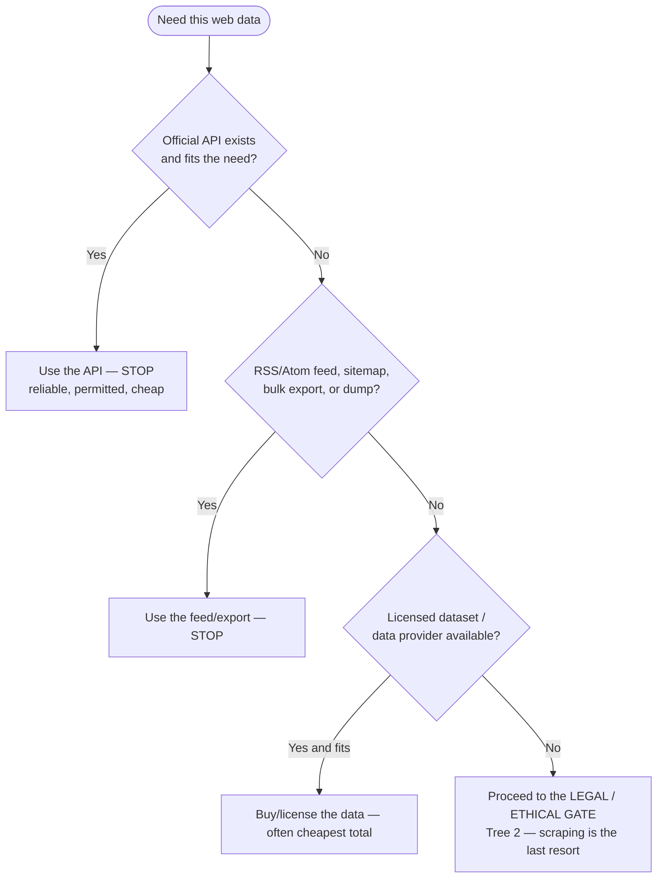
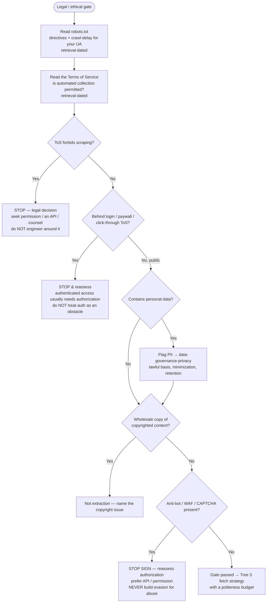
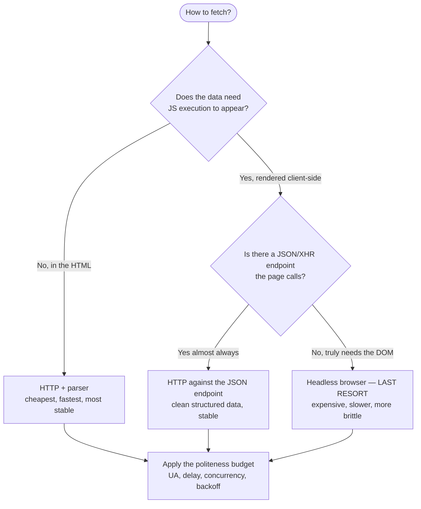
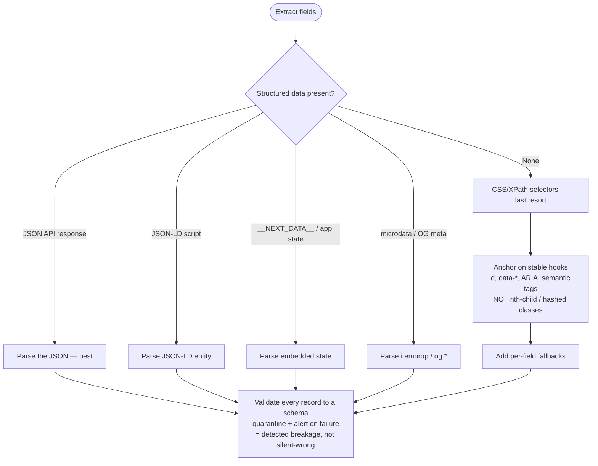
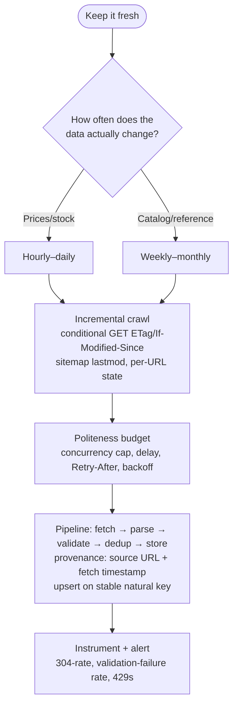

# Knowledge — Web-scraping & data-extraction decision trees

> **Last reviewed:** 2026-07-22 · **Confidence:** High on the durable framings (API-before-scrape,
> the legal/ethical gate, structured-data-before-selectors, be-a-polite-client,
> validate-to-a-schema — broad practitioner consensus). **robots.txt/ToS content, anti-bot
> behavior, jurisdictional legality, and library APIs are volatile + site-specific — re-verify
> each at use.**
> The most-asked questions are "is there an API instead?", "is it OK to scrape this?", "HTTP or
> headless?", "how do I parse this so it doesn't break?", and "how often do I re-crawl?". These are
> the trees the team traverses **before** writing a fetcher.

The team's discipline: **name the source (API before scrape), pass the legal/ethical gate before any
code, fetch as lightly as the target allows, parse structured-data-first, and be a polite client.**
This is **not legal advice** — volatile legal/ToS specifics carry a retrieval date and are verified
at use. Moving data that *already exists* leaves this layer for `data-orchestration` /
`data-streaming-engineering`; PII *policy* goes to `data-governance-privacy`.

---

## Decision Tree 1: is there a better source than scraping?

**Rule:** a permitted structured source beats a scraper on reliability, legality, and total cost.
Scrape only public, permitted data with no better source.

---

## Decision Tree 2: the legal & ethical gate (BEFORE any code)

**The gate is a gate.** A ToS prohibition, an auth wall, a wholesale-copyright issue, or an
aggressive anti-bot system stops the work and gets *surfaced* — this team does not design evasion
for prohibited or abusive access. A politeness/reliability measure for an **authorized** target
(honest UA, honoring `Retry-After`, a session for a licensed API) is **not** evasion.

---

## Decision Tree 3: fetch strategy — lightest that works

**Order:** HTTP → JSON endpoint → headless. The browser is the expensive last resort; the JSON the
page already calls is usually right there and far more stable than the rendered DOM.

---

## Decision Tree 4: parse strategy — structured-data-first

---

## Decision Tree 5: schedule & change-detection

---

## Seams to adjacent plugins

| If the question is… | It belongs to… |
|---|---|
| Move/transform/orchestrate data that **already exists** in a store | `data-orchestration` |
| Real-time streaming ingestion of an existing event source | `data-streaming-engineering` |
| Privacy **policy** for collected personal data (lawful basis, retention) | `data-governance-privacy` |
| Design/consume a first-party **API** (the thing you'd rather use than scrape) | `api-engineering` |
| A generic backend service unrelated to acquisition | `backend-engineering` |
| A genuine **legal** determination | a lawyer — this team surfaces it, retrieval-dated, not legal advice |

This team owns **acquiring** web data — lawfully, robustly, and politely — and turning it into
validated structured records.
