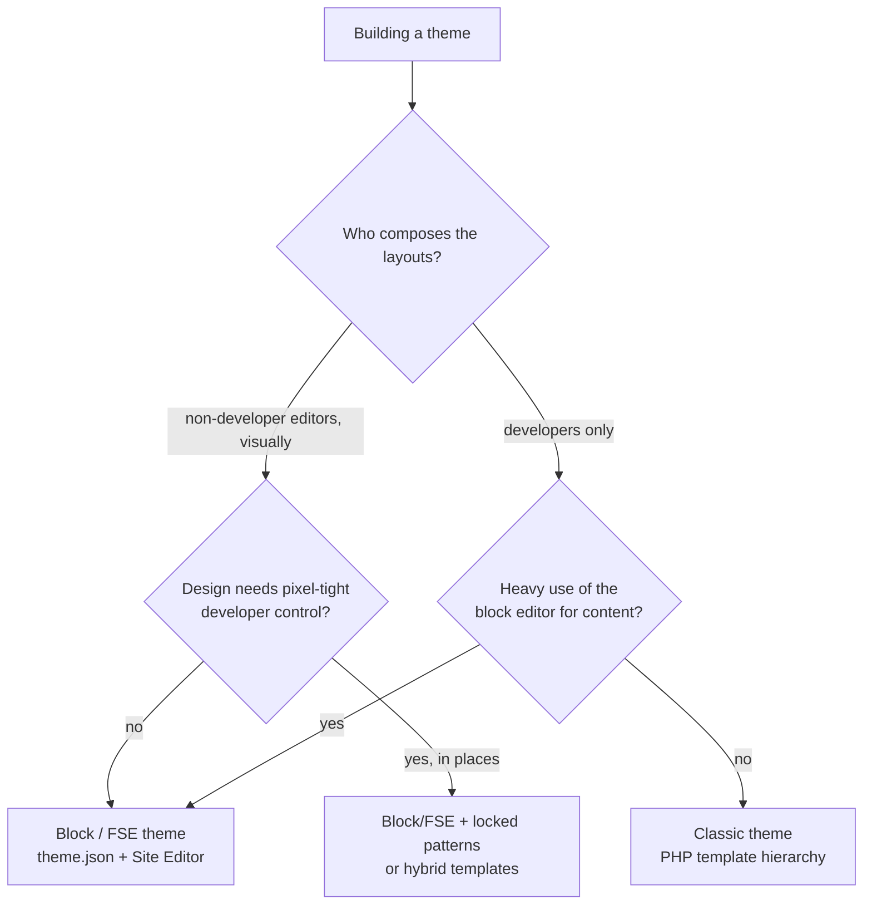
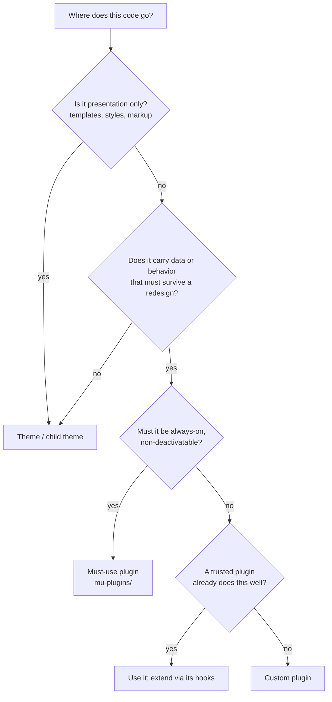
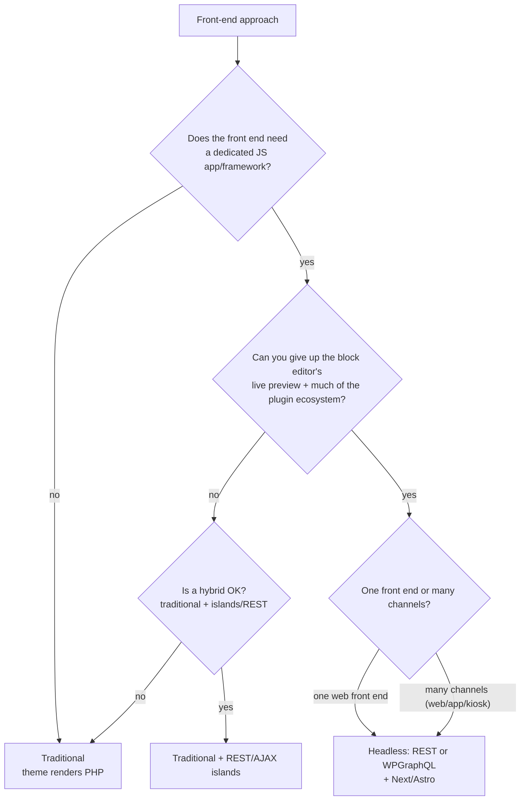
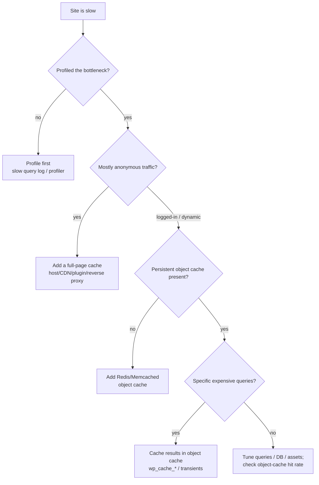

# WordPress / CMS — Decision Trees

> Reference decision trees for the `wordpress-cms-engineering` team. Agents **traverse the relevant tree top-to-bottom before choosing** (the proactive complement to the Capability Grounding Protocol). Each `## Decision Tree` section is a Mermaid graph plus the rule it encodes.
>
> _Last reviewed: 2026-06-22 by `claude`. Principles are durable; specific product/library/version names live (dated) in [`wordpress-stack-2026.md`](wordpress-stack-2026.md)._

---

## Decision Tree: classic vs block/FSE theme?

**Rule:** the editing model picks the theme model. Editors composing layouts → block/FSE (`theme.json`, Site Editor); developer-owned, pixel-tight templates with no visual layout editing → classic. Don't pick block/FSE for a site no non-developer will edit, or classic for a site whose editors live in the block editor.

---

## Decision Tree: custom plugin vs existing plugin vs theme functions?

**Rule:** presentation → theme; data/behavior that must survive a redesign → a plugin (must-use for always-on infrastructure). Prefer extending a solid existing plugin through its hooks over reinventing it; never put business logic (CPTs, integrations) in the theme.

---

## Decision Tree: headless/decoupled vs traditional?

**Rule:** stay traditional unless the front end genuinely demands a JS framework or multi-channel delivery. Headless buys a modern front-end stack and clean separation; it costs the editor's live preview, much of the plugin ecosystem, and a second deployable. Name the trade before committing.

---

## Decision Tree: which caching layer(s)?

**Rule:** measure before you cache. Anonymous breadth → a page cache; dynamic/logged-in depth → a persistent object cache (Redis/Memcached), then cache the expensive queries on top. The default (non-persistent) object cache doesn't survive the request — wire a real backend.

---

## See also

- [`wordpress-stack-2026.md`](wordpress-stack-2026.md) — dated tooling/library capability map (re-verify before quoting versions).
- Skills: [`../skills/choose-wordpress-architecture/SKILL.md`](../skills/choose-wordpress-architecture/SKILL.md), [`../skills/build-blocks-and-themes/SKILL.md`](../skills/build-blocks-and-themes/SKILL.md), [`../skills/extend-with-hooks-and-plugins/SKILL.md`](../skills/extend-with-hooks-and-plugins/SKILL.md), [`../skills/harden-and-secure-wordpress/SKILL.md`](../skills/harden-and-secure-wordpress/SKILL.md), [`../skills/performance-and-caching/SKILL.md`](../skills/performance-and-caching/SKILL.md).
